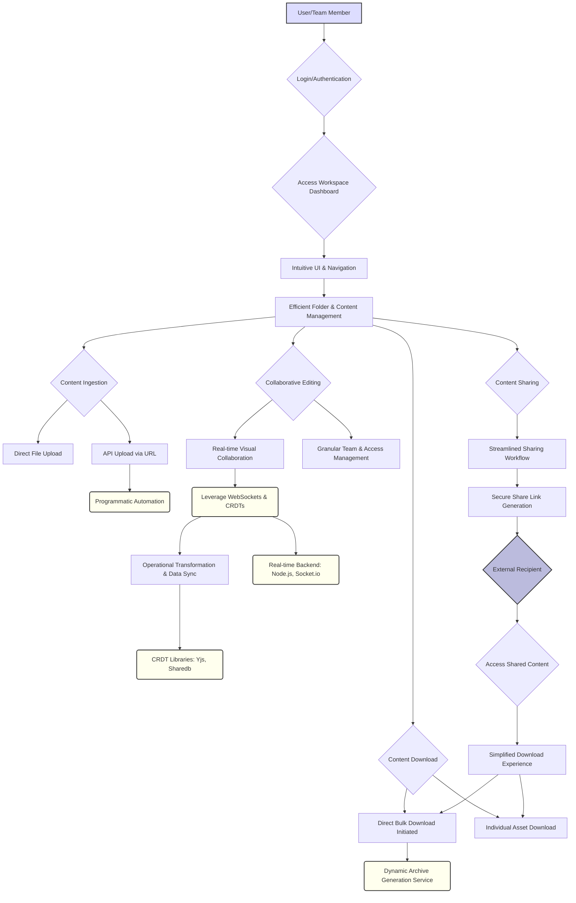

# Implementation Guide: Collaborative Visual Workspace


## System Architecture

The superior Collaborative Visual Workspace will operate on a hybrid architecture, leveraging the existing PHP/Tailwind/MySQL foundation for core functionalities while introducing a dedicated Node.js-based real-time backend for interactive collaboration and WebSockets. This design ensures robust data persistence, scalable real-time capabilities, and a responsive user experience.

**Core Components:**

1.  **Frontend (PHP/Tailwind/JavaScript):**
    *   **Primary Rendering:** PHP with Tailwind CSS for rapid UI development, responsive design, and core page generation.
    *   **Interactive Components:** Extensive use of JavaScript (potentially integrated with a lightweight framework like Alpine.js or a dedicated SPA for collaborative workspaces) for dynamic UI elements, client-side validation, and real-time interaction with the WebSocket backend.
    *   **Collaborative Canvas:** HTML5 Canvas API for rendering drawing operations and visual media, integrated with a JavaScript library like Paper.js or tldraw for managing vector graphics and user input.
    *   **WebSocket Client:** A dedicated JavaScript client module that establishes and manages WebSocket connections to the Node.js Real-time Service.

2.  **Backend (PHP/MySQL):**
    *   **API Gateway & Business Logic:** The existing PHP application will serve as the primary RESTful API for user authentication, authorization (RBAC), file/folder management metadata, team management, permissions, and traditional CRUD operations.
    *   **Database:** MySQL for storing all structured data: user profiles, team configurations, folder hierarchies, file metadata (name, type, size, owner, permissions, share links), and activity logs.
    *   **Asynchronous Task Queue (e.g., Redis/RabbitMQ with PHP workers):** For offloading long-running processes such as bulk archive generation, media processing (thumbnailing, transcoding), and sending notifications.

3.  **Real-time Service (Node.js/WebSockets/CRDTs):**
    *   **WebSocket Server:** A dedicated Node.js server using `ws` or Socket.io for managing persistent, bi-directional communication channels with connected clients. This service handles real-time events for collaborative drawing, live cursors, presence, and instant notifications.
    *   **Conflict-free Replicated Data Types (CRDTs) - Yjs:** Integrated within the Node.js service and client-side JavaScript, Yjs will be used to manage the shared state of collaborative elements (e.g., vector drawing paths, annotations, shared pointers) without requiring a centralized authority for conflict resolution, ensuring eventual consistency across all collaborators.
    *   **Data Persistence (Optional/Snapshotting):** While CRDTs handle real-time sync, the Node.js service may periodically persist snapshots of the collaborative state to MySQL for long-term storage and session recovery.

4.  **Object Storage (S3-compatible):**
    *   **Primary Media Repository:** All images, videos, and other large binary files will be stored in a scalable, high-availability object storage solution (e.g., AWS S3, MinIO). This decouples file storage from the web server, enabling direct uploads/downloads and efficient content delivery.

5.  **Bulk Download Service (Node.js/PHP Microservice):**
    *   **Dedicated Archiving:** A lightweight service (potentially a Node.js microservice or a PHP worker listening to the message queue) responsible for asynchronously fetching multiple selected files from Object Storage, compressing them into a ZIP archive, and temporarily storing the archive for download.

**Deployment & Infrastructure:**
*   **Reverse Proxy/Load Balancer (e.g., Nginx):** To distribute incoming HTTP/HTTPS traffic to the PHP backend and proxy WebSocket connections to the Node.js Real-time Service.
*   **CDN (Content Delivery Network):** For caching and serving static assets (JS, CSS, images) and potentially accelerating media delivery from Object Storage.
*   **Containerization (Docker/Kubernetes):** For consistent deployment, scalability, and isolation of different services (PHP, Node.js Real-time, Bulk Download).

## Problem-Solution

This architecture addresses the identified complaints and gaps with technically sound, scalable solutions:

### 1. Lack of Direct Bulk Downloading Functionality & Cumbersome Sharing for Recipients

**Problem:** Users and recipients of shared content lack direct bulk downloading, often requiring third-party tools, leading to a complex and frustrating experience.

**Solution:** Implement a dedicated **Bulk Download Service** coupled with a streamlined sharing mechanism.
*   **Mechanism:** When a user requests a bulk download (e.g., selected files/folders), the request is sent to the PHP backend. The PHP backend queues an asynchronous job in the **Task Queue**. A **Bulk Download Service** worker picks up this job, retrieves the specified files from **Object Storage**, compresses them into a single archive (e.g., ZIP), and stores this temporary archive back in Object Storage (with a limited TTL).
*   **User Experience:** The user is notified when the archive is ready, receiving a direct, time-limited URL for download. For external shared content, a simplified, branded landing page is presented, offering a prominent "Download All" button that triggers this same bulk download process, abstracting all complexity from the recipient.
*   **Technical Detail:** Utilizes object storage's multi-part download capabilities for efficiency. Secure, ephemeral pre-signed URLs are generated for direct download from Object Storage, bypassing the application server for large files.

### 2. API Image Uploading via URLs is Disabled

**Problem:** The existing API lacks programmatic image upload via URL, hindering automation and integration.

**Solution:** Develop a robust, secure API endpoint for URL-based image uploads.
*   **Mechanism:** A new API endpoint on the **PHP Backend** will accept a URL pointing to an image. The backend will perform a server-side fetch of the image from the provided URL, validate its MIME type and size, and then stream it directly to the **Object Storage**. Upon successful upload, the metadata (URL, file name, size, type, storage path) is stored in **MySQL**.
*   **Technical Detail:** This involves using PHP's `curl` extension or a robust HTTP client (e.g., Guzzle) with appropriate timeouts and error handling. Implement security measures like URL sanitization, content type verification, and protection against SSRF (Server-Side Request Forgery) and large file attacks.

### 3. User Interface and Navigation Described as Difficult and Disorganized

**Problem:** The UI/UX is challenging, impacting efficient navigation and folder management.

**Solution:** Implement a modern, intuitive, and highly organized user interface with enhanced navigation.
*   **Mechanism:** Leverage **Tailwind CSS** extensively for a clean, consistent, and responsive design system. Re-architect the frontend using client-side JavaScript to create a dynamic single-page application experience for file browsing and management. This includes drag-and-drop functionality for files and folders, virtualized lists for large directories, and a clear, breadcrumb-based navigation system.
*   **Technical Detail:** Employ client-side state management for folder structures and selected items. Utilize CSS transitions and animations for a fluid user experience. Implement keyboard shortcuts for common actions to improve efficiency for power users.

### 4. Not Suitable for Collaborative Sharing or a Replacement for Mainstream Sharing Programs

**Problem:** The tool lacks comprehensive collaborative features, team management, and streamlined workflows.

**Solution:** Integrate a full-fledged real-time collaborative workspace and robust team management capabilities.
*   **Mechanism:** The core of this solution lies in the **Real-time Service (Node.js/WebSockets/CRDTs)**. When users enter a shared visual workspace, their **Frontend** clients establish WebSocket connections. Collaborative actions (e.g., drawing, adding annotations, moving objects) are sent as events via WebSockets to the Node.js service. This service, powered by **Yjs (CRDTs)**, disseminates the changes to all connected clients, ensuring real-time synchronization and automatic conflict resolution without a central authority.
*   **Team Management:** The **PHP Backend** will be extended with full RBAC (Role-Based Access Control) for teams, projects, and granular permissions on files/folders and specific collaborative workspaces. This allows defining roles like "Viewer," "Contributor," and "Admin" within teams.
*   **Streamlined Workflows:** Integrate notification systems (via WebSockets for real-time alerts or email for offline users) for new comments, changes, or task assignments within collaborative spaces.
*   **Technical Detail:** Client-side JavaScript will render the collaborative canvas (HTML5 Canvas) using libraries like Paper.js. Yjs will manage the shared document state (e.g., vector paths, object positions). The Node.js service acts as a signaling server and facilitates CRDT synchronization.

By implementing these architectural components and solutions, the Collaborative Visual Workspace will transform into a highly functional, intuitive, and truly collaborative platform, directly addressing user complaints and closing critical feature gaps.



```sql
-- MySQL 8.0 Database Schema for a Superior Collaborative Visual Workspace

-- Table: `users`
-- Stores user account information.
CREATE TABLE `users` (
    `user_id` BIGINT AUTO_INCREMENT PRIMARY KEY,
    `email` VARCHAR(255) NOT NULL UNIQUE,
    `password_hash` VARCHAR(255) NOT NULL, -- Store bcrypt or similar strong hash
    `first_name` VARCHAR(100),
    `last_name` VARCHAR(100),
    `profile_picture_url` VARCHAR(2048), -- URL to user's profile picture
    `is_active` BOOLEAN NOT NULL DEFAULT TRUE,
    `last_login_at` DATETIME,
    `created_at` DATETIME NOT NULL DEFAULT CURRENT_TIMESTAMP,
    `updated_at` DATETIME NOT NULL DEFAULT CURRENT_TIMESTAMP ON UPDATE CURRENT_TIMESTAMP
);

-- Table: `organizations`
-- Represents organizations or companies using the platform (optional, for multi-tenancy).
CREATE TABLE `organizations` (
    `org_id` BIGINT AUTO_INCREMENT PRIMARY KEY,
    `name` VARCHAR(255) NOT NULL,
    `slug` VARCHAR(255) NOT NULL UNIQUE, -- URL-friendly identifier for the organization
    `owner_user_id` BIGINT NOT NULL, -- The user who owns/administers this organization
    `status` ENUM('active', 'suspended', 'archived') NOT NULL DEFAULT 'active',
    `created_at` DATETIME NOT NULL DEFAULT CURRENT_TIMESTAMP,
    `updated_at` DATETIME NOT NULL DEFAULT CURRENT_TIMESTAMP ON UPDATE CURRENT_TIMESTAMP,
    FOREIGN KEY (`owner_user_id`) REFERENCES `users`(`user_id`) ON DELETE RESTRICT -- Prevent deleting owner directly
);

-- Table: `teams`
-- Groups of users for collaborative efforts within an organization or as standalone units.
CREATE TABLE `teams` (
    `team_id` BIGINT AUTO_INCREMENT PRIMARY KEY,
    `org_id` BIGINT, -- NULL if the team is not associated with an organization
    `name` VARCHAR(255) NOT NULL,
    `description` TEXT,
    `created_at` DATETIME NOT NULL DEFAULT CURRENT_TIMESTAMP,
    `updated_at` DATETIME NOT NULL DEFAULT CURRENT_TIMESTAMP ON UPDATE CURRENT_TIMESTAMP,
    FOREIGN KEY (`org_id`) REFERENCES `organizations`(`org_id`) ON DELETE CASCADE
);

-- Table: `user_team_memberships`
-- Junction table to manage user membership and roles within teams.
CREATE TABLE `user_team_memberships` (
    `user_id` BIGINT NOT NULL,
    `team_id` BIGINT NOT NULL,
    `role` ENUM('admin', 'member', 'guest') NOT NULL DEFAULT 'member', -- Team-specific access role
    `joined_at` DATETIME NOT NULL DEFAULT CURRENT_TIMESTAMP,
    PRIMARY KEY (`user_id`, `team_id`),
    FOREIGN KEY (`user_id`) REFERENCES `users`(`user_id`) ON DELETE CASCADE,
    FOREIGN KEY (`team_id`) REFERENCES `teams`(`team_id`) ON DELETE CASCADE
);

-- Table: `projects`
-- Represents a collaborative workspace or a collection of related content.
CREATE TABLE `projects` (
    `project_id` BIGINT AUTO_INCREMENT PRIMARY KEY,
    `team_id` BIGINT, -- NULL if this is a personal project not linked to a team
    `owner_user_id` BIGINT NOT NULL, -- The user who created this project
    `name` VARCHAR(255) NOT NULL,
    `description` TEXT,
    `status` ENUM('active', 'archived', 'deleted') NOT NULL DEFAULT 'active',
    `created_at` DATETIME NOT NULL DEFAULT CURRENT_TIMESTAMP,
    `updated_at` DATETIME NOT NULL DEFAULT CURRENT_TIMESTAMP ON UPDATE CURRENT_TIMESTAMP,
    FOREIGN KEY (`team_id`) REFERENCES `teams`(`team_id`) ON DELETE SET NULL,
    FOREIGN KEY (`owner_user_id`) REFERENCES `users`(`user_id`) ON DELETE RESTRICT
);

-- Table: `folders`
-- Provides a hierarchical structure for organizing files within projects.
CREATE TABLE `folders` (
    `folder_id` BIGINT AUTO_INCREMENT PRIMARY KEY,
    `project_id` BIGINT NOT NULL,
    `parent_folder_id` BIGINT, -- NULL for root folders within a project
    `name` VARCHAR(255) NOT NULL,
    `created_by_user_id` BIGINT NOT NULL,
    `created_at` DATETIME NOT NULL DEFAULT CURRENT_TIMESTAMP,
    `updated_at` DATETIME NOT NULL DEFAULT CURRENT_TIMESTAMP ON UPDATE CURRENT_TIMESTAMP,
    FOREIGN KEY (`project_id`) REFERENCES `projects`(`project_id`) ON DELETE CASCADE,
    FOREIGN KEY (`parent_folder_id`) REFERENCES `folders`(`folder_id`) ON DELETE CASCADE, -- Supports hierarchical deletion
    FOREIGN KEY (`created_by_user_id`) REFERENCES `users`(`user_id`) ON DELETE RESTRICT
);

-- Table: `files`
-- Stores metadata for all media (images, videos) and collaborative drawing files.
CREATE TABLE `files` (
    `file_id` BIGINT AUTO_INCREMENT PRIMARY KEY,
    `folder_id` BIGINT NOT NULL,
    `owner_user_id` BIGINT NOT NULL, -- User who initially uploaded/created the file
    `original_filename` VARCHAR(255) NOT NULL,
    `stored_filename` VARCHAR(255) NOT NULL, -- Unique identifier/name on the actual storage system
    `file_path` VARCHAR(2048) NOT NULL, -- Full path or S3 key to the file's data
    `mime_type` VARCHAR(100) NOT NULL,
    `file_type` ENUM('image', 'video', 'document', 'drawing', 'other') NOT NULL, -- Categorization for specific handling
    `file_size_bytes` BIGINT NOT NULL,
    `width` INT, -- For images/videos
    `height` INT, -- For images/videos
    `duration_seconds` INT, -- For videos
    `thumbnail_url` VARCHAR(2048), -- URL to a generated thumbnail
    `description` TEXT,
    `status` ENUM('uploaded', 'processing', 'failed', 'ready') NOT NULL DEFAULT 'uploaded',
    `created_at` DATETIME NOT NULL DEFAULT CURRENT_TIMESTAMP,
    `updated_at` DATETIME NOT NULL DEFAULT CURRENT_TIMESTAMP ON UPDATE CURRENT_TIMESTAMP,
    FOREIGN KEY (`folder_id`) REFERENCES `folders`(`folder_id`) ON DELETE CASCADE,
    FOREIGN KEY (`owner_user_id`) REFERENCES `users`(`user_id`) ON DELETE RESTRICT
);

-- Table: `file_versions`
-- Stores historical versions of files, enabling rollback or tracking changes.
CREATE TABLE `file_versions` (
    `version_id` BIGINT AUTO_INCREMENT PRIMARY KEY,
    `file_id` BIGINT NOT NULL,
    `version_number` INT NOT NULL,
    `stored_filename` VARCHAR(255) NOT NULL, -- Stored filename for this specific version
    `file_path` VARCHAR(2048) NOT NULL, -- Path to this version's data
    `created_by_user_id` BIGINT NOT NULL,
    `created_at` DATETIME NOT NULL DEFAULT CURRENT_TIMESTAMP,
    UNIQUE KEY `uk_file_version` (`file_id`, `version_number`), -- Ensures unique version per file
    FOREIGN KEY (`file_id`) REFERENCES `files`(`file_id`) ON DELETE CASCADE,
    FOREIGN KEY (`created_by_user_id`) REFERENCES `users`(`user_id`) ON DELETE RESTRICT
);

-- Table: `drawing_canvases`
-- Specifically stores the persistent state for collaborative drawing files (where `files.file_type` is 'drawing').
-- The CRDT state allows for real-time collaborative editing.
CREATE TABLE `drawing_canvases` (
    `drawing_id` BIGINT AUTO_INCREMENT PRIMARY KEY,
    `file_id` BIGINT NOT NULL UNIQUE, -- Each drawing file has one persistent canvas state
    `crdt_state_blob` MEDIUMBLOB NOT NULL, -- Serialized CRDT document (e.g., Yjs binary state)
    `last_updated_by_user_id` BIGINT NOT NULL,
    `created_at` DATETIME NOT NULL DEFAULT CURRENT_TIMESTAMP,
    `updated_at` DATETIME NOT NULL DEFAULT CURRENT_TIMESTAMP ON UPDATE CURRENT_TIMESTAMP,
    FOREIGN KEY (`file_id`) REFERENCES `files`(`file_id`) ON DELETE CASCADE,
    FOREIGN KEY (`last_updated_by_user_id`) REFERENCES `users`(`user_id`) ON DELETE RESTRICT
);

-- Table: `api_keys`
-- Manages API keys for programmatic access, enabling automation and integrations.
CREATE TABLE `api_keys` (
    `api_key_id` BIGINT AUTO_INCREMENT PRIMARY KEY,
    `user_id` BIGINT NOT NULL, -- The user who generated this API key
    `key_hash` VARCHAR(255) NOT NULL UNIQUE, -- Store bcrypt/argon2 hash of the actual API key
    `name` VARCHAR(255), -- User-defined name for easier identification (e.g., "My Automation Script")
    `permissions_json` JSON, -- JSON array of granted permissions (e.g., ["upload:url", "download:bulk", "read:metadata"])
    `is_active` BOOLEAN NOT NULL DEFAULT TRUE,
    `expires_at` DATETIME,
    `created_at` DATETIME NOT NULL DEFAULT CURRENT_TIMESTAMP,
    `updated_at` DATETIME NOT NULL DEFAULT CURRENT_TIMESTAMP ON UPDATE CURRENT_TIMESTAMP,
    FOREIGN KEY (`user_id`) REFERENCES `users`(`user_id`) ON DELETE CASCADE
);

-- Table: `api_uploads_queue`
-- Queues and manages asynchronous image/video uploads via URL, addressing the API gap.
CREATE TABLE `api_uploads_queue` (
    `queue_id` BIGINT AUTO_INCREMENT PRIMARY KEY,
    `api_key_id` BIGINT, -- Which API key initiated the upload (NULL if direct user upload)
    `user_id` BIGINT NOT NULL, -- The user account associated with the upload
    `target_folder_id` BIGINT NOT NULL,
    `source_url` VARCHAR(2048) NOT NULL, -- URL of the content to be uploaded
    `status` ENUM('pending', 'downloading', 'processing', 'completed', 'failed') NOT NULL DEFAULT 'pending',
    `error_message` TEXT, -- Stores any error messages during the upload process
    `file_id` BIGINT, -- Reference to the `files` table if upload is successful
    `created_at` DATETIME NOT NULL DEFAULT CURRENT_TIMESTAMP,
    `started_at` DATETIME,
    `completed_at` DATETIME,
    FOREIGN KEY (`api_key_id`) REFERENCES `api_keys`(`api_key_id`) ON DELETE SET NULL,
    FOREIGN KEY (`user_id`) REFERENCES `users`(`user_id`) ON DELETE RESTRICT,
    FOREIGN KEY (`target_folder_id`) REFERENCES `folders`(`folder_id`) ON DELETE RESTRICT,
    FOREIGN KEY (`file_id`) REFERENCES `files`(`file_id`) ON DELETE SET NULL -- If the resulting file is deleted
);

-- Table: `sharing_links`
-- Manages public/private sharing links for files, folders, or projects, simplifying content distribution.
CREATE TABLE `sharing_links` (
    `link_id` BIGINT AUTO_INCREMENT PRIMARY KEY,
    `unique_hash` VARCHAR(255) NOT NULL UNIQUE, -- A short, unique hash for the shareable URL
    `owner_user_id` BIGINT NOT NULL, -- User who created this share link
    `resource_type` ENUM('file', 'folder', 'project') NOT NULL, -- What kind of resource is being shared
    `resource_id` BIGINT NOT NULL, -- ID of the specific resource (file, folder, or project)
    `access_type` ENUM('view_only', 'download_only', 'view_and_download') NOT NULL DEFAULT 'view_only',
    `password_hash` VARCHAR(255), -- Optional password for accessing the link
    `expires_at` DATETIME, -- When the link becomes invalid
    `max_downloads` INT DEFAULT 0, -- 0 means unlimited downloads
    `current_downloads` INT DEFAULT 0, -- Tracks how many times content has been downloaded
    `is_active` BOOLEAN NOT NULL DEFAULT TRUE,
    `created_at` DATETIME NOT NULL DEFAULT CURRENT_TIMESTAMP,
    FOREIGN KEY (`owner_user_id`) REFERENCES `users`(`user_id`) ON DELETE CASCADE
    -- No direct FK on resource_id due to polymorphic nature (can point to files, folders, projects)
);

-- Table: `activity_logs`
-- Records user and system actions for auditing, real-time feeds, and troubleshooting.
CREATE TABLE `activity_logs` (
    `log_id` BIGINT AUTO_INCREMENT PRIMARY KEY,
    `user_id` BIGINT, -- NULL for system-initiated actions
    `event_type` VARCHAR(100) NOT NULL, -- e.g., 'file_uploaded', 'folder_created', 'project_shared', 'user_login'
    `resource_type` ENUM('user', 'organization', 'team', 'project', 'folder', 'file', 'sharing_link', 'api_key') NOT NULL,
    `resource_id` BIGINT, -- ID of the primary resource affected by the event
    `details_json` JSON, -- Additional context and data about the event in JSON format
    `ip_address` VARCHAR(45), -- IP address of the user who performed the action
    `created_at` DATETIME NOT NULL DEFAULT CURRENT_TIMESTAMP,
    INDEX `idx_user_id` (`user_id`),
    INDEX `idx_resource` (`resource_type`, `resource_id`),
    FOREIGN KEY (`user_id`) REFERENCES `users`(`user_id`) ON DELETE SET NULL
);

-- Table: `tags`
-- Allows for categorization and better organization of content.
CREATE TABLE `tags` (
    `tag_id` BIGINT AUTO_INCREMENT PRIMARY KEY,
    `name` VARCHAR(100) NOT NULL UNIQUE,
    `created_by_user_id` BIGINT, -- Optional: Who created this tag
    `created_at` DATETIME NOT NULL DEFAULT CURRENT_TIMESTAMP,
    FOREIGN KEY (`created_by_user_id`) REFERENCES `users`(`user_id`) ON DELETE SET NULL
);

-- Table: `file_tags`
-- Junction table for a many-to-many relationship between files and tags.
CREATE TABLE `file_tags` (
    `file_id` BIGINT NOT NULL,
    `tag_id` BIGINT NOT NULL,
    PRIMARY KEY (`file_id`, `tag_id`),
    FOREIGN KEY (`file_id`) REFERENCES `files`(`file_id`) ON DELETE CASCADE,
    FOREIGN KEY (`tag_id`) REFERENCES `tags`(`tag_id`) ON DELETE CASCADE
);

-- Additional Indexes for Performance
CREATE INDEX `idx_folders_project_id` ON `folders`(`project_id`);
CREATE INDEX `idx_folders_parent_folder_id` ON `folders`(`parent_folder_id`);
CREATE INDEX `idx_files_folder_id` ON `files`(`folder_id`);
CREATE INDEX `idx_files_owner_user_id` ON `files`(`owner_user_id`);
CREATE INDEX `idx_files_mime_type` ON `files`(`mime_type`);
CREATE INDEX `idx_files_file_type` ON `files`(`file_type`);
CREATE INDEX `idx_files_status` ON `files`(`status`);
CREATE INDEX `idx_projects_team_id` ON `projects`(`team_id`);
CREATE INDEX `idx_sharing_links_resource` ON `sharing_links`(`resource_type`, `resource_id`);
CREATE INDEX `idx_api_uploads_queue_status` ON `api_uploads_queue`(`status`);
CREATE INDEX `idx_drawing_canvases_file_id` ON `drawing_canvases`(`file_id`);
```

The existing "Collaborative Visual Workspace" (PHP/Tailwind/MySQL) exhibits critical deficiencies in API functionality, media management, and real-time collaborative capabilities. To build a superior version, a multi-faceted API integration strategy is required, leveraging modern real-time communication protocols and conflict-free data synchronization techniques. This strategy focuses on augmenting the existing PHP backend with specialized services for real-time operations and robust media handling.

## API Integration Strategy

The strategy outlines the integration of new or enhanced APIs across three primary domains: **Media Management, Real-time Collaborative Canvas, and User/Team/Sharing Management**.

### 1. Media Management API

**Objective:** To provide a robust, reliable, and scalable API for programmatic image/video uploads via URL, direct file uploads, and efficient bulk downloading capabilities.

**Architecture:** A dedicated, stateless RESTful API, potentially implemented as a microservice (e.g., in Node.js or a lightweight PHP framework), to handle media processing and interaction with object storage.

**A. Image/Video Uploads:**

*   **Endpoint:** `POST /api/v1/media/upload`
*   **Functionality:** This endpoint will replace and enhance the current upload mechanism, supporting two primary modes:
    *   **Direct File Upload:**
        *   **Request Type:** `multipart/form-data`
        *   **Parameters:** `file` (binary data), `workspaceId`, `metadata` (JSON, optional).
        *   **Process:** Authenticate user, validate file type/size, upload to a transient storage (e.g., a temporary S3 bucket), enqueue a message to a processing queue (e.g., AWS SQS, RabbitMQ).
    *   **URL-based Upload (Addressing Gap):**
        *   **Request Type:** `application/json`
        *   **Parameters:** `url` (string, URL of the external image/video), `workspaceId`, `metadata` (JSON, optional).
        *   **Process:** Authenticate user, validate URL format. Enqueue a message to a dedicated URL-fetching and processing queue. A worker service will asynchronously fetch the content from the provided URL, validate it, and upload it to the designated object storage. This prevents long-running HTTP requests and allows for retries.
*   **Storage Backend:** Integrate with a scalable object storage solution like AWS S3, Google Cloud Storage, or Azure Blob Storage. File metadata (path, MIME type, size, owner, timestamp) will be stored in the primary MySQL database.
*   **Asynchronous Processing:** All uploads should be processed asynchronously using a message queue system (e.g., Redis Queue, AWS SQS) to handle file validation, metadata extraction, thumbnail generation, and potential media transcoding without blocking the API response. Progress updates can be pushed via WebSockets.

**B. Bulk Downloading (Addressing Gap):**

*   **Endpoint:** `POST /api/v1/media/download/bulk`
*   **Functionality:** Enables users to download multiple selected media files as a single archive.
*   **Request Type:** `application/json`
*   **Parameters:** `mediaIds` (array of strings, IDs of media items), `archiveFormat` (string, e.g., "zip", "tar.gz", optional, default "zip").
*   **Process:**
    1.  **Authentication & Authorization:** Verify user access to all specified `mediaIds`.
    2.  **Asynchronous Archive Generation:** Enqueue a task to a worker service responsible for retrieving the specified media files from object storage, creating a ZIP/TAR archive, and uploading the archive to a temporary, secure storage location (e.g., S3 bucket with a time-limited pre-signed URL).
    3.  **Notification:** Once the archive is ready, notify the user (e.g., via a WebSocket push notification or email) with a link to download the generated archive. The download link should be a time-limited pre-signed URL to ensure security and prevent unauthorized access.
*   **Single File Download:**
    *   **Endpoint:** `GET /api/v1/media/{mediaId}`
    *   **Process:** Redirect to a time-limited pre-signed URL from the object storage, ensuring secure and direct access to the file.

### 2. Real-time Collaborative Canvas API

**Objective:** To enable true real-time, conflict-free collaborative drawing and visual interaction within the workspace, replacing the current limitations.

**Architecture:** A dedicated Node.js backend leveraging WebSockets (Socket.io) for low-latency communication and Conflict-free Replicated Data Types (CRDTs) for robust state synchronization.

**A. WebSocket Server (Node.js/Socket.io):**

*   **Technology Stack:** Node.js with `socket.io` for real-time bi-directional communication. This aligns directly with resources like "Real-time Collaborative drawing: Node, Socket.io & PaperJs" and "Building real-time applications with WebSockets".
*   **Connection Management:** Manage user sessions, authenticate WebSocket connections (e.g., using JWTs obtained from the primary PHP backend), and map users to specific collaborative workspaces.

**B. Collaborative Data Synchronization (CRDTs):**

*   **Technology:** Implement CRDTs (Conflict-free Replicated Data Types) like `Yjs` or `ShareDB` (as referenced in GitHub resources: `yjs/yjs`, `stas-sl/realtime-collaboration-resources`). CRDTs are paramount for achieving true eventual consistency and seamless collaboration without relying on complex Operational Transformation (OT) server logic.
*   **Shared Document Model:** The collaborative canvas state (drawing strokes, shapes, text, object transformations, presence indicators) will be modeled as a shared CRDT document. Each drawing operation from a client translates into a CRDT update.
*   **API Events (Socket.io):**
    *   `ws.on('joinWorkspace', { workspaceId, userId })`: A client requests to join a specific workspace. The server retrieves the latest CRDT document state for that workspace and sends it to the client.
    *   `ws.emit('crdtUpdate', { workspaceId, updatePayload })`: Clients send CRDT updates to the server. The server broadcasts these updates to all other connected clients in the same workspace and persists them to the database.
    *   `ws.on('presenceUpdate', { workspaceId, userId, cursorPosition, viewport })`: Clients periodically send their cursor positions, viewport, and other presence data. The server broadcasts this to other users for real-time awareness.
    *   `ws.on('undoRedo', { workspaceId, actionType })`: CRDTs inherently support undo/redo capabilities without complex server-side state management.
*   **Persistence:** The CRDT document states and their deltas will be persisted to a suitable NoSQL database (e.g., MongoDB, PostgreSQL with JSONB) for durability and to allow new clients to synchronize to the latest state. The `Yjs` ecosystem offers excellent persistence connectors.
*   **Frontend Integration:** Utilize frontend libraries like `tldraw`, `Paper.js`, `Plait`, or HTML5 Canvas directly, integrated with `Yjs` for state management, to render and interact with the collaborative canvas.

### 3. User, Team, and Sharing Management API

**Objective:** To streamline the user experience for sharing content, managing teams, and accessing shared workspaces, replacing the current cumbersome process.

**Architecture:** The existing PHP/MySQL backend can be enhanced to provide these functionalities, potentially as a set of RESTful endpoints.

**A. Sharing Enhancements (Addressing Gap):**

*   **Endpoint:** `POST /api/v1/workspaces/{workspaceId}/share`
*   **Functionality:** Generates secure, simplified sharing links for individual media items or entire workspaces.
*   **Request Type:** `application/json`
*   **Parameters:** `permissions` (array, e.g., "view", "edit", "download"), `expiryDate` (ISO 8601 string, optional), `password` (string, optional), `recipientEmail` (string, optional, for direct invites).
*   **Process:**
    1.  Generate a unique, unguessable sharing token.
    2.  Store token, associated workspace/media ID, permissions, expiry, and any password hash in the MySQL database.
    3.  Return a simple, direct URL to the client (e.g., `https://yourdomain.com/share/{token}`).
    4.  If `recipientEmail` is provided, trigger an email notification with the sharing link.
*   **Accessing Shared Content:**
    *   **Endpoint:** `GET /share/{token}` (handled by the PHP frontend or a dedicated microservice).
    *   **Process:** Validate the token, check expiry, and apply permissions. For media downloads, the public recipient will be presented with a direct download button that initiates a request to the *Media Management API*'s single file download endpoint, potentially using a temporary, signed URL specific to the share link. This provides a "Simplified and user-friendly download experience for external recipients."

**B. Team Management:**

*   **Endpoints:**
    *   `POST /api/v1/teams`: Create a new team.
    *   `GET /api/v1/teams/{teamId}`: Retrieve team details.
    *   `POST /api/v1/teams/{teamId}/members`: Add users to a team (with role assignments).
    *   `DELETE /api/v1/teams/{teamId}/members/{userId}`: Remove user from team.
    *   `PATCH /api/v1/teams/{teamId}/members/{userId}/role`: Update user role.
*   **Functionality:** Implement robust Role-Based Access Control (RBAC) to manage permissions for workspaces and media within teams. This allows for fine-grained control over who can view, edit, or manage content, addressing the "comprehensive features for collaborative sharing, team management" gap.

### 4. General API Considerations

*   **Authentication & Authorization:** All API endpoints must be protected. Utilize JSON Web Tokens (JWTs) for stateless authentication. Frontend clients obtain a JWT from the PHP backend's login endpoint and include it in the `Authorization` header for subsequent REST requests and WebSocket connections. Implement strict Role-Based Access Control (RBAC) at the API gateway level and within each service.
*   **Input Validation:** Implement comprehensive server-side input validation for all API requests to prevent malformed data and potential security vulnerabilities.
*   **Rate Limiting:** Protect against abuse by implementing rate limiting on all API endpoints.
*   **Error Handling:** Standardize API error responses (e.g., using HTTP status codes and detailed JSON error bodies).
*   **Logging & Monitoring:** Implement robust logging (centralized logging system) and API monitoring (e.g., Prometheus/Grafana) to track performance, identify issues, and ensure system reliability.
*   **API Documentation:** Maintain up-to-date API documentation (e.g., OpenAPI/Swagger) for all exposed endpoints.

This API integration strategy provides a clear roadmap to address the identified gaps by leveraging established patterns and technologies for real-time collaboration and robust media handling, ultimately delivering a superior "Collaborative Visual Workspace."

```php
<?php

namespace App\Core\Contracts;

use DateTimeImmutable;
use App\Core\Enums\AccessLevel;
use App\Core\Exceptions\AuthenticationException;
use App\Core\Exceptions\AuthorizationException;
use App\Core\Exceptions\FileNotFoundException;
use App\Core\Exceptions\FileStorageException;
use App\Core\Exceptions\InvalidInputException;
use App\Core\Exceptions\RealtimeServiceException;
use App\Core\Exceptions\ResourceNotFoundException;

/**
 * Core Interfaces and Class Definitions for a Collaborative Visual Workspace Backend.
 * This structure focuses on robust API, media management, collaboration, and real-time data persistence.
 */

// --- I. Foundational Interfaces ---

/**
 * Represents a generic identifiable entity.
 */
interface IEntity
{
    public function getId(): string;
    public function getCreatedAt(): DateTimeImmutable;
    public function getUpdatedAt(): DateTimeImmutable;
}

/**
 * Contract for a generic repository managing entities.
 * @template T of IEntity
 */
interface IRepository
{
    /** @return T|null */
    public function findById(string $id): ?IEntity;
    /** @return T[] */
    public function findAll(): array;
    /** @param T $entity */
    public function save(IEntity $entity): void;
    /** @param T $entity */
    public function delete(IEntity $entity): void;
}

/**
 * Interface for abstracting file storage operations (e.g., local, S3, Azure Blob).
 */
interface IFileStorageAdapter
{
    /**
     * Uploads content to a specified path.
     * @throws FileStorageException If the upload fails.
     */
    public function upload(string $path, string $content, array $options = []): void;

    /**
     * Downloads content from a specified path.
     * @throws FileStorageException If the download fails.
     * @throws FileNotFoundException If the file does not exist.
     */
    public function download(string $path): string;

    /**
     * Retrieves a stream for downloading large files.
     * @throws FileStorageException If the stream cannot be created.
     * @throws FileNotFoundException If the file does not exist.
     * @return resource
     */
    public function getDownloadStream(string $path);

    /**
     * Deletes a file at the specified path.
     * @throws FileStorageException If deletion fails.
     * @throws FileNotFoundException If the file does not exist.
     */
    public function delete(string $path): void;

    /**
     * Checks if a file exists at the specified path.
     */
    public function exists(string $path): bool;

    /**
     * Generates a temporary, pre-signed URL for direct download.
     */
    public function getTemporaryDownloadUrl(string $path, int $expirySeconds = 3600): string;
}

/**
 * Interface for dispatching internal application events.
 */
interface IEventDispatcher
{
    public function dispatch(object $event): void;
}

// --- II. User & Authentication ---

interface IUser extends IEntity
{
    public function getEmail(): string;
    public function getUsername(): string;
    public function getPasswordHash(): string;
    public function hasPermission(string $permissionCode): bool;
}

interface IAuthService
{
    /**
     * Authenticates a user based on credentials.
     * @throws AuthenticationException If authentication fails.
     */
    public function authenticate(string $identifier, string $password): IUser;

    /**
     * Validates an API token or key.
     * @throws AuthenticationException If the token is invalid or expired.
     */
    public function validateApiToken(string $token): IUser;

    public function generateApiToken(IUser $user, int $expirySeconds = null): string;
    public function getCurrentUser(): ?IUser;
}

interface IPermissionManager
{
    /**
     * Checks if a user has a specific permission on a given resource.
     * @throws AuthorizationException If the user lacks permission.
     */
    public function authorize(IUser $user, string $permission, IEntity $resource = null): void;

    public function check(IUser $user, string $permission, IEntity $resource = null): bool;
}

// --- III. Workspace, Media & Sharing ---

/**
 * Represents a top-level workspace or project container.
 */
interface IWorkspace extends IEntity
{
    public function getName(): string;
    public function getOwnerId(): string; // References IUser->getId()
    public function setDescription(string $description): void;
    public function getDescription(): ?string;
}

/**
 * Represents a folder within a workspace.
 */
interface IFolder extends IEntity
{
    public function getName(): string;
    public function getWorkspaceId(): string;
    public function getParentFolderId(): ?string; // Null for root folders
}

/**
 * Represents a generic media asset (image, video, document, collaborative canvas state).
 */
interface IMediaAsset extends IEntity
{
    public function getFilename(): string;
    public function getMimeType(): string;
    public function getSizeBytes(): int;
    public function getStoragePath(): string; // Path in the IFileStorageAdapter
    public function getUploaderId(): string; // References IUser->getId()
    public function getFolderId(): ?string; // References IFolder->getId()
    public function getWorkspaceId(): string; // References IWorkspace->getId()
    public function getMetadata(): array;
    public function setMetadata(array $metadata): void;
}

/**
 * Represents an image asset.
 */
interface IImageAsset extends IMediaAsset
{
    public function getDimensions(): array; // ['width' => int, 'height' => int]
    public function getThumbnailStoragePath(): ?string;
}

/**
 * Represents a video asset.
 */
interface IVideoAsset extends IMediaAsset
{
    public function getDurationSeconds(): int;
    public function getThumbnailStoragePath(): ?string;
}

/**
 * Represents a shareable link for public or controlled access.
 */
interface IShareLink extends IEntity
{
    public function getToken(): string;
    public function getResourceId(): string; // ID of the IMediaAsset or IFolder being shared
    public function getResourceType(): string; // e.g., 'media_asset', 'folder'
    public function getAccessLevel(): AccessLevel; // e.g., 'view', 'download'
    public function getExpiresAt(): ?DateTimeImmutable;
    public function getCreatorId(): string; // References IUser->getId()
    public function getPasswordHash(): ?string; // Optional password protection
    public function allowBulkDownload(): bool;
}

/**
 * Service for managing media uploads.
 */
interface IMediaUploadService
{
    /**
     * Uploads a file directly (e.g., from $_FILES).
     * @return IMediaAsset
     * @throws FileStorageException|InvalidInputException
     */
    public function uploadFile(string $workspaceId, string $folderId = null, array $fileData, IUser $uploader): IMediaAsset;

    /**
     * Uploads an image or video from a remote URL.
     * Supports programmatic uploading via API.
     * @return IMediaAsset
     * @throws FileStorageException|InvalidInputException
     */
    public function uploadFromUrl(string $workspaceId, string $folderId = null, string $url, IUser $uploader, array $metadata = []): IMediaAsset;

    /**
     * Initiates a bulk upload process (e.g., for multiple files).
     * Actual file processing might be asynchronous.
     * @param array<array{filename: string, mimeType: string, contentStream: resource}> $files
     * @return string Bulk operation ID.
     * @throws FileStorageException|InvalidInputException
     */
    public function initiateBulkUpload(string $workspaceId, string $folderId = null, array $files, IUser $uploader): string;
}

/**
 * Service for handling media downloads, including bulk and shared links.
 */
interface IMediaDownloadService
{
    /**
     * Prepares a single media asset for download.
     * Returns a direct download URL or a stream.
     * @throws ResourceNotFoundException|AuthorizationException|FileStorageException
     * @return array{url: string, filename: string, mimeType: string}|resource
     */
    public function prepareDownload(string $mediaAssetId, IUser $requester, bool $asStream = false): array|string;

    /**
     * Prepares a bulk download archive (e.g., ZIP) for specified assets/folders.
     * @param string[] $assetIds
     * @param string[] $folderIds
     * @throws ResourceNotFoundException|AuthorizationException|FileStorageException
     * @return array{url: string, filename: string}
     */
    public function prepareBulkDownload(array $assetIds, array $folderIds, IUser $requester): array;

    /**
     * Prepares a download (single or bulk) via a share link.
     * @param string $shareToken The token from IShareLink.
     * @param string|null $password Optional password for protected links.
     * @throws ResourceNotFoundException|AuthenticationException|FileStorageException
     * @return array{url: string, filename: string, mimeType: string}|array{url: string, filename: string}
     */
    public function prepareDownloadByShareLink(string $shareToken, ?string $password = null): array;
}

/**
 * Service for creating and managing share links.
 */
interface ISharingService
{
    /**
     * Creates a new share link for a resource.
     * @param string $resourceId ID of IMediaAsset or IFolder.
     * @param string $resourceType 'media_asset' or 'folder'.
     * @throws AuthorizationException|InvalidInputException
     */
    public function createShareLink(IUser $creator, string $resourceId, string $resourceType, AccessLevel $accessLevel, ?DateTimeImmutable $expiresAt = null, ?string $password = null, bool $allowBulkDownload = false): IShareLink;

    /**
     * Revokes a share link.
     * @throws AuthorizationException|ResourceNotFoundException
     */
    public function revokeShareLink(IUser $requester, string $shareLinkId): void;

    /**
     * Retrieves share links associated with a resource.
     * @return IShareLink[]
     */
    public function getShareLinksForResource(string $resourceId, string $resourceType): array;
}

/**
 * Service for processing media (e.g., generating thumbnails, transcoding).
 */
interface IMediaProcessingService
{
    /**
     * Generates a thumbnail for a given media asset.
     * @param IMediaAsset $asset The asset to process.
     * @param array $options E.g., ['width' => 128, 'height' => 128].
     * @return string Path to the generated thumbnail in storage.
     * @throws InvalidInputException|FileStorageException
     */
    public function generateThumbnail(IMediaAsset $asset, array $options = []): string;

    /**
     * Converts a video asset to a different format.
     * @return string Path to the converted video.
     * @throws InvalidInputException|FileStorageException
     */
    public function convertVideo(IVideoAsset $asset, string $targetFormat): string;
}

// --- IV. Collaborative Data & Real-time Integration ---

/**
 * Represents a single operation or change within a Conflict-free Replicated Data Type (CRDT) document.
 * This is the atomic unit of collaboration for persistence.
 */
interface ICRDTOperation extends IEntity
{
    public function getDocumentId(): string; // References ICollaborativeDocument->getId()
    public function getOriginatorId(): string; // ID of the user who performed the operation
    public function getOperationType(): string; // e.g., 'insert', 'delete', 'update'
    public function getPayload(): array; // The specific CRDT delta/operation data
    public function getTimestamp(): DateTimeImmutable;
    public function getSequenceNumber(): int; // For ordering operations if needed
}

/**
 * Represents a collaborative document (e.g., a whiteboard, a rich text document).
 * The PHP backend typically stores the *state* or the *sequence of operations* for such documents.
 * The actual real-time merging is done by a dedicated real-time server (Node.js/CRDT library).
 */
interface ICollaborativeDocument extends IEntity
{
    public function getWorkspaceId(): string;
    public function getName(): string;
    public function getType(): string; // e.g., 'whiteboard', 'richtext'
    public function getCurrentStateJson(): string; // The merged state (e.g., JSON string of canvas data or rich text)
    public function setCurrentStateJson(string $stateJson): void;
    public function getAssociatedMediaAssetId(): ?string; // Link to an IMediaAsset if it's a "drawing over an image" type
}

/**
 * Service for persisting and retrieving CRDT operations and collaborative document states.
 */
interface ICollaborativeDocumentService
{
    /**
     * Retrieves a collaborative document by its ID.
     * @throws ResourceNotFoundException
     */
    public function getDocument(string $documentId): ICollaborativeDocument;

    /**
     * Creates a new collaborative document.
     */
    public function createDocument(string $workspaceId, string $name, string $type, IUser $creator): ICollaborativeDocument;

    /**
     * Persists a CRDT operation received from the real-time server.
     * This method typically runs on a webhook callback from the real-time service.
     * @return ICRDTOperation
     * @throws ResourceNotFoundException|InvalidInputException
     */
    public function persistCRDTOperation(string $documentId, string $originatorId, string $operationType, array $payload, int $sequenceNumber): ICRDTOperation;

    /**
     * Updates the merged state of a collaborative document.
     * This is usually called after a successful merge operation on the real-time server.
     * @throws ResourceNotFoundException
     */
    public function updateDocumentState(string $documentId, string $newStateJson): void;

    /**
     * Retrieves a historical sequence of CRDT operations for a document.
     * @return ICRDTOperation[] Ordered from oldest to newest.
     */
    public function getDocumentOperationsHistory(string $documentId, ?int $sinceSequenceNumber = null): array;
}

/**
 * Interface for publishing events/data to a real-time WebSocket service.
 * PHP backend uses this to notify the real-time service of changes (e.g., new users joining).
 */
interface IRealtimeEventPublisher
{
    /**
     * Publishes a generic event to the real-time service for specific channels/documents.
     * @param string $channel The target channel or document identifier.
     * @param string $eventType The type of event (e.g., 'user_joined', 'document_updated').
     * @param array $payload The data associated with the event.
     * @throws RealtimeServiceException If communication with the real-time service fails.
     */
    public function publish(string $channel, string $eventType, array $payload): void;
}

/**
 * Interface for handling incoming webhooks from a real-time service (e.g., CRDT updates).
 * This service would orchestrate the `ICollaborativeDocumentService::persistCRDTOperation` calls.
 */
interface IRealtimeWebhookProcessor
{
    /**
     * Processes an incoming webhook request from the real-time collaboration service.
     * @param array $webhookPayload The raw payload from the webhook.
     * @throws InvalidInputException|RealtimeServiceException
     */
    public function processWebhook(array $webhookPayload): void;
}

// --- V. UI/Workflow Support (Backend Logic) ---

interface IWorkspaceManager
{
    public function createWorkspace(string $name, IUser $owner, ?string $description = null): IWorkspace;
    public function getWorkspace(string $workspaceId, IUser $requester): IWorkspace;
    public function updateWorkspace(string $workspaceId, array $data, IUser $requester): IWorkspace;
    public function deleteWorkspace(string $workspaceId, IUser $requester): void;
    /** @return IWorkspace[] */
    public function getUserWorkspaces(IUser $user): array;
}

interface IFolderManager
{
    public function createFolder(string $name, string $workspaceId, string $parentFolderId = null, IUser $creator): IFolder;
    public function getFolder(string $folderId, IUser $requester): IFolder;
    public function updateFolder(string $folderId, array $data, IUser $requester): IFolder;
    public function deleteFolder(string $folderId, IUser $requester): void;
    /** @return IFolder[] */
    public function getWorkspaceFolders(string $workspaceId, ?string $parentFolderId = null, IUser $requester): array;
}

interface IActivityLogger
{
    /**
     * Logs an activity performed by a user on a resource.
     */
    public function logActivity(IUser $user, string $activityType, IEntity $resource, array $details = []): void;
}

// --- VI. Concrete Classes (for clarity, without implementation details) ---

/**
 * @implements IUser
 * A basic user class.
 */
final class User implements IUser
{
    public function __construct(
        private readonly string $id,
        private string $email,
        private string $username,
        private string $passwordHash,
        private DateTimeImmutable $createdAt,
        private DateTimeImmutable $updatedAt,
        private array $permissions = [] // e.g., ['workspace:create', 'media:upload']
    ) {}

    public function getId(): string { /* ... */ }
    public function getEmail(): string { /* ... */ }
    public function getUsername(): string { /* ... */ }
    public function getPasswordHash(): string { /* ... */ }
    public function hasPermission(string $permissionCode): bool { /* ... */ }
    public function getCreatedAt(): DateTimeImmutable { /* ... */ }
    public function getUpdatedAt(): DateTimeImmutable { /* ... */ }
}

/**
 * @implements IWorkspace
 * A basic workspace class.
 */
final class Workspace implements IWorkspace
{
    public function __construct(
        private readonly string $id,
        private string $name,
        private readonly string $ownerId,
        private ?string $description,
        private DateTimeImmutable $createdAt,
        private DateTimeImmutable $updatedAt
    ) {}

    public function getId(): string { /* ... */ }
    public function getName(): string { /* ... */ }
    public function getOwnerId(): string { /* ... */ }
    public function setDescription(string $description): void { /* ... */ }
    public function getDescription(): ?string { /* ... */ }
    public function getCreatedAt(): DateTimeImmutable { /* ... */ }
    public function getUpdatedAt(): DateTimeImmutable { /* ... */ }
}

/**
 * @implements IMediaAsset
 * An abstract base class for media assets to share common properties.
 */
abstract class AbstractMediaAsset implements IMediaAsset
{
    public function __construct(
        private readonly string $id,
        private string $filename,
        private string $mimeType,
        private int $sizeBytes,
        private string $storagePath,
        private readonly string $uploaderId,
        private readonly string $workspaceId,
        private ?string $folderId,
        private array $metadata,
        private DateTimeImmutable $createdAt,
        private DateTimeImmutable $updatedAt
    ) {}

    public function getId(): string { /* ... */ }
    public function getFilename(): string { /* ... */ }
    public function getMimeType(): string { /* ... */ }
    public function getSizeBytes(): int { /* ... */ }
    public function getStoragePath(): string { /* ... */ }
    public function getUploaderId(): string { /* ... */ }
    public function getFolderId(): ?string { /* ... */ }
    public function getWorkspaceId(): string { /* ... */ }
    public function getMetadata(): array { /* ... */ }
    public function setMetadata(array $metadata): void { /* ... */ }
    public function getCreatedAt(): DateTimeImmutable { /* ... */ }
    public function getUpdatedAt(): DateTimeImmutable { /* ... */ }
}

/**
 * @implements IImageAsset
 */
final class ImageAsset extends AbstractMediaAsset implements IImageAsset
{
    public function __construct(
        string $id, string $filename, string $mimeType, int $sizeBytes, string $storagePath,
        string $uploaderId, string $workspaceId, ?string $folderId, array $metadata,
        DateTimeImmutable $createdAt, DateTimeImmutable $updatedAt,
        private array $dimensions,
        private ?string $thumbnailStoragePath = null
    ) {
        parent::__construct($id, $filename, $mimeType, $sizeBytes, $storagePath, $uploaderId, $workspaceId, $folderId, $metadata, $createdAt, $updatedAt);
    }

    public function getDimensions(): array { /* ... */ }
    public function getThumbnailStoragePath(): ?string { /* ... */ }
}

/**
 * @implements ICollaborativeDocument
 * Represents a document whose state is managed by a real-time CRDT service.
 */
final class CollaborativeDocument implements ICollaborativeDocument
{
    public function __construct(
        private readonly string $id,
        private readonly string $workspaceId,
        private string $name,
        private string $type,
        private string $currentStateJson, // The latest merged state from the CRDT system
        private ?string $associatedMediaAssetId,
        private DateTimeImmutable $createdAt,
        private DateTimeImmutable $updatedAt
    ) {}

    public function getId(): string { /* ... */ }
    public function getWorkspaceId(): string { /* ... */ }
    public function getName(): string { /* ... */ }
    public function getType(): string { /* ... */ }
    public function getCurrentStateJson(): string { /* ... */ }
    public function setCurrentStateJson(string $stateJson): void { /* ... */ }
    public function getAssociatedMediaAssetId(): ?string { /* ... */ }
    public function getCreatedAt(): DateTimeImmutable { /* ... */ }
    public function getUpdatedAt(): DateTimeImmutable { /* ... */ }
}

// --- VII. Enums & Exceptions ---

namespace App\Core\Enums;

enum AccessLevel: string
{
    case View = 'view';
    case Download = 'download';
    case Edit = 'edit';
    case Upload = 'upload';
}

namespace App\Core\Exceptions;

use Exception;

class AuthenticationException extends Exception {}
class AuthorizationException extends Exception {}
class FileNotFoundException extends Exception {}
class FileStorageException extends Exception {}
class InvalidInputException extends Exception {}
class ResourceNotFoundException extends Exception {}
class RealtimeServiceException extends Exception {}

```

The "Collaborative Visual Workspace" is undergoing a significant architectural upgrade, transitioning from a PHP/Tailwind/MySQL monolith to a more distributed system capable of real-time interaction and enhanced media management. While PHP/Tailwind/MySQL remains the foundation for core asset management and user administration, real-time collaborative functionalities will leverage a dedicated Node.js WebSocket backend integrated with CRDTs (Conflict-free Replicated Data Types) for robust state synchronization.

This frontend implementation focuses on addressing existing pain points (UI/UX, bulk operations, sharing) and introducing advanced collaborative drawing capabilities using modern web technologies and Tailwind CSS for utility-first styling.

---

### Frontend Implementation: Key Components and Tailwind CSS Snippets

**Architectural Overview:**
The frontend will operate as a Single Page Application (SPA) experience, likely powered by a modern JavaScript framework (e.g., Vue.js, React, Svelte) to manage complex state and real-time updates. Tailwind CSS provides the styling layer, ensuring responsiveness and a consistent design system. Real-time features, such as collaborative drawing and presence indicators, will connect to a separate Node.js WebSocket server, leveraging libraries like `Yjs` for CRDT-based data synchronization and `tldraw` for the drawing canvas.

---

#### 1. Main Workspace Layout (`index.html` or `App.vue`/`App.jsx`)

This foundational layout provides the global navigation, header with user controls, and the main content area for asset browsing or collaborative sessions.

```html
<div class="min-h-screen bg-gray-900 text-gray-100 flex">

  <!-- Sidebar: Navigation & Project Context -->
  <aside class="w-64 bg-gray-800 p-4 flex flex-col shadow-lg border-r border-gray-700">
    <div class="mb-8 text-2xl font-bold text-indigo-400">CollaboraVue</div>
    <nav class="flex-grow">
      <ul class="space-y-2">
        <li>
          <a href="#" class="flex items-center p-3 rounded-lg text-gray-300 hover:bg-indigo-700 hover:text-white transition-colors duration-200">
            <svg class="w-5 h-5 mr-3" fill="none" stroke="currentColor" viewBox="0 0 24 24" xmlns="http://www.w3.org/2000/svg"><path stroke-linecap="round" stroke-linejoin="round" stroke-width="2" d="M3 12l2-2m0 0l7-7 7 7M5 10v10a1 1 0 001 1h3m10-11l2 2m-2-2v10a1 1 0 001 1h3m-6-11v4h4v-4m-4 0v4h4v-4m-4 0z"></path></svg>
            <span class="font-medium">All Files</span>
          </a>
        </li>
        <li>
          <a href="#" class="flex items-center p-3 rounded-lg text-gray-300 hover:bg-indigo-700 hover:text-white transition-colors duration-200">
            <svg class="w-5 h-5 mr-3" fill="none" stroke="currentColor" viewBox="0 0 24 24" xmlns="http://www.w3.org/2000/svg"><path stroke-linecap="round" stroke-linejoin="round" stroke-width="2" d="M17 14v6m-3-3h6m-1-9V6a1 1 0 00-1-1H4a1 1 0 00-1 1v10a1 1 0 001 1h10a1 1 0 001-1V7.5M17 14H7"></path></svg>
            <span class="font-medium">Shared with me</span>
          </a>
        </li>
        <li>
          <a href="#" class="flex items-center p-3 rounded-lg text-indigo-400 bg-indigo-800 hover:bg-indigo-700 transition-colors duration-200">
            <svg class="w-5 h-5 mr-3" fill="none" stroke="currentColor" viewBox="0 0 24 24" xmlns="http://www.w3.org/2000/svg"><path stroke-linecap="round" stroke-linejoin="round" stroke-width="2" d="M8 4H6a2 2 0 00-2 2v12a2 2 0 002 2h12a2 2 0 002-2V6a2 2 0 00-2-2h-2m-4-1v8m0-8V1m0 0h.01M16 4h2a2 2 0 012 2v12a2 2 0 01-2 2H6a2 2 0 01-2-2V6a2 2 0 012-2h2m0 0h4m-4 0h4"></path></svg>
            <span class="font-medium">My Projects</span>
          </a>
        </li>
        <li class="pl-4">
            <a href="#" class="block p-2 rounded-lg text-gray-400 hover:bg-gray-700 hover:text-white transition-colors duration-200">Project Alpha</a>
        </li>
        <li class="pl-4">
            <a href="#" class="block p-2 rounded-lg text-gray-400 hover:bg-gray-700 hover:text-white transition-colors duration-200">Design System V2</a>
        </li>
      </ul>
    </nav>
    <div class="mt-8">
      <button class="w-full bg-indigo-600 hover:bg-indigo-700 text-white font-semibold py-3 px-4 rounded-lg flex items-center justify-center transition-colors duration-200">
        <svg class="w-5 h-5 mr-2" fill="none" stroke="currentColor" viewBox="0 0 24 24" xmlns="http://www.w3.org/2000/svg"><path stroke-linecap="round" stroke-linejoin="round" stroke-width="2" d="M12 6v6m0 0v6m0-6h6m-6 0H6"></path></svg>
        New Upload
      </button>
      <button class="w-full mt-2 bg-purple-600 hover:bg-purple-700 text-white font-semibold py-3 px-4 rounded-lg flex items-center justify-center transition-colors duration-200"
              onclick="showCollaborativeDrawingModal()">
        <svg class="w-5 h-5 mr-2" fill="none" stroke="currentColor" viewBox="0 0 24 24" xmlns="http://www.w3.org/2000/svg"><path stroke-linecap="round" stroke-linejoin="round" stroke-width="2" d="M15.232 5.232l3.536 3.536m-2.036-5.036a2.5 2.5 0 113.536 3.536L6.5 21.036H3v-3.572L16.732 3.732z"></path></svg>
        New Collaborative Canvas
      </button>
    </div>
  </aside>

  <!-- Main Content Area -->
  <main class="flex-grow flex flex-col bg-gray-950">
    <!-- Header: Search, User Profile, Global Actions -->
    <header class="p-4 bg-gray-800 shadow-md flex items-center justify-between border-b border-gray-700 z-10">
      <div class="flex items-center flex-grow">
        <h1 class="text-3xl font-extrabold text-white mr-6">Current Project Name</h1>
        <div class="relative w-full max-w-xl">
          <input type="text" placeholder="Search files, folders..." class="w-full pl-10 pr-4 py-2 rounded-lg bg-gray-700 border border-gray-600 text-white placeholder-gray-400 focus:outline-none focus:ring-2 focus:ring-indigo-500 focus:border-transparent">
          <svg class="absolute left-3 top-1/2 -translate-y-1/2 w-5 h-5 text-gray-400" fill="none" stroke="currentColor" viewBox="0 0 24 24" xmlns="http://www.w3.org/2000/svg"><path stroke-linecap="round" stroke-linejoin="round" stroke-width="2" d="M21 21l-6-6m2-5a7 7 0 11-14 0 7 7 0 0114 0z"></path></svg>
        </div>
      </div>
      <div class="flex items-center space-x-4">
        <button class="p-2 rounded-full hover:bg-gray-700 transition-colors duration-200">
          <svg class="w-6 h-6 text-gray-300" fill="none" stroke="currentColor" viewBox="0 0 24 24" xmlns="http://www.w3.org/2000/svg"><path stroke-linecap="round" stroke-linejoin="round" stroke-width="2" d="M15 17h5l-1.405-1.405A2.032 2.032 0 0118 14.158V11a6.002 6.002 0 00-4-5.659V5a2 2 0 10-4 0v.341C7.67 6.165 6 8.388 6 11v3.159c0 .538-.214 1.055-.595 1.436L4 17h5m6 0v1a3 3 0 11-6 0v-1m6 0H9"></path></svg>
        </button>
        <div class="relative group">
          
          <div class="absolute right-0 mt-2 w-48 bg-gray-700 rounded-md shadow-lg py-1 z-20 opacity-0 group-hover:opacity-100 group-focus-within:opacity-100 transition-opacity duration-200 pointer-events-none group-hover:pointer-events-auto">
            <a href="#" class="block px-4 py-2 text-sm text-gray-200 hover:bg-gray-600">Profile</a>
            <a href="#" class="block px-4 py-2 text-sm text-gray-200 hover:bg-gray-600">Settings</a>
            <div class="border-t border-gray-600 my-1"></div>
            <a href="#" class="block px-4 py-2 text-sm text-red-400 hover:bg-gray-600">Logout</a>
          </div>
        </div>
      </div>
    </header>

    <!-- Content Area: Where File Explorer or Collaborative Canvas Renders -->
    <div id="content-area" class="flex-grow p-6 overflow-auto">
      <!-- This area will be dynamically populated by JS frameworks -->
      <!-- Example: File explorer or collaborative drawing component -->
    </div>
  </main>
</div>

<!-- Placeholder for JS for dynamic content/modals -->
<script>
  function showCollaborativeDrawingModal() {
    // In a real application, this would trigger a framework-specific component render,
    // or navigate to a new route. For example:
    // Vue: router.push('/draw/new');
    // React: <CollaborativeDrawingCanvas show={true} />
    console.log("Launching new collaborative drawing canvas...");
    // For demonstration, let's inject a placeholder.
    const contentArea = document.getElementById('content-area');
    contentArea.innerHTML = `
      <div class="bg-gray-800 rounded-lg p-6 flex flex-col h-full">
        <div class="flex justify-between items-center mb-4 pb-4 border-b border-gray-700">
          <h2 class="text-2xl font-bold text-indigo-300">New Collaborative Drawing Session</h2>
          <div class="flex items-center space-x-3 text-sm text-gray-400">
            <span class="flex items-center"><span class="relative flex h-2 w-2 mr-1"><span class="animate-ping absolute inline-flex h-full w-full rounded-full bg-green-400 opacity-75"></span><span class="relative inline-flex rounded-full h-2 w-2 bg-green-500"></span></span>3 collaborators online</span>
            <button class="bg-gray-700 hover:bg-gray-600 px-3 py-1 rounded text-gray-300">Share</button>
            <button class="bg-indigo-600 hover:bg-indigo-700 px-3 py-1 rounded text-white">Save & Exit</button>
          </div>
        </div>
        <div id="collaborative-canvas-container" class="flex-grow bg-gray-900 border border-gray-700 rounded-lg overflow-hidden relative">
          <!-- The actual tldraw or Paper.js canvas would be initialized here -->
          <div class="absolute inset-0 flex items-center justify-center text-gray-500 text-lg">
            Loading Real-time Collaborative Canvas (powered by tldraw & Yjs)...
          </div>
          <!-- Example: tldraw component would mount here -->
          <!-- <Tldraw app={{ id: 'my-collaborative-workspace', yjsDoc: yDoc, wsProvider: wsProvider }} /> -->
        </div>
      </div>
    `;
    // Simulate setting height for the parent container of the canvas
    const canvasContainer = document.getElementById('collaborative-canvas-container');
    if (canvasContainer) {
      canvasContainer.style.height = 'calc(100vh - 220px)'; // Adjust based on header/footer
    }
  }
</script>
```

---

#### 2. Asset Grid View with Bulk Selection (`components/AssetGrid.vue`/`.jsx`)

This component displays visual assets (images, videos) in a grid, enabling individual and bulk selection for operations like download or sharing.

```html
<div class="grid grid-cols-1 sm:grid-cols-2 md:grid-cols-3 lg:grid-cols-4 xl:grid-cols-5 gap-6 p-4">
  <!-- Asset Card Component (repeat for each asset) -->
  <div class="relative bg-gray-800 rounded-lg shadow-lg overflow-hidden group cursor-pointer border border-gray-700 hover:border-indigo-500 transition-all duration-200">
    <!-- Selection Checkbox -->
    <input type="checkbox" class="absolute top-3 left-3 z-10 w-5 h-5 rounded-md bg-gray-600 border-gray-500 text-indigo-500 focus:ring-indigo-500 opacity-0 group-hover:opacity-100 peer checked:opacity-100" />

    <!-- Asset Thumbnail/Preview -->
    <div class="w-full h-48 bg-gray-700 flex items-center justify-center relative overflow-hidden">
      <!-- Example Image -->
      
      <!-- Overlay for video or special indicators -->
      <div class="absolute inset-0 bg-gradient-to-t from-black/60 to-transparent opacity-0 group-hover:opacity-100 transition-opacity duration-300 flex items-end p-3">
        <span class="text-white text-xs font-semibold px-2 py-1 rounded-full bg-blue-600">VIDEO</span>
      </div>
    </div>

    <!-- Asset Details -->
    <div class="p-4 relative">
      <h3 class="text-lg font-semibold text-white truncate">Design Iteration A.png</h3>
      <p class="text-sm text-gray-400">1.2 MB | 2 days ago</p>

      <!-- Context Menu (hidden by default, shown on hover/click) -->
      <div class="absolute top-4 right-4 z-20">
        <button class="p-2 rounded-full bg-gray-700 hover:bg-gray-600 text-gray-300 opacity-0 group-hover:opacity-100 peer-checked:opacity-100 transition-opacity duration-200">
          <svg class="w-5 h-5" fill="none" stroke="currentColor" viewBox="0 0 24 24" xmlns="http://www.w3.org/2000/svg"><path stroke-linecap="round" stroke-linejoin="round" stroke-width="2" d="M12 5v.01M12 12v.01M12 19v.01M12 6a1 1 0 110-2 1 1 0 010 2zm0 7a1 1 0 110-2 1 1 0 010 2zm0 7a1 1 0 110-2 1 1 0 010 2z"></path></svg>
        </button>
        <!-- Actual dropdown menu would be implemented with JS, shown on button click -->
        <!-- <ul class="absolute right-0 mt-2 w-36 bg-gray-700 rounded-md shadow-lg hidden">...</ul> -->
      </div>
    </div>
  </div>
  <!-- ... more Asset Cards ... -->
</div>
```

---

#### 3. Bulk Action Bar (`components/BulkActionBar.vue`/`.jsx`)

This bar appears when one or more assets are selected, providing context-sensitive actions.

```html
<!-- This component would be conditionally rendered based on selected asset count -->
<div class="fixed bottom-0 left-64 right-0 bg-gray-800 p-4 shadow-2xl border-t border-gray-700 z-30">
  <div class="max-w-7xl mx-auto flex justify-between items-center px-4 sm:px-6 lg:px-8">
    <span class="text-lg font-medium text-white">
      <span id="selected-count" class="text-indigo-400">3</span> items selected
    </span>
    <div class="flex space-x-3">
      <button class="flex items-center px-4 py-2 rounded-lg bg-indigo-600 hover:bg-indigo-700 text-white font-semibold transition-colors duration-200">
        <svg class="w-5 h-5 mr-2" fill="none" stroke="currentColor" viewBox="0 0 24 24" xmlns="http://www.w3.org/2000/svg"><path stroke-linecap="round" stroke-linejoin="round" stroke-width="2" d="M4 16v1a3 3 0 003 3h10a3 3 0 003-3v-1m-4-4l-4 4m0 0l-4-4m4 4V4"></path></svg>
        Bulk Download
      </button>
      <button class="flex items-center px-4 py-2 rounded-lg bg-gray-700 hover:bg-gray-600 text-gray-200 font-semibold transition-colors duration-200">
        <svg class="w-5 h-5 mr-2" fill="none" stroke="currentColor" viewBox="0 0 24 24" xmlns="http://www.w3.org/2000/svg"><path stroke-linecap="round" stroke-linejoin="round" stroke-width="2" d="M8.684 13.342C8.886 12.938 9 12.482 9 12c0-.482-.114-.938-.316-1.342m0 2.684a3 3 0 110-2.684m0 2.684l6.632 3.316m-6.632-6l6.632-3.316m0 0a3 3 0 105.367-2.684 3 3 0 00-5.367 2.684zm0 9.316a3 3 0 105.368 2.684 3 3 0 00-5.368-2.684z"></path></svg>
        Share Selected
      </button>
      <button class="flex items-center px-4 py-2 rounded-lg bg-red-600 hover:bg-red-700 text-white font-semibold transition-colors duration-200">
        <svg class="w-5 h-5 mr-2" fill="none" stroke="currentColor" viewBox="0 0 24 24" xmlns="http://www.w3.org/2000/svg"><path stroke-linecap="round" stroke-linejoin="round" stroke-width="2" d="M19 7l-.867 12.142A2 2 0 0116.138 21H7.862a2 2 0 01-1.995-1.858L5 7m5 4v6m4-6v6m1-10V4a1 1 0 00-1-1h-4a1 1 0 00-1 1v3M4 7h16"></path></svg>
        Delete Selected
      </button>
      <button class="flex items-center px-4 py-2 rounded-lg bg-gray-900 hover:bg-gray-700 text-gray-300 font-semibold transition-colors duration-200">
        Cancel
      </button>
    </div>
  </div>
</div>
```

---

#### 4. Simplified Sharing Interface (Modal) (`components/ShareModal.vue`/`.jsx`)

A streamlined modal for generating shareable links, setting permissions, and inviting specific collaborators.

```html
<!-- Share Modal (example for a single item or bulk share) -->
<div class="fixed inset-0 bg-black bg-opacity-75 flex items-center justify-center z-50">
  <div class="bg-gray-800 rounded-xl shadow-2xl p-8 w-full max-w-2xl border border-gray-700">
    <div class="flex justify-between items-center mb-6 border-b border-gray-700 pb-4">
      <h2 class="text-3xl font-extrabold text-white">Share Content</h2>
      <button class="text-gray-400 hover:text-white" onclick="closeShareModal()">
        <svg class="w-7 h-7" fill="none" stroke="currentColor" viewBox="0 0 24 24" xmlns="http://www.w3.org/2000/svg"><path stroke-linecap="round" stroke-linejoin="round" stroke-width="2" d="M6 18L18 6M6 6l12 12"></path></svg>
      </button>
    </div>

    <div class="space-y-6">
      <!-- Direct Link Sharing -->
      <div>
        <label for="share-link" class="block text-sm font-medium text-gray-300 mb-2">Shareable Link</label>
        <div class="flex rounded-lg shadow-sm">
          <input type="text" id="share-link" readonly value="https://collaboravue.com/s/xyz123abc"
                 class="flex-1 block w-full rounded-l-lg bg-gray-700 border-gray-600 text-gray-100 focus:ring-indigo-500 focus:border-indigo-500 p-3 text-lg">
          <button class="inline-flex items-center px-5 py-3 border border-transparent rounded-r-lg shadow-sm text-lg font-medium text-white bg-indigo-600 hover:bg-indigo-700 focus:outline-none focus:ring-2 focus:ring-offset-2 focus:ring-indigo-500 transition-colors duration-200">
            <svg class="w-5 h-5 mr-2" fill="none" stroke="currentColor" viewBox="0 0 24 24" xmlns="http://www.w3.org/2000/svg"><path stroke-linecap="round" stroke-linejoin="round" stroke-width="2" d="M8 5H6a2 2 0 00-2 2v12a2 2 0 002 2h10a2 2 0 002-2v-1M8 5a2 2 0 002 2h2a2 2 0 002-2M8 5a2 2 0 012-2h2a2 2 0 012 2m0 0h2.586a1 1 0 01.707 1.707l-4.586 4.586a1 1 0 01-1.707 0l-4.586-4.586A1 1 0 018 5z"></path></svg>
            Copy Link
          </button>
        </div>
      </div>

      <!-- Link Settings -->
      <div>
        <label class="block text-sm font-medium text-gray-300 mb-2">Link Access</label>
        <div class="bg-gray-700 rounded-lg p-4 space-y-3">
          <div class="flex items-center justify-between">
            <span class="text-gray-200">Anyone with the link can view</span>
            <label class="relative inline-flex items-center cursor-pointer">
              <input type="checkbox" value="" class="sr-only peer" checked>
              <div class="w-11 h-6 bg-gray-500 peer-focus:outline-none peer-focus:ring-4 peer-focus:ring-indigo-300 rounded-full peer peer-checked:after:translate-x-full peer-checked:after:border-white after:content-[''] after:absolute after:top-[2px] after:left-[2px] after:bg-white after:border-gray-300 after:border after:rounded-full after:h-5 after:w-5 after:transition-all peer-checked:bg-indigo-600"></div>
            </label>
          </div>
          <div class="flex items-center justify-between">
            <span class="text-gray-200">Password protect link</span>
            <label class="relative inline-flex items-center cursor-pointer">
              <input type="checkbox" value="" class="sr-only peer">
              <div class="w-11 h-6 bg-gray-500 peer-focus:outline-none peer-focus:ring-4 peer-focus:ring-indigo-300 rounded-full peer peer-checked:after:translate-x-full peer-checked:after:border-white after:content-[''] after:absolute after:top-[2px] after:left-[2px] after:bg-white after:border-gray-300 after:border after:rounded-full after:h-5 after:w-5 after:transition-all peer-checked:bg-indigo-600"></div>
            </label>
          </div>
          <div class="flex items-center justify-between">
            <span class="text-gray-200">Set expiry date</span>
            <input type="date" class="bg-gray-600 text-gray-100 rounded-md p-2 border border-gray-500 focus:ring-indigo-500 focus:border-indigo-500">
          </div>
        </div>
      </div>

      <!-- Specific Collaborators -->
      <div>
        <label class="block text-sm font-medium text-gray-300 mb-2">Invite People</label>
        <div class="flex">
          <input type="email" placeholder="Enter email address"
                 class="flex-1 block w-full rounded-l-lg bg-gray-700 border-gray-600 text-gray-100 focus:ring-indigo-500 focus:border-indigo-500 p-3">
          <button class="inline-flex items-center px-5 py-3 border border-transparent rounded-r-lg shadow-sm text-lg font-medium text-white bg-green-600 hover:bg-green-700 focus:outline-none focus:ring-2 focus:ring-offset-2 focus:ring-green-500 transition-colors duration-200">
            Send Invite
          </button>
        </div>
        <div class="mt-4 space-y-2">
          <!-- List of invited users -->
          <div class="flex items-center justify-between bg-gray-700 p-3 rounded-lg">
            <span class="text-gray-200">john.doe@example.com <span class="text-gray-400 text-sm">(Editor)</span></span>
            <button class="text-red-400 hover:text-red-300 text-sm">Remove</button>
          </div>
        </div>
      </div>
    </div>

    <div class="mt-8 flex justify-end space-x-3 border-t border-gray-700 pt-6">
      <button class="px-6 py-3 rounded-lg text-gray-300 bg-gray-700 hover:bg-gray-600 font-semibold transition-colors duration-200" onclick="closeShareModal()">Cancel</button>
      <button class="px-6 py-3 rounded-lg text-white bg-indigo-600 hover:bg-indigo-700 font-semibold transition-colors duration-200">Save Sharing Settings</button>
    </div>
  </div>
</div>

<script>
  function closeShareModal() {
    // In a real application, this would hide the modal component or change route
    console.log("Closing share modal...");
    // For this snippet, you'd typically remove the modal HTML or toggle a visibility class
  }
</script>
```

---

#### 5. Collaborative Drawing Canvas Component (`components/CollaborativeDrawingCanvas.vue`/`.jsx`)

This specialized component will host the real-time drawing environment. It's designed to be a dedicated full-screen experience within the workspace.

```html
<!-- This component would replace the main content area when a collaborative canvas is opened -->
<div class="fixed inset-0 bg-gray-950 flex flex-col z-40">
  <!-- Top Bar for Drawing Tools & Session Controls -->
  <div class="flex items-center justify-between p-4 bg-gray-800 shadow-md border-b border-gray-700">
    <div class="flex items-center space-x-4">
      <button class="p-2 rounded-lg hover:bg-gray-700 text-gray-300" onclick="exitCollaborativeDrawing()">
        <svg class="w-6 h-6" fill="none" stroke="currentColor" viewBox="0 0 24 24" xmlns="http://www.w3.org/2000/svg"><path stroke-linecap="round" stroke-linejoin="round" stroke-width="2" d="M10 19l-7-7m0 0l7-7m-7 7h18"></path></svg>
      </button>
      <h2 class="text-xl font-bold text-indigo-300">Project Canvas: Wireframe V3</h2>
      <span class="text-sm text-gray-500">
        <span class="relative flex h-3 w-3 mr-1"><span class="animate-ping absolute inline-flex h-full w-full rounded-full bg-green-400 opacity-75"></span><span class="relative inline-flex rounded-full h-3 w-3 bg-green-500"></span></span>
        <span id="active-collaborators">5</span> collaborators online
      </span>
    </div>

    <!-- Drawing Tools -->
    <div class="flex items-center space-x-2 bg-gray-700 p-2 rounded-lg">
      <button class="tool-button p-2 rounded-md text-gray-300 hover:bg-indigo-600 hover:text-white transition-colors duration-150" title="Select">
        <svg class="w-5 h-5" fill="none" stroke="currentColor" viewBox="0 0 24 24" xmlns="http://www.w3.org/2000/svg"><path stroke-linecap="round" stroke-linejoin="round" stroke-width="2" d="M15 15l-2 5L9 9l11 4-5 2zm0 0l5 5H7l2-5m2 5h2m-2-5v-5h5"></path></svg>
      </button>
      <button class="tool-button p-2 rounded-md bg-indigo-600 text-white transition-colors duration-150" title="Pen Tool">
        <svg class="w-5 h-5" fill="none" stroke="currentColor" viewBox="0 0 24 24" xmlns="http://www.w3.org/2000/svg"><path stroke-linecap="round" stroke-linejoin="round" stroke-width="2" d="M15.232 5.232l3.536 3.536m-2.036-5.036a2.5 2.5 0 113.536 3.536L6.5 21.036H3v-3.572L16.732 3.732z"></path></svg>
      </button>
      <button class="tool-button p-2 rounded-md text-gray-300 hover:bg-indigo-600 hover:text-white transition-colors duration-150" title="Shape Tool">
        <svg class="w-5 h-5" fill="none" stroke="currentColor" viewBox="0 0 24 24" xmlns="http://www.w3.org/2000/svg"><path stroke-linecap="round" stroke-linejoin="round" stroke-width="2" d="M9 12l2 2 4-4m5.618-4.276a11.955 11.955 0 01-.566 4.225m-6.046 7.505a11.955 11.955 0 01-4.225-.566M21 12a9 9 0 11-18 0 9 9 0 0118 0z"></path></svg>
      </button>
      <button class="tool-button p-2 rounded-md text-gray-300 hover:bg-indigo-600 hover:text-white transition-colors duration-150" title="Text Tool">
        <svg class="w-5 h-5" fill="none" stroke="currentColor" viewBox="0 0 24 24" xmlns="http://www.w3.org/2000/svg"><path stroke-linecap="round" stroke-linejoin="round" stroke-width="2" d="M4 6h16M4 12h16M4 18h16"></path></svg>
      </button>
      <button class="tool-button p-2 rounded-md text-gray-300 hover:bg-indigo-600 hover:text-white transition-colors duration-150" title="Eraser">
        <svg class="w-5 h-5" fill="none" stroke="currentColor" viewBox="0 0 24 24" xmlns="http://www.w3.org/2000/svg"><path stroke-linecap="round" stroke-linejoin="round" stroke-width="2" d="M19 7l-.867 12.142A2 2 0 0116.138 21H7.862a2 2 0 01-1.995-1.858L5 7m5 4v6m4-6v6m1-10V4a1 1 0 00-1-1h-4a1 1 0 00-1 1v3M4 7h16"></path></svg>
      </button>
      <div class="w-px h-6 bg-gray-600"></div>
      <input type="color" class="w-8 h-8 rounded-md border-none cursor-pointer p-0 m-0 overflow-hidden" value="#6366f1" title="Color Picker">
      <button class="tool-button p-2 rounded-md text-gray-300 hover:bg-gray-600 transition-colors duration-150" title="Undo">
        <svg class="w-5 h-5" fill="none" stroke="currentColor" viewBox="0 0 24 24" xmlns="http://www.w3.org/2000/svg"><path stroke-linecap="round" stroke-linejoin="round" stroke-width="2" d="M10 19l-7-7m0 0l7-7m-7 7h18"></path></svg>
      </button>
      <button class="tool-button p-2 rounded-md text-gray-300 hover:bg-gray-600 transition-colors duration-150" title="Redo">
        <svg class="w-5 h-5" fill="none" stroke="currentColor" viewBox="0 0 24 24" xmlns="http://www.w3.org/2000/svg"><path stroke-linecap="round" stroke-linejoin="round" stroke-width="2" d="M14 5l7 7m0 0l-7 7m7-7H3"></path></svg>
      </button>
    </div>

    <div class="flex items-center space-x-3">
      <button class="px-4 py-2 rounded-lg bg-green-600 hover:bg-green-700 text-white font-semibold transition-colors duration-200">
        <svg class="w-5 h-5 inline-block mr-2" fill="none" stroke="currentColor" viewBox="0 0 24 24" xmlns="http://www.w3.org/2000/svg"><path stroke-linecap="round" stroke-linejoin="round" stroke-width="2" d="M8 7H5a2 2 0 00-2 2v9a2 2 0 002 2h14a2 2 0 002-2V9a2 2 0 00-2-2h-3m-1 4l-3 3m0 0l-3-3m3 3V4"></path></svg>
        Save & Share
      </button>
      <button class="px-4 py-2 rounded-lg bg-gray-700 hover:bg-gray-600 text-gray-200 font-semibold transition-colors duration-200" onclick="exitCollaborativeDrawing()">
        Exit
      </button>
    </div>
  </div>

  <!-- Main Canvas Area -->
  <div id="collaborative-drawing-canvas" class="flex-grow bg-gray-900 overflow-hidden relative">
    <!-- This is where a library like `tldraw` or a custom `Paper.js` implementation
         would mount its canvas. Yjs would manage the collaborative state via WebSockets. -->
    <div class="absolute inset-0 flex items-center justify-center text-gray-600 text-2xl animate-pulse">
      Initializing drawing engine...
      <span class="ml-3">
        <svg class="animate-spin h-6 w-6 text-indigo-400" xmlns="http://www.w3.org/2000/svg" fill="none" viewBox="0 0 24 24">
          <circle class="opacity-25" cx="12" cy="12" r="10" stroke="currentColor" stroke-width="4"></circle>
          <path class="opacity-75" fill="currentColor" d="M4 12a8 8 0 018-8V0C5.373 0 0 5.373 0 12h4zm2 5.291A7.962 7.962 0 014 12H0c0 3.042 1.135 5.824 3 7.938l3-2.647z"></path>
        </svg>
      </span>
    </div>

    <!-- Example of a pointer/cursor for a remote collaborator (simulated) -->
    <div class="absolute top-1/3 left-1/2 p-2 rounded-full bg-blue-500 text-white flex items-center text-sm shadow-md pointer-events-none transform -translate-x-1/2 -translate-y-1/2 animate-bounce-slow">
      <span class="mr-1">User B</span>
      <svg class="w-4 h-4" fill="currentColor" viewBox="0 0 20 20" xmlns="http://www.w3.org/2000/svg"><path fill-rule="evenodd" d="M10.293 15.707a1 1 0 010-1.414L14.586 10H4a1 1 0 110-2h10.586l-4.293-4.293a1 1 0 111.414-1.414l6 6a1 1 0 010 1.414l-6 6a1 1 0 01-1.414 0z" clip-rule="evenodd"></path></svg>
    </div>
  </div>
</div>

<script>
  function exitCollaborativeDrawing() {
    // This function would handle saving the current canvas state and navigating back
    // to the main file explorer or dashboard.
    console.log("Exiting collaborative drawing session...");
    // In a framework, this would involve routing back or unmounting the component.
    // E.g., router.push('/files');
  }
</script>
```

---

**Technical Implementation Notes:**

1.  **Framework Integration:** These HTML snippets are designed for integration within a modern JavaScript framework (Vue, React, Svelte). Components like `AssetGrid`, `BulkActionBar`, `ShareModal`, and `CollaborativeDrawingCanvas` would be individual framework components, managing their own state (e.g., `selectedAssets`, `isShareModalOpen`, `drawingData`).
2.  **API Integration:**
    *   **Asset Management (PHP/MySQL):** File uploads (including URL-based via a proxy on the PHP backend to address the current gap), downloads, metadata management, and sharing settings would communicate with the PHP backend REST API. Bulk download functionality would involve the backend zipping files for a single download.
    *   **Real-time Collaboration (Node.js/WebSockets):** The `CollaborativeDrawingCanvas` component would establish a WebSocket connection to a Node.js server. This server would mediate drawing actions and state synchronization using a CRDT library like `Yjs`. `tldraw` (or a similar SDK) would render the canvas and provide the UI drawing tools, with `Yjs` handling the underlying data model.
3.  **Client-Side State Management:** A robust state management pattern (Vuex/Pinia, Redux, Zustand, Svelte stores) would be crucial for managing selected items, modal visibility, user presence, and real-time drawing state across components.
4.  **Error Handling & Feedback:** Implement visual feedback for operations (e.g., success/error toasts for uploads/downloads, loading spinners).
5.  **Accessibility:** Ensure proper ARIA attributes, keyboard navigation, and semantic HTML for an inclusive user experience.
6.  **Performance:** For bulk operations and large asset sets, implement virtualized lists/grids and lazy loading. Optimize WebSocket communication by batching updates and using efficient serialization.
7.  **Security:** All API endpoints must be secured with authentication (e.g., JWT) and authorization checks. Sharing links should have robust access controls (passwords, expiry, specific user permissions).

This frontend blueprint outlines a path to a superior collaborative visual workspace, addressing existing deficiencies while introducing powerful real-time capabilities.