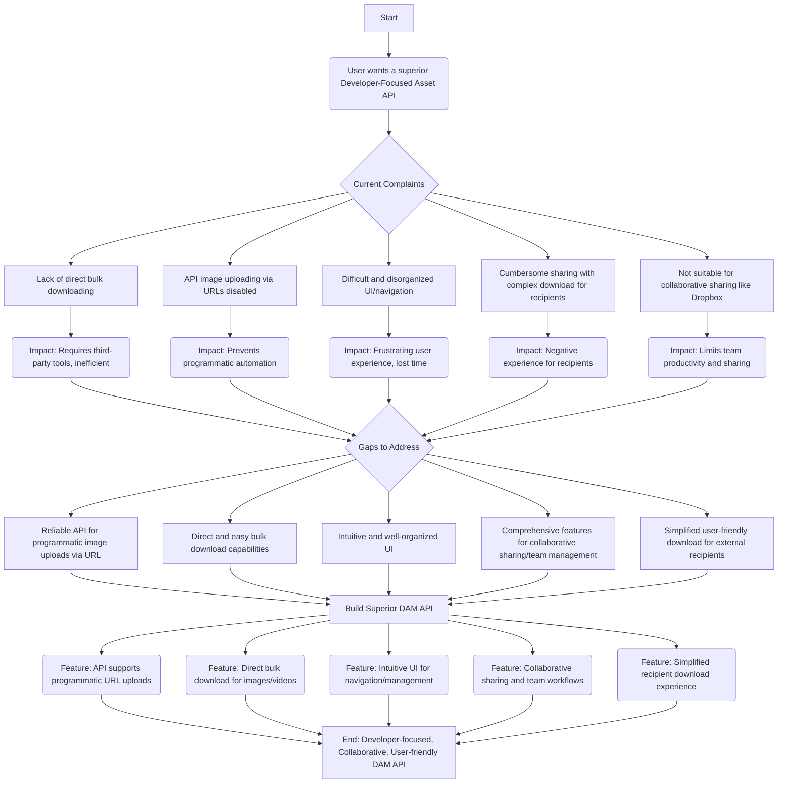

# Implementation Guide: Developer-Focused Asset API


## System Architecture

Our superior Developer-Focused Asset API is engineered as a robust, scalable, and API-first platform built on a PHP backend (leveraging a modern framework like Laravel for its MVC structure, ORM, and queueing system), a MySQL relational database for metadata management, and a highly intuitive frontend powered by Tailwind CSS and a reactive JavaScript framework (e.g., Vue.js or React.js).

The architecture comprises several interconnected layers:

1.  **API Gateway & Backend Core (PHP/Laravel):**
    *   **RESTful API Endpoints:** Implemented in PHP (Laravel) to provide a comprehensive suite of endpoints for asset CRUD operations, bulk actions, user management, sharing, and configuration. All endpoints are designed to be developer-friendly, following HATEOAS principles where appropriate, and secured with API keys and OAuth 2.0 for robust authentication and authorization.
    *   **Request Handling & Validation:** Utilizes Laravel's robust request validation to ensure data integrity and security, particularly for file uploads and URL-based asset ingestion.
    *   **Service Layer:** A clean separation of business logic into services for asset processing, user management, and sharing, ensuring modularity and maintainability.
    *   **Database ORM (Eloquent):** Interacts with MySQL to store all asset metadata (filenames, types, sizes, tags, versions, access permissions), user profiles, sharing configurations, and audit logs. Efficient indexing will be employed for rapid search and retrieval.

2.  **Asset Storage Layer:**
    *   **Abstracted Storage (Flysystem):** Employs a PHP storage abstraction layer (e.g., Laravel's Flysystem integration) to support multiple storage backends. This allows for flexible deployment, from local file systems for development to cloud object storage solutions like Amazon S3, Google Cloud Storage, or MinIO for production scalability and durability.
    *   **Secure Storage:** All assets are stored securely with appropriate access controls, preventing direct public access unless explicitly shared via generated links.

3.  **Asset Processing Engine (Asynchronous & Scalable):**
    *   **Job Queue (Redis/Beanstalkd):** Critical for handling computationally intensive tasks asynchronously. When an asset is uploaded (either directly or via URL) or a bulk operation (e.g., zipping) is initiated, a job is pushed to the queue. This prevents blocking the API response and improves user experience.
    *   **Image & Video Processing Workers:** Dedicated background workers consume jobs from the queue.
        *   **Image Processing:** Utilizes libraries like `Intervention/Image` or direct calls to `ImageMagick`/`GraphicsMagick` for operations such as resizing, cropping, format conversion, watermarking, and optimization (e.g., WebP conversion, compression).
        *   **Video Processing:** Leverages `FFmpeg` for transcoding, thumbnail generation, resolution adaptation, and optimization for various streaming contexts.
    *   **Metadata Extraction:** Automated extraction of EXIF/IPTC data for images and comprehensive video metadata.
    *   **Virus Scanning:** Optional integration with a virus scanning service for uploaded assets.

4.  **Content Delivery Network (CDN) Integration:**
    *   **Edge Caching:** Directly integrates with a global CDN (e.g., Cloudflare, Fastly, or direct CDN setup for S3 buckets) to serve optimized assets rapidly worldwide.
    *   **Image & Video Optimization:** CDN-level optimization (e.g., image resizing, compression, and format conversion on-the-fly) ensures the smallest possible file sizes are delivered for each device and bandwidth condition, enhancing user experience and reducing transfer costs.

5.  **Frontend Interface (Tailwind CSS / JavaScript Framework):**
    *   **Single-Page Application (SPA):** A reactive SPA built with a modern JavaScript framework (e.g., Vue.js or React.js) provides a dynamic, fluid, and highly responsive user experience.
    *   **Tailwind CSS:** Utilized for a highly customizable, utility-first CSS framework, enabling rapid development of a clean, modern, and intuitive user interface with consistent styling.
    *   **Client-side Asset Management:** Handles interactive folder navigation, drag-and-drop uploads, multi-select for bulk actions, and rich search/filtering interfaces.
    *   **Real-time Notifications:** Utilizes WebSockets (e.g., Laravel Echo) for real-time updates on job completion (e.g., bulk download ready, URL upload finished).

6.  **Search & Indexing (Elasticsearch/Meilisearch - Optional for advanced search):**
    *   For highly performant and complex search queries across rich metadata, an external search engine like Elasticsearch or Meilisearch can be integrated, syncing asset metadata for full-text search, faceted search, and advanced filtering.

## Problem-Solution

Our superior Developer-Focused Asset API is designed to directly address the identified complaints and gaps with technically sound, user-centric solutions:

1.  **Complaint: Lack of direct bulk downloading functionality for images and videos, requiring third-party programs.**
    *   **Solution:** We implement a dedicated API endpoint (`POST /assets/bulk-download`) that accepts an array of asset IDs or a folder ID. Upon receiving this request, the backend immediately dispatches an **asynchronous job** to the **Job Queue**. A dedicated **worker process** then retrieves the specified assets from the **Storage Layer**, dynamically creates a compressed archive (e.g., ZIP file) on a temporary storage location, and encrypts it if necessary. Once the archive is ready, a notification (via UI or webhook) is sent to the user, providing a **secure, time-limited download URL** (`GET /downloads/{token}`). This ensures the API remains responsive while large files are processed, and users receive a direct, single-click download link.

2.  **Complaint: API image uploading via URLs is disabled, despite the API being listed as available.**
    *   **Solution:** We provide a robust API endpoint (`POST /assets/upload-from-url`) that accepts a URL pointing to an external image or video. The PHP backend uses a secure HTTP client (e.g., Guzzle) to **fetch the asset asynchronously** to prevent blocking the API request. Critical steps include:
        *   **URL Validation:** Rigorous checks for valid URL format and prevention of Server-Side Request Forgery (SSRF) vulnerabilities.
        *   **Content-Type Verification:** Ensures the fetched content is indeed an image or video based on MIME types.
        *   **Size & Security Checks:** Limits file size and potentially integrates with an external service for malware scanning.
        *   **Asset Processing:** Once fetched, the asset enters the standard **Asset Processing Engine** pipeline for optimization, thumbnail generation, metadata extraction, and storage, just like a direct upload. The API returns a job ID, allowing developers to poll for status or receive a webhook notification upon completion.

3.  **Complaint: User interface and navigation are described as difficult and disorganized.**
    *   **Solution:** The **Frontend Interface** is built as a **Single-Page Application (SPA)** using a reactive JavaScript framework and styled with **Tailwind CSS**, prioritizing user experience.
        *   **Intuitive Folder Hierarchy:** Implemented with clear visual cues and drag-and-drop functionality for easy organization and navigation, mirroring a familiar desktop file system.
        *   **Powerful Search & Filtering:** Utilizes dynamic search capabilities with real-time results, supporting metadata filtering (tags, date, type, dimensions, custom fields) powered by efficient MySQL queries or an optional external search engine.
        *   **Customizable Views:** Users can switch between grid, list, and detail views, and save their preferred layouts.
        *   **Breadcrumbs & Quick Access:** Provides clear navigational breadcrumbs and a "favorites" or "recent assets" section for quick access.

4.  **Complaint: Sharing content is cumbersome due to a complex download process for recipients.**
    *   **Solution:** We introduce a "Share Link" feature that simplifies content delivery for recipients. Through the API or UI, users can generate **unique, public share URLs** (`GET /share/{token}`) for individual assets, selected groups of assets, or entire folders. These links can be configured with:
        *   **Password Protection:** Optional password for sensitive content.
        *   **Expiry Dates:** Automatic link invalidation after a set period.
        *   **Permissions:** Define if recipients can only view, download, or both.
        *   **Direct Access:** Recipients clicking the link land on a clean, simplified public page (styled with **Tailwind CSS**) where they can preview assets and initiate **direct bulk downloads** (using the same server-side zipping mechanism as internal bulk downloads) with a single click, requiring no login or complex steps.

5.  **Complaint: The tool is not suitable for collaborative sharing or as a replacement for mainstream sharing programs like Dropbox.**
    *   **Solution:** Our platform integrates comprehensive collaborative features:
        *   **Role-Based Access Control (RBAC):** Granular permissions managed in MySQL allow administrators to define specific roles (e.g., editor, viewer, uploader) and assign them to users or teams, controlling access to assets, folders, and features at a fine-grained level.
        *   **Team Management:** Support for creating teams, inviting members, and assigning collective permissions to shared workspaces or projects.
        *   **Asset Versioning:** The **MySQL database** tracks previous versions of assets, allowing users to revert to older states and view a full revision history.
        *   **Activity Logs:** A comprehensive audit trail logs all actions (uploads, downloads, shares, edits) by users, enhancing accountability and transparency.
        *   **Commenting & Annotation:** Future integration plans include a commenting system directly on assets for collaborative feedback, akin to mainstream sharing platforms.
        *   **Streamlined Sharing Workflows:** Beyond simple share links, we offer integrations via **webhooks** with other collaboration tools, allowing automated asset syncing or notification when new content is available or updated. This positions the API as a central "single source of truth" that can feed into existing team workflows.



```sql
-- MySQL 8.0 Database Schema for Superior Developer-Focused Asset API

-- This schema addresses the identified complaints and gaps, focusing on collaboration,
-- flexible asset management, sharing capabilities, and API-first design principles.

-- -----------------------------------------------------
-- Table `users`
-- Stores information about individual users who can log in and interact with the platform.
-- This is crucial for collaboration, access control, and audit trails.
-- -----------------------------------------------------
CREATE TABLE users (
    user_id BIGINT UNSIGNED AUTO_INCREMENT PRIMARY KEY,
    username VARCHAR(255) NOT NULL UNIQUE,
    email VARCHAR(255) NOT NULL UNIQUE,
    password_hash VARCHAR(255) NOT NULL, -- Stores hashed passwords for security
    first_name VARCHAR(255),
    last_name VARCHAR(255),
    profile_picture_url VARCHAR(2048), -- URL to user's profile image
    status ENUM('active', 'inactive', 'suspended') DEFAULT 'active' NOT NULL,
    created_at TIMESTAMP DEFAULT CURRENT_TIMESTAMP,
    updated_at TIMESTAMP DEFAULT CURRENT_TIMESTAMP ON UPDATE CURRENT_TIMESTAMP
) ENGINE=InnoDB DEFAULT CHARSET=utf8mb4 COLLATE=utf8mb4_unicode_ci;

-- -----------------------------------------------------
-- Table `organizations`
-- Represents a team or company. Assets, folders, and shared links belong to an organization,
-- facilitating multi-tenancy and team collaboration.
-- -----------------------------------------------------
CREATE TABLE organizations (
    org_id BIGINT UNSIGNED AUTO_INCREMENT PRIMARY KEY,
    org_name VARCHAR(255) NOT NULL UNIQUE,
    description TEXT,
    owner_user_id BIGINT UNSIGNED NOT NULL, -- The user who primarily manages/owns this organization
    created_at TIMESTAMP DEFAULT CURRENT_TIMESTAMP,
    updated_at TIMESTAMP DEFAULT CURRENT_TIMESTAMP ON UPDATE CURRENT_TIMESTAMP,
    FOREIGN KEY (owner_user_id) REFERENCES users(user_id) ON DELETE RESTRICT
) ENGINE=InnoDB DEFAULT CHARSET=utf8mb4 COLLATE=utf8mb4_unicode_ci;

-- -----------------------------------------------------
-- Table `organization_members`
-- Links users to organizations and defines their role (permissions) within that organization.
-- Supports collaborative sharing and team management.
-- -----------------------------------------------------
CREATE TABLE organization_members (
    member_id BIGINT UNSIGNED AUTO_INCREMENT PRIMARY KEY,
    org_id BIGINT UNSIGNED NOT NULL,
    user_id BIGINT UNSIGNED NOT NULL,
    role ENUM('owner', 'admin', 'editor', 'viewer') DEFAULT 'viewer' NOT NULL, -- Defines permissions (e.g., upload, edit, delete, view)
    joined_at TIMESTAMP DEFAULT CURRENT_TIMESTAMP,
    UNIQUE (org_id, user_id), -- A user can only be a member of an organization once with a single role
    FOREIGN KEY (org_id) REFERENCES organizations(org_id) ON DELETE CASCADE,
    FOREIGN KEY (user_id) REFERENCES users(user_id) ON DELETE CASCADE
) ENGINE=InnoDB DEFAULT CHARSET=utf8mb4 COLLATE=utf8mb4_unicode_ci;

-- -----------------------------------------------------
-- Table `folders`
-- Provides hierarchical organization for assets, mirroring a file system structure.
-- Addresses UI navigation and organization complaints.
-- -----------------------------------------------------
CREATE TABLE folders (
    folder_id BIGINT UNSIGNED AUTO_INCREMENT PRIMARY KEY,
    org_id BIGINT UNSIGNED NOT NULL,
    parent_folder_id BIGINT UNSIGNED, -- Self-referencing FK to enable nested folders (NULL for root folders)
    folder_name VARCHAR(255) NOT NULL,
    created_by_user_id BIGINT UNSIGNED,
    created_at TIMESTAMP DEFAULT CURRENT_TIMESTAMP,
    updated_at TIMESTAMP DEFAULT CURRENT_TIMESTAMP ON UPDATE CURRENT_TIMESTAMP,
    UNIQUE (org_id, parent_folder_id, folder_name), -- Folder names must be unique within their parent folder per organization
    FOREIGN KEY (org_id) REFERENCES organizations(org_id) ON DELETE CASCADE,
    FOREIGN KEY (parent_folder_id) REFERENCES folders(folder_id) ON DELETE CASCADE,
    FOREIGN KEY (created_by_user_id) REFERENCES users(user_id) ON DELETE SET NULL
) ENGINE=InnoDB DEFAULT CHARSET=utf8mb4 COLLATE=utf8mb4_unicode_ci;

-- -----------------------------------------------------
-- Table `assets`
-- The core table for all digital assets. Includes fields to support both direct uploads
-- and programmatic uploads via URL, versioning, and media-specific metadata.
-- Addresses API upload via URL and bulk download preparation.
-- -----------------------------------------------------
CREATE TABLE assets (
    asset_id BIGINT UNSIGNED AUTO_INCREMENT PRIMARY KEY,
    public_id VARCHAR(36) NOT NULL UNIQUE, -- A UUID for public API access and unique identification (e.g., 'a1b2c3d4-e5f6-7890-1234-567890abcdef')
    org_id BIGINT UNSIGNED NOT NULL,
    original_filename VARCHAR(255) NOT NULL,
    title VARCHAR(255), -- User-friendly title, can differ from filename
    description TEXT,
    storage_path VARCHAR(2048), -- Internal path or key (e.g., S3 object key, local file path)
    external_url VARCHAR(2048), -- URL if the asset is primarily hosted externally or uploaded via URL
    mime_type VARCHAR(255) NOT NULL,
    file_size_bytes BIGINT UNSIGNED NOT NULL,
    checksum VARCHAR(255), -- MD5 or SHA256 hash for integrity verification
    width INT UNSIGNED, -- Image/video width in pixels
    height INT UNSIGNED, -- Image/video height in pixels
    duration_seconds INT UNSIGNED, -- Video/audio duration in seconds
    uploaded_by_user_id BIGINT UNSIGNED,
    created_at TIMESTAMP DEFAULT CURRENT_TIMESTAMP,
    updated_at TIMESTAMP DEFAULT CURRENT_TIMESTAMP ON UPDATE CURRENT_TIMESTAMP,
    status ENUM('active', 'archived', 'deleted', 'processing') DEFAULT 'active' NOT NULL,
    current_version INT UNSIGNED DEFAULT 1 NOT NULL, -- Tracks the latest active version number
    is_url_asset BOOLEAN DEFAULT FALSE NOT NULL, -- TRUE if the asset originated from/is primarily an external_url
    FOREIGN KEY (org_id) REFERENCES organizations(org_id) ON DELETE CASCADE,
    FOREIGN KEY (uploaded_by_user_id) REFERENCES users(user_id) ON DELETE SET NULL
) ENGINE=InnoDB DEFAULT CHARSET=utf8mb4 COLLATE=utf8mb4_unicode_ci;

-- -----------------------------------------------------
-- Table `asset_versions`
-- Stores historical versions of assets, allowing rollback and tracking changes.
-- -----------------------------------------------------
CREATE TABLE asset_versions (
    version_id BIGINT UNSIGNED AUTO_INCREMENT PRIMARY KEY,
    asset_id BIGINT UNSIGNED NOT NULL,
    version_number INT UNSIGNED NOT NULL,
    storage_path VARCHAR(2048) NOT NULL, -- Specific storage path for this version
    file_size_bytes BIGINT UNSIGNED NOT NULL,
    checksum VARCHAR(255),
    created_at TIMESTAMP DEFAULT CURRENT_TIMESTAMP,
    uploaded_by_user_id BIGINT UNSIGNED,
    UNIQUE (asset_id, version_number), -- Ensures unique versioning per asset
    FOREIGN KEY (asset_id) REFERENCES assets(asset_id) ON DELETE CASCADE,
    FOREIGN KEY (uploaded_by_user_id) REFERENCES users(user_id) ON DELETE SET NULL
) ENGINE=InnoDB DEFAULT CHARSET=utf8mb4 COLLATE=utf8mb4_unicode_ci;

-- -----------------------------------------------------
-- Table `asset_folders`
-- A junction table allowing assets to reside in multiple folders.
-- Enhances organization and navigation flexibility.
-- -----------------------------------------------------
CREATE TABLE asset_folders (
    asset_folder_id BIGINT UNSIGNED AUTO_INCREMENT PRIMARY KEY,
    asset_id BIGINT UNSIGNED NOT NULL,
    folder_id BIGINT UNSIGNED NOT NULL,
    added_at TIMESTAMP DEFAULT CURRENT_TIMESTAMP,
    UNIQUE (asset_id, folder_id), -- An asset can only be linked to a specific folder once
    FOREIGN KEY (asset_id) REFERENCES assets(asset_id) ON DELETE CASCADE,
    FOREIGN KEY (folder_id) REFERENCES folders(folder_id) ON DELETE CASCADE
) ENGINE=InnoDB DEFAULT CHARSET=utf8mb4 COLLATE=utf8mb4_unicode_ci;

-- -----------------------------------------------------
-- Table `tags`
-- Defines custom tags for assets, enabling flexible categorization and search.
-- Addresses UI organization and discoverability.
-- -----------------------------------------------------
CREATE TABLE tags (
    tag_id BIGINT UNSIGNED AUTO_INCREMENT PRIMARY KEY,
    org_id BIGINT UNSIGNED NOT NULL, -- Tags can be specific to an organization
    tag_name VARCHAR(255) NOT NULL,
    created_by_user_id BIGINT UNSIGNED,
    created_at TIMESTAMP DEFAULT CURRENT_TIMESTAMP,
    UNIQUE (org_id, tag_name), -- Tag names must be unique within an organization
    FOREIGN KEY (org_id) REFERENCES organizations(org_id) ON DELETE CASCADE,
    FOREIGN KEY (created_by_user_id) REFERENCES users(user_id) ON DELETE SET NULL
) ENGINE=InnoDB DEFAULT CHARSET=utf8mb4 COLLATE=utf8mb4_unicode_ci;

-- -----------------------------------------------------
-- Table `asset_tags`
-- A junction table connecting assets to tags (many-to-many).
-- -----------------------------------------------------
CREATE TABLE asset_tags (
    asset_tag_id BIGINT UNSIGNED AUTO_INCREMENT PRIMARY KEY,
    asset_id BIGINT UNSIGNED NOT NULL,
    tag_id BIGINT UNSIGNED NOT NULL,
    assigned_at TIMESTAMP DEFAULT CURRENT_TIMESTAMP,
    UNIQUE (asset_id, tag_id), -- An asset can only have a specific tag once
    FOREIGN KEY (asset_id) REFERENCES assets(asset_id) ON DELETE CASCADE,
    FOREIGN KEY (tag_id) REFERENCES tags(tag_id) ON DELETE CASCADE
) ENGINE=InnoDB DEFAULT CHARSET=utf8mb4 COLLATE=utf8mb4_unicode_ci;

-- -----------------------------------------------------
-- Table `sharing_links`
-- Manages shareable links for assets or collections of assets/folders.
-- Directly addresses cumbersome sharing, simplified download, and bulk download.
-- -----------------------------------------------------
CREATE TABLE sharing_links (
    link_id BIGINT UNSIGNED AUTO_INCREMENT PRIMARY KEY,
    public_token VARCHAR(36) NOT NULL UNIQUE, -- A UUID used in the shareable URL (e.g., 'share-a1b2c3d4-e5f6-7890-1234-567890abcdef')
    org_id BIGINT UNSIGNED NOT NULL,
    shared_by_user_id BIGINT UNSIGNED,
    link_name VARCHAR(255), -- User-friendly name for the shared link (e.g., "Q3 Marketing Campaign Images")
    description TEXT,
    expires_at TIMESTAMP, -- NULL for permanent links, otherwise specifies expiration
    max_downloads INT UNSIGNED, -- NULL for unlimited downloads, otherwise limits total downloads
    current_downloads INT UNSIGNED DEFAULT 0 NOT NULL, -- Counter for actual downloads
    password_hash VARCHAR(255), -- Optional password protection for the link
    is_active BOOLEAN DEFAULT TRUE NOT NULL,
    allow_bulk_download BOOLEAN DEFAULT TRUE NOT NULL, -- Explicitly enables or disables bulk download for recipients
    is_download_only BOOLEAN DEFAULT FALSE NOT NULL, -- If TRUE, recipients are prompted to download directly, not view in browser
    created_at TIMESTAMP DEFAULT CURRENT_TIMESTAMP,
    updated_at TIMESTAMP DEFAULT CURRENT_TIMESTAMP ON UPDATE CURRENT_TIMESTAMP,
    FOREIGN KEY (org_id) REFERENCES organizations(org_id) ON DELETE CASCADE,
    FOREIGN KEY (shared_by_user_id) REFERENCES users(user_id) ON DELETE SET NULL
) ENGINE=InnoDB DEFAULT CHARSET=utf8mb4 COLLATE=utf8mb4_unicode_ci;

-- -----------------------------------------------------
-- Table `sharing_link_items`
-- Links assets and/or folders to a specific sharing link, creating custom collections.
-- -----------------------------------------------------
CREATE TABLE sharing_link_items (
    link_item_id BIGINT UNSIGNED AUTO_INCREMENT PRIMARY KEY,
    link_id BIGINT UNSIGNED NOT NULL,
    asset_id BIGINT UNSIGNED, -- NULL if the item is a folder
    folder_id BIGINT UNSIGNED, -- NULL if the item is an asset
    item_type ENUM('asset', 'folder') NOT NULL,
    added_at TIMESTAMP DEFAULT CURRENT_TIMESTAMP,
    -- Ensure each asset/folder is linked only once per share link
    UNIQUE (link_id, asset_id),
    UNIQUE (link_id, folder_id),
    FOREIGN KEY (link_id) REFERENCES sharing_links(link_id) ON DELETE CASCADE,
    FOREIGN KEY (asset_id) REFERENCES assets(asset_id) ON DELETE CASCADE,
    FOREIGN KEY (folder_id) REFERENCES folders(folder_id) ON DELETE CASCADE,
    -- Constraint to ensure exactly one of asset_id or folder_id is not NULL
    CONSTRAINT chk_asset_or_folder_not_null CHECK (asset_id IS NOT NULL OR folder_id IS NOT NULL),
    CONSTRAINT chk_asset_xor_folder_null CHECK (NOT (asset_id IS NOT NULL AND folder_id IS NOT NULL))
) ENGINE=InnoDB DEFAULT CHARSET=utf8mb4 COLLATE=utf8mb4_unicode_ci;

-- -----------------------------------------------------
-- Table `activity_logs`
-- Comprehensive audit trail for all significant actions performed on the platform.
-- Essential for tracking workflows, security, and debugging.
-- -----------------------------------------------------
CREATE TABLE activity_logs (
    log_id BIGINT UNSIGNED AUTO_INCREMENT PRIMARY KEY,
    user_id BIGINT UNSIGNED, -- NULL if action is system-generated or by an unauthenticated recipient
    org_id BIGINT UNSIGNED, -- NULL if action is global or not organization-specific
    asset_id BIGINT UNSIGNED, -- NULL if action not related to a specific asset
    folder_id BIGINT UNSIGNED, -- NULL if action not related to a specific folder
    sharing_link_id BIGINT UNSIGNED, -- NULL if action not related to a specific sharing link
    action_type VARCHAR(255) NOT NULL, -- e.g., 'asset_uploaded', 'asset_downloaded', 'folder_created', 'share_link_accessed', 'user_registered'
    details JSON, -- Stores additional contextual information as JSON (e.g., old_value, new_value, IP address, user_agent)
    timestamp TIMESTAMP DEFAULT CURRENT_TIMESTAMP,
    FOREIGN KEY (user_id) REFERENCES users(user_id) ON DELETE SET NULL,
    FOREIGN KEY (org_id) REFERENCES organizations(org_id) ON DELETE SET NULL,
    FOREIGN KEY (asset_id) REFERENCES assets(asset_id) ON DELETE SET NULL,
    FOREIGN KEY (folder_id) REFERENCES folders(folder_id) ON DELETE SET NULL,
    FOREIGN KEY (sharing_link_id) REFERENCES sharing_links(link_id) ON DELETE SET NULL
) ENGINE=InnoDB DEFAULT CHARSET=utf8mb4 COLLATE=utf8mb4_unicode_ci;

-- -----------------------------------------------------
-- Table `configurations`
-- Stores dynamic settings, including global application configurations,
-- organization-specific settings, and individual user preferences.
-- -----------------------------------------------------
CREATE TABLE configurations (
    config_id BIGINT UNSIGNED AUTO_INCREMENT PRIMARY KEY,
    org_id BIGINT UNSIGNED, -- NULL for global settings
    user_id BIGINT UNSIGNED, -- NULL for org/global settings
    config_key VARCHAR(255) NOT NULL,
    config_value TEXT, -- Stores configuration values (can be JSON for complex settings)
    created_at TIMESTAMP DEFAULT CURRENT_TIMESTAMP,
    updated_at TIMESTAMP DEFAULT CURRENT_TIMESTAMP ON UPDATE CURRENT_TIMESTAMP,
    -- Ensures unique settings based on their scope (global, organization, or user)
    UNIQUE (org_id, user_id, config_key),
    FOREIGN KEY (org_id) REFERENCES organizations(org_id) ON DELETE CASCADE,
    FOREIGN KEY (user_id) REFERENCES users(user_id) ON DELETE CASCADE
) ENGINE=InnoDB DEFAULT CHARSET=utf8mb4 COLLATE=utf8mb4_unicode_ci;
```

To build a superior "Developer-Focused Asset API" that addresses the identified complaints and gaps, the strategy will leverage a combination of a robust internal PHP/MySQL backend and specialized third-party APIs for media handling, optimization, and delivery. This hybrid approach ensures scalability, performance, and a rich feature set while allowing our core application to focus on user experience and business logic.

---

### API Integration Strategy

**I. Core Media Asset Management, Optimization & Delivery (Cloudinary)**

To address:
*   **API image uploading via URLs is disabled:** Cloudinary provides direct API support for this.
*   **Lack of direct bulk downloading functionality:** Cloudinary can generate on-demand ZIP archives.
*   **Simplified and user-friendly download experience for external recipients:** Cloudinary's optimized asset URLs and ZIP generation, combined with our frontend, facilitate this.
*   **Scalable storage, transformations, and global CDN delivery.**

**Chosen API:** **Cloudinary** (or a similar service like DatoCMS Images API, Transloadit for specific functions)

**Integration Details:**

1.  **Programmatic Asset Upload (Direct & via URL):**
    *   **Endpoint:** Cloudinary Upload API (`https://api.cloudinary.com/v1_1/<cloud_name>/image/upload` or `/video/upload`).
    *   **PHP Backend Role:**
        *   Our PHP backend will expose an internal API endpoint (e.g., `/api/assets/upload`) that accepts either a direct file upload (multipart/form-data) or a remote URL.
        *   **Direct Upload:** For files submitted from the UI, our PHP server will temporarily receive the file and then proxy it to Cloudinary's Upload API. For highly optimized client-side uploads, Cloudinary's unsigned upload mechanism can be integrated directly from the frontend, reducing server load.
        *   **Upload via URL (Automation):** If the request includes a `url` parameter, our PHP backend will send this URL directly to Cloudinary's `file` parameter. Cloudinary will then fetch the asset from the provided URL and store it.
    *   **Response Handling:** Upon successful upload, Cloudinary returns a `public_id`, secure URL, format, dimensions, etc. Our PHP backend will store this crucial metadata (especially `public_id`) in our MySQL database, linked to the asset's owner, folder, and any custom metadata.

2.  **Dynamic Asset Retrieval & Optimization (CDN Delivery):**
    *   **Endpoint:** Cloudinary Delivery URLs (generated dynamically).
    *   **PHP Backend Role:** Our PHP application will store the Cloudinary `public_id` for each asset. When a user requests an asset, our PHP backend will construct a Cloudinary delivery URL using this `public_id` and desired transformations (e.g., `c_fill,w_800,h_600,f_auto`).
    *   **Client-Side Integration:** The frontend (Tailwind) will receive these optimized URLs directly from our PHP API and embed them in image `src` or video `source` tags.
    *   **Benefits:** This enables on-the-fly resizing, cropping, format conversion (e.g., to WebP for images, adaptive streaming for videos), quality adjustment, and other transformations. All assets are delivered via Cloudinary's global Content Delivery Network (CDN), ensuring high performance and low latency.

3.  **Direct & Bulk Download Capabilities:**
    *   **Endpoint:** Cloudinary Admin API (for resource management and archive creation).
    *   **PHP Backend Role:**
        *   **Single Asset Download:** Our PHP backend will generate a direct download link for a single asset using Cloudinary's signed URL capabilities (if secure downloads are needed) or simply constructing a delivery URL with a `fl_attachment` flag for browser download.
        *   **Bulk Download:** When a user selects multiple assets or a folder for bulk download, our PHP backend will collect the `public_id`s of the selected assets. It will then make an API call to Cloudinary (e.g., using Cloudinary's SDK for PHP) to generate a ZIP archive of these assets. Cloudinary provides a temporary, pre-signed URL to download the generated ZIP file.
    *   **Client-Side Integration:** Our frontend will trigger the PHP backend endpoint for bulk download. Upon receiving the Cloudinary ZIP URL, the frontend will redirect the user or provide a direct download button, simplifying the process for both internal users and external recipients.

**II. Collaborative Sharing & Team Management (Internal PHP/MySQL)**

To address:
*   **Tool not suitable for collaborative sharing or as a replacement for mainstream sharing programs:** Implement robust internal features.
*   **Comprehensive features for collaborative sharing, team management, and streamlined workflows:** Core business logic managed internally.

**Chosen Approach:** Custom PHP/MySQL Implementation

**Integration Details:**

1.  **User, Team, and Role Management:**
    *   **MySQL Schema:** Design tables for `users`, `teams`, `team_members` (pivot table for many-to-many), `roles`, `permissions`, and `role_permissions`.
    *   **PHP Backend Role:**
        *   Implement user authentication, registration, and profile management.
        *   Develop API endpoints for creating, managing, and deleting teams.
        *   Implement a robust Role-Based Access Control (RBAC) system to define roles (e.g., Admin, Editor, Viewer) within teams and assign granular permissions to these roles (e.g., `can_upload`, `can_delete`, `can_share`, `can_view_metadata`).
        *   Associate assets and folders with specific teams or users and enforce permissions at the API level for every action (upload, modify, delete, share, download).

2.  **Folder & Asset Structure Management:**
    *   **MySQL Schema:** Design tables for `folders` (parent-child relationships for nested folders) and `assets` (linking to `folders`, `users`, `teams`, and Cloudinary `public_id`).
    *   **PHP Backend Role:**
        *   Provide API endpoints for creating, renaming, moving, and deleting folders.
        *   Implement endpoints for associating assets with folders.
        *   Ensure that all folder and asset operations respect the defined user/team permissions.

3.  **Shareable Links & External Access:**
    *   **MySQL Schema:** Create a `share_links` table to store unique share tokens, associated asset/folder IDs, expiry dates, password hashes (if applicable), and access statistics.
    *   **PHP Backend Role:**
        *   Implement API endpoints to generate unique, secure, and configurable share links for individual assets or entire folders.
        *   Share link options will include: expiry dates, password protection, and view-only vs. download access.
        *   When an external recipient accesses a share link, our PHP backend will validate the link, check permissions/password, and then present a simplified public viewing/download interface (frontend). This interface will leverage Cloudinary's optimized asset URLs and bulk download ZIP capabilities as described in I.4.

4.  **Activity Logging & Version Control:**
    *   **MySQL Schema:** A `activity_logs` table to track user actions (upload, download, share, delete, modify metadata).
    *   **PHP Backend Role:** Log all significant operations.
    *   **Versioning:** Integrate with Cloudinary's versioning feature. When an asset is updated, Cloudinary can create a new version. Our PHP backend can store references to these versions, allowing users to view and restore previous states of an asset.

**III. User Interface & Navigation (Leveraging APIs for a Superior UX)**

To address:
*   **User interface and navigation are described as difficult and disorganized:** A well-designed internal API will empower a clean frontend.
*   **Intuitive and well-organized user interface for efficient navigation and folder management:** Frontend driven by a robust backend API.

**Chosen Approach:** Our PHP Backend's Internal RESTful API for the Tailwind Frontend

**Integration Details:**

1.  **Consistent RESTful API:**
    *   **PHP Backend Role:** Design a clean, predictable, and versioned RESTful API (e.g., `/api/v1/assets`, `/api/v1/folders`, `/api/v1/shares`, `/api/v1/teams`).
    *   **Endpoints will support:**
        *   Standard CRUD operations (GET, POST, PUT, DELETE).
        *   Pagination, filtering, and sorting parameters for efficient data retrieval.
        *   Clear error responses and status codes.
    *   **Benefits:** This standardized API will greatly simplify frontend development, allowing the Tailwind UI to fetch, display, and manage assets and folders efficiently.

2.  **Asynchronous Operations & Notifications:**
    *   **PHP Backend Role:** For long-running operations (e.g., large bulk ZIP generation, extensive video processing via Cloudinary), our API endpoints will return an immediate `202 Accepted` status.
    *   **Mechanism:** Implement webhooks from Cloudinary (for processing completion) or an internal polling mechanism where the frontend can periodically check the status of a task ID returned by our API.
    *   **Client-Side Integration:** The Tailwind frontend will use loading indicators and notify users of task completion without blocking the UI.

This comprehensive API integration strategy ensures a powerful, scalable, and developer-friendly asset management platform that directly tackles all identified shortcomings. By offloading media processing to a specialized service like Cloudinary, we can focus our PHP development on building a superior user experience and robust collaboration features.

```php
<?php

declare(strict_types=1);

// This structure outlines core PHP interfaces and classes for a Developer-Focused Digital Asset Management API.
// It addresses the identified complaints and gaps by providing specific functionalities
// such as bulk downloads, URL-based uploads, and a foundation for collaborative features.

// region -------------------- 1. Core Domain Interfaces/Models --------------------

/**
 * Interface AssetInterface
 * Represents a digital asset managed by the system.
 */
interface AssetInterface
{
    public function getId(): int;
    public function getName(): string;
    public function getFilename(): string;
    public function getMimeType(): string;
    public function getSize(): int; // Size in bytes
    public function getPath(): string; // Path/identifier in the storage system
    public function getOwnerId(): int;
    public function getFolderId(): ?int; // Null if in root or unassigned
    public function getCreatedAt(): DateTimeImmutable;
    public function getUpdatedAt(): DateTimeImmutable;
    public function getMetadata(): array; // Arbitrary key-value pairs
    public function getStatus(): string; // e.g., 'pending', 'ready', 'processing', 'failed'

    public function setName(string $name): void;
    public function setFolderId(?int $folderId): void;
    public function setMetadata(array $metadata): void;
    public function setStatus(string $status): void;
}

/**
 * Interface UserInterface
 * Represents a system user, crucial for authentication and authorization.
 */
interface UserInterface
{
    public function getId(): int;
    public function getUsername(): string;
    public function getEmail(): string;
    public function getTeamId(): ?int; // Null if not part of a team
    public function getRoles(): array; // e.g., ['admin', 'member', 'guest']

    public function setUsername(string $username): void;
    public function setEmail(string $email): void;
    public function setTeamId(?int $teamId): void;
    public function addRole(string $role): void;
    public function removeRole(string $role): void;
}

/**
 * Interface TeamInterface
 * Represents a collaborative team, enabling shared asset management and permissions.
 * Addresses Gap: Comprehensive features for collaborative sharing, team management.
 */
interface TeamInterface
{
    public function getId(): int;
    public function getName(): string;
    public function getOwnerId(): int; // The user ID of the team owner
    public function getCreatedAt(): DateTimeImmutable;
    public function getUpdatedAt(): DateTimeImmutable;

    public function setName(string $name): void;
}

/**
 * Interface FolderInterface
 * Represents a directory for organizing assets, improving UI/navigation.
 * Addresses Gap: An intuitive and well-organized user interface for efficient navigation and folder management.
 */
interface FolderInterface
{
    public function getId(): int;
    public function getName(): string;
    public function getParentId(): ?int; // Null if root folder
    public function getOwnerId(): int; // The user ID who created the folder
    public function getTeamId(): ?int; // Null if personal folder
    public function getCreatedAt(): DateTimeImmutable;
    public function getUpdatedAt(): DateTimeImmutable;

    public function setName(string $name): void;
    public function setParentId(?int $parentId): void;
}

/**
 * Interface ShareLinkInterface
 * Represents a sharable link for assets or folders, simplifying content distribution.
 * Addresses Complaint: Sharing content is cumbersome.
 * Addresses Gap: Simplified and user-friendly download experience for external recipients.
 */
interface ShareLinkInterface
{
    public function getId(): int;
    public function getToken(): string; // Unique, short token for the URL
    public function getAssetIds(): array; // List of asset IDs included in the share
    public function getFolderIds(): array; // List of folder IDs included in the share
    public function getExpiresAt(): ?DateTimeImmutable; // Null for no expiration
    public function isPublic(): bool; // True if accessible without login
    public function isPasswordProtected(): bool; // True if a password is required
    public function getPasswordHash(): ?string; // Hashed password if protected
    public function getCreatedAt(): DateTimeImmutable;
    public function getCreatedByUserId(): int;

    public function setExpiresAt(?DateTimeImmutable $expiresAt): void;
    public function setIsPublic(bool $isPublic): void;
    public function setPassword(?string $password): void; // Handles hashing internally, sets isPasswordProtected
}

// endregion

// region -------------------- 2. Infrastructure / Driver Interfaces --------------------

/**
 * Interface StorageDriverInterface
 * Defines contracts for interacting with various storage backends (e.g., local filesystem, S3, Azure Blob).
 * Essential for bulk downloading and API uploads via URL.
 */
interface StorageDriverInterface
{
    /**
     * Stores a file from a local path to the target storage path.
     * @param string $localPath The path to the temporary local file.
     * @param string $targetPath The desired path in the storage (e.g., 'users/1/assets/image.jpg').
     * @param array $options Additional options for storage (e.g., ACL, content-type).
     * @return string The actual path/identifier where the file was stored.
     * @throws StorageException
     */
    public function store(string $localPath, string $targetPath, array $options = []): string;

    /**
     * Stores a file by downloading it from a given URL to the target storage path.
     * Addresses Gap: A reliable and fully functional API that supports programmatic image uploads via URL for automation.
     * @param string $url The URL of the file to download and store.
     * @param string $targetPath The desired path in the storage.
     * @param array $options Additional options for storage.
     * @return string The actual path/identifier where the file was stored.
     * @throws StorageException
     * @throws InvalidUrlException If the provided URL is invalid or unreachable.
     */
    public function storeFromUrl(string $url, string $targetPath, array $options = []): string;

    /**
     * Retrieves a file from storage, returning its content or a stream/temporary local path.
     * @param string $path The path to the file in storage.
     * @return string The content of the file or a path to a temporary local file.
     * @throws StorageException
     */
    public function retrieve(string $path): string;

    /**
     * Deletes a file from storage.
     * @param string $path The path to the file in storage.
     * @return bool True on success, false otherwise.
     * @throws StorageException
     */
    public function delete(string $path): bool;

    /**
     * Generates a public or pre-signed URL for accessing the stored file.
     * @param string $path The path to the file in storage.
     * @param int|null $expiresInSeconds Optional expiration time in seconds for signed URLs.
     * @return string The public/signed URL.
     * @throws StorageException
     */
    public function getPublicUrl(string $path, int $expiresInSeconds = null): string;

    /**
     * Generates a temporary, time-limited URL for direct download of a single file.
     * @param string $path The path to the file in storage.
     * @param int $expiresInSeconds Expiration time for the URL.
     * @return string The temporary download URL.
     * @throws StorageException
     */
    public function getTemporaryDownloadUrl(string $path, int $expiresInSeconds): string;

    /**
     * Creates and returns a URL to a downloadable archive (e.g., ZIP) containing multiple files.
     * Addresses Complaint: Lack of direct bulk downloading functionality.
     * Addresses Gap: Direct and easy bulk download capabilities for users and recipients.
     * @param array<string> $paths An array of storage paths for files to include.
     * @param string $archiveName The desired filename for the archive (e.g., "my_assets.zip").
     * @param int $expiresInSeconds Expiration time for the URL.
     * @return string The URL to the generated bulk download archive.
     * @throws StorageException
     */
    public function getBulkDownloadArchiveUrl(array $paths, string $archiveName, int $expiresInSeconds): string;
}

/**
 * Interface AssetProcessingDriverInterface
 * Defines contracts for processing (e.g., resizing, optimizing, watermarking) assets.
 */
interface AssetProcessingDriverInterface
{
    /**
     * Processes an asset based on a set of transformations.
     * This might involve creating a new asset version or modifying the existing one.
     * @param AssetInterface $asset The asset to process.
     * @param array $transformations An array of transformation definitions (e.g., ['resize' => ['width' => 100]]).
     * @return AssetInterface The processed asset (might be a new asset or updated original).
     * @throws AssetProcessingException
     */
    public function processAsset(AssetInterface $asset, array $transformations): AssetInterface;

    /**
     * Generates a thumbnail for an asset.
     * @param AssetInterface $asset The asset to generate a thumbnail for.
     * @param int $width Desired thumbnail width.
     * @param int $height Desired thumbnail height.
     * @return string The storage path to the generated thumbnail.
     * @throws AssetProcessingException
     */
    public function generateThumbnail(AssetInterface $asset, int $width, int $height): string;

    /**
     * Optimizes an asset (e.g., compression, format conversion) for web delivery.
     * @param AssetInterface $asset The asset to optimize.
     * @return AssetInterface The optimized asset (might be a new asset or updated original).
     * @throws AssetProcessingException
     */
    public function optimizeAsset(AssetInterface $asset): AssetInterface;
}

/**
 * Interface AccessControlDriverInterface
 * Defines contracts for checking user/team permissions on resources.
 */
interface AccessControlDriverInterface
{
    /**
     * Checks if a user has permission to perform an action on a resource.
     * @param UserInterface $user The user attempting the action.
     * @param string $action The action being attempted (e.g., 'view_asset', 'edit_folder', 'delete_share_link').
     * @param object $resource The resource being acted upon (AssetInterface, FolderInterface, ShareLinkInterface).
     * @return bool True if the user has permission, false otherwise.
     */
    public function can(UserInterface $user, string $action, object $resource): bool;
}

/**
 * Interface EventDispatcherInterface
 * Defines contracts for dispatching events within the application, useful for automation and integrations.
 */
interface EventDispatcherInterface
{
    /**
     * Dispatches an event to registered listeners.
     * @param string $eventName The name of the event (e.g., 'asset.uploaded', 'sharelink.created').
     * @param array $payload Data associated with the event.
     */
    public function dispatch(string $eventName, array $payload): void;
}

// endregion

// region -------------------- 3. Core Application Services --------------------

/**
 * Class AssetService
 * Manages all asset-related business logic, including uploads, retrieval, updates, and bulk operations.
 * Central to addressing most asset-specific complaints and gaps.
 */
class AssetService
{
    protected StorageDriverInterface $storageDriver;
    protected AssetProcessingDriverInterface $assetProcessor;
    protected AccessControlDriverInterface $aclDriver;
    protected EventDispatcherInterface $eventDispatcher;
    // In a real application, this would be an interface (e.g., AssetRepositoryInterface)
    protected object $assetRepository; 

    public function __construct(
        StorageDriverInterface $storageDriver,
        AssetProcessingDriverInterface $assetProcessor,
        AccessControlDriverInterface $aclDriver,
        EventDispatcherInterface $eventDispatcher,
        object $assetRepository
    ) {
        $this->storageDriver = $storageDriver;
        $this->assetProcessor = $assetProcessor;
        $this->aclDriver = $aclDriver;
        $this->eventDispatcher = $eventDispatcher;
        $this->assetRepository = $assetRepository;
    }

    /**
     * Creates a new asset by uploading a local file (e.g., from an HTTP POST request).
     * @param UserInterface $user The user initiating the upload.
     * @param string $localPath Path to the temporary uploaded file on the server.
     * @param string $originalFilename The original filename provided by the client.
     * @param string $mimeType The MIME type of the file.
     * @param int|null $folderId Optional folder ID to assign the asset to.
     * @param array $metadata Optional additional metadata for the asset.
     * @return AssetInterface
     * @throws UnauthorizedException
     * @throws InvalidFileException
     * @throws StorageException
     */
    public function createAssetFromFile(
        UserInterface $user,
        string $localPath,
        string $originalFilename,
        string $mimeType,
        ?int $folderId = null,
        array $metadata = []
    ): AssetInterface { /* ... implementation ... */ return new class implements AssetInterface { /* mock */ public function getId(): int { return 1; } public function getName(): string { return ''; } public function getFilename(): string { return ''; } public function getMimeType(): string { return ''; } public function getSize(): int { return 0; } public function getPath(): string { return ''; } public function getOwnerId(): int { return 0; } public function getFolderId(): ?int { return null; } public function getCreatedAt(): DateTimeImmutable { return new DateTimeImmutable(); } public function getUpdatedAt(): DateTimeImmutable { return new DateTimeImmutable(); } public function getMetadata(): array { return []; } public function getStatus(): string { return ''; } public function setName(string $name): void {} public function setFolderId(?int $folderId): void {} public function setMetadata(array $metadata): void {} public function setStatus(string $status): void {} }; }

    /**
     * Creates a new asset by downloading a file from a URL.
     * Addresses Gap: Reliable API for programmatic image uploads via URL for automation.
     * Addresses Complaint: API image uploading via URLs is disabled.
     * @param UserInterface $user The user initiating the upload.
     * @param string $url The URL of the file to download.
     * @param string|null $filename Optional desired filename. If null, derive from URL.
     * @param int|null $folderId Optional folder ID.
     * @param array $metadata Optional additional metadata.
     * @return AssetInterface
     * @throws UnauthorizedException
     * @throws InvalidUrlException
     * @throws StorageException
     */
    public function createAssetFromUrl(
        UserInterface $user,
        string $url,
        ?string $filename = null,
        ?int $folderId = null,
        array $metadata = []
    ): AssetInterface { /* ... implementation ... */ return new class implements AssetInterface { /* mock */ public function getId(): int { return 1; } public function getName(): string { return ''; } public function getFilename(): string { return ''; } public function getMimeType(): string { return ''; } public function getSize(): int { return 0; } public function getPath(): string { return ''; } public function getOwnerId(): int { return 0; } public function getFolderId(): ?int { return null; } public function getCreatedAt(): DateTimeImmutable { return new DateTimeImmutable(); } public function getUpdatedAt(): DateTimeImmutable { return new DateTimeImmutable(); } public function getMetadata(): array { return []; } public function getStatus(): string { return ''; } public function setName(string $name): void {} public function setFolderId(?int $folderId): void {} public function setMetadata(array $metadata): void {} public function setStatus(string $status): void {} }; }

    /**
     * Retrieves an asset by its ID.
     * @param int $id The asset ID.
     * @param UserInterface $user The user requesting the asset (for ACL).
     * @return AssetInterface
     * @throws AssetNotFoundException
     * @throws UnauthorizedException
     */
    public function getAsset(int $id, UserInterface $user): AssetInterface
    { /* ... implementation ... */ return new class implements AssetInterface { /* mock */ public function getId(): int { return 1; } public function getName(): string { return ''; } public function getFilename(): string { return ''; } public function getMimeType(): string { return ''; } public function getSize(): int { return 0; } public function getPath(): string { return ''; } public function getOwnerId(): int { return 0; } public function getFolderId(): ?int { return null; } public function getCreatedAt(): DateTimeImmutable { return new DateTimeImmutable(); } public function getUpdatedAt(): DateTimeImmutable { return new DateTimeImmutable(); } public function getMetadata(): array { return []; } public function getStatus(): string { return ''; } public function setName(string $name): void {} public function setFolderId(?int $folderId): void {} public function setMetadata(array $metadata): void {} public function setStatus(string $status): void {} }; }

    /**
     * Updates an asset's metadata or properties.
     * @param int $id The asset ID.
     * @param array $data Data to update (e.g., 'name', 'folderId', 'metadata').
     * @param UserInterface $user The user performing the update.
     * @return AssetInterface
     * @throws AssetNotFoundException
     * @throws UnauthorizedException
     */
    public function updateAsset(int $id, array $data, UserInterface $user): AssetInterface
    { /* ... implementation ... */ return new class implements AssetInterface { /* mock */ public function getId(): int { return 1; } public function getName(): string { return ''; } public function getFilename(): string { return ''; } public function getMimeType(): string { return ''; } public function getSize(): int { return 0; } public function getPath(): string { return ''; } public function getOwnerId(): int { return 0; } public function getFolderId(): ?int { return null; } public function getCreatedAt(): DateTimeImmutable { return new DateTimeImmutable(); } public function getUpdatedAt(): DateTimeImmutable { return new DateTimeImmutable(); } public function getMetadata(): array { return []; } public function getStatus(): string { return ''; } public function setName(string $name): void {} public function setFolderId(?int $folderId): void {} public function setMetadata(array $metadata): void {} public function setStatus(string $status): void {} }; }

    /**
     * Deletes an asset from the system and storage.
     * @param int $id The asset ID.
     * @param UserInterface $user The user performing the deletion.
     * @return bool True on successful deletion.
     * @throws AssetNotFoundException
     * @throws UnauthorizedException
     * @throws StorageException
     */
    public function deleteAsset(int $id, UserInterface $user): bool
    { /* ... implementation ... */ return true; }

    /**
     * Gets a list of assets within a specific folder accessible by the user.
     * @param int $folderId The folder ID.
     * @param UserInterface $user The user requesting the assets.
     * @return AssetInterface[]
     * @throws FolderNotFoundException
     * @throws UnauthorizedException
     */
    public function getAssetsByFolder(int $folderId, UserInterface $user): array
    { /* ... implementation ... */ return []; }

    /**
     * Prepares a bulk download link for multiple assets.
     * Addresses Complaint: Lack of direct bulk downloading functionality.
     * Addresses Gap: Direct and easy bulk download capabilities for users and recipients.
     * @param array<int> $assetIds An array of asset IDs to include in the bulk download.
     * @param UserInterface $user The user requesting the bulk download.
     * @param string $archiveName Desired name for the archive file.
     * @param int $expiresInSeconds How long the download link is valid for.
     * @return string A temporary URL for downloading the archive.
     * @throws AssetNotFoundException If any asset is not found.
     * @throws UnauthorizedException If the user doesn't have access to all specified assets.
     * @throws StorageException
     */
    public function prepareBulkDownload(
        array $assetIds,
        UserInterface $user,
        string $archiveName = 'assets.zip',
        int $expiresInSeconds = 3600
    ): string { /* ... implementation ... */ return 'http://example.com/download-bulk-assets-token'; }

    /**
     * Applies processing (e.g., resizing, optimization) to an asset.
     * @param AssetInterface $asset The asset to process.
     * @param array $transformations Transformation parameters.
     * @param UserInterface $user The user initiating the processing.
     * @return AssetInterface The updated asset.
     * @throws UnauthorizedException
     * @throws AssetProcessingException
     */
    public function applyProcessing(AssetInterface $asset, array $transformations, UserInterface $user): AssetInterface
    { /* ... implementation ... */ return $asset; }
}

/**
 * Class FolderService
 * Manages all folder-related business logic, impacting UI and navigation.
 * Addresses Gap: An intuitive and well-organized user interface for efficient navigation and folder management.
 */
class FolderService
{
    protected AccessControlDriverInterface $aclDriver;
    // In a real application, this would be an interface (e.g., FolderRepositoryInterface)
    protected object $folderRepository; 

    public function __construct(AccessControlDriverInterface $aclDriver, object $folderRepository)
    {
        $this->aclDriver = $aclDriver;
        $this->folderRepository = $folderRepository;
    }

    /**
     * Creates a new folder.
     * @param UserInterface $user The user creating the folder.
     * @param string $name The name of the folder.
     * @param int|null $parentId Optional parent folder ID.
     * @param int|null $teamId Optional team ID if creating a team folder.
     * @return FolderInterface
     * @throws UnauthorizedException
     * @throws FolderNotFoundException If parentId is invalid.
     */
    public function createFolder(
        UserInterface $user,
        string $name,
        ?int $parentId = null,
        ?int $teamId = null
    ): FolderInterface { /* ... implementation ... */ return new class implements FolderInterface { /* mock */ public function getId(): int { return 1; } public function getName(): string { return ''; } public function getParentId(): ?int { return null; } public function getOwnerId(): int { return 0; } public function getTeamId(): ?int { return null; } public function getCreatedAt(): DateTimeImmutable { return new DateTimeImmutable(); } public function getUpdatedAt(): DateTimeImmutable { return new DateTimeImmutable(); } public function setName(string $name): void {} public function setParentId(?int $parentId): void {} }; }

    /**
     * Retrieves a folder by its ID.
     * @param int $id The folder ID.
     * @param UserInterface $user The user requesting the folder (for ACL).
     * @return FolderInterface
     * @throws FolderNotFoundException
     * @throws UnauthorizedException
     */
    public function getFolder(int $id, UserInterface $user): FolderInterface
    { /* ... implementation ... */ return new class implements FolderInterface { /* mock */ public function getId(): int { return 1; } public function getName(): string { return ''; } public function getParentId(): ?int { return null; } public function getOwnerId(): int { return 0; } public function getTeamId(): ?int { return null; } public function getCreatedAt(): DateTimeImmutable { return new DateTimeImmutable(); } public function getUpdatedAt(): DateTimeImmutable { return new DateTimeImmutable(); } public function setName(string $name): void {} public function setParentId(?int $parentId): void {} }; }

    /**
     * Updates a folder's properties.
     * @param int $id The folder ID.
     * @param array $data Data to update (e.g., 'name', 'parentId').
     * @param UserInterface $user The user performing the update.
     * @return FolderInterface
     * @throws FolderNotFoundException
     * @throws UnauthorizedException
     */
    public function updateFolder(int $id, array $data, UserInterface $user): FolderInterface
    { /* ... implementation ... */ return new class implements FolderInterface { /* mock */ public function getId(): int { return 1; } public function getName(): string { return ''; } public function getParentId(): ?int { return null; } public function getOwnerId(): int { return 0; } public function getTeamId(): ?int { return null; } public function getCreatedAt(): DateTimeImmutable { return new DateTimeImmutable(); } public function getUpdatedAt(): DateTimeImmutable { return new DateTimeImmutable(); } public function setName(string $name): void {} public function setParentId(?int $parentId): void {} }; }

    /**
     * Deletes a folder (and optionally its contents).
     * @param int $id The folder ID.
     * @param UserInterface $user The user performing the deletion.
     * @param bool $forceDeleteContents If true, also delete assets/subfolders within.
     * @return bool True on success.
     * @throws FolderNotFoundException
     * @throws UnauthorizedException
     * @throws StorageException
     * @throws FolderNotEmptyException If forceDeleteContents is false and folder is not empty.
     */
    public function deleteFolder(int $id, UserInterface $user, bool $forceDeleteContents = false): bool
    { /* ... implementation ... */ return true; }

    /**
     * Gets all folders accessible by the user.
     * @param UserInterface $user The user requesting the folders.
     * @param int|null $parentId Optional, to get subfolders of a specific parent.
     * @return FolderInterface[]
     */
    public function getFoldersByUser(UserInterface $user, ?int $parentId = null): array
    { /* ... implementation ... */ return []; }
}

/**
 * Class ShareService
 * Manages the creation and management of share links.
 * Addresses Complaint: Sharing content is cumbersome.
 * Addresses Gap: Simplified and user-friendly download experience for external recipients of shared media.
 */
class ShareService
{
    protected StorageDriverInterface $storageDriver;
    protected AccessControlDriverInterface $aclDriver;
    // In a real application, these would be interfaces for data repositories
    protected object $shareLinkRepository; 
    protected object $assetRepository; 
    protected object $folderRepository; 

    public function __construct(
        StorageDriverInterface $storageDriver,
        AccessControlDriverInterface $aclDriver,
        object $shareLinkRepository,
        object $assetRepository,
        object $folderRepository
    ) {
        $this->storageDriver = $storageDriver;
        $this->aclDriver = $aclDriver;
        $this->shareLinkRepository = $shareLinkRepository;
        $this->assetRepository = $assetRepository;
        $this->folderRepository = $folderRepository;
    }

    /**
     * Creates a new share link for a collection of assets and/or folders.
     * @param UserInterface $user The user creating the share link.
     * @param array<int> $assetIds List of asset IDs to share.
     * @param array<int> $folderIds List of folder IDs to share.
     * @param array $options Options like 'expiresAt' (DateTimeImmutable), 'isPublic' (bool), 'password' (string).
     * @return ShareLinkInterface
     * @throws UnauthorizedException If the user cannot share specified assets/folders.
     * @throws AssetNotFoundException If any asset is not found.
     * @throws FolderNotFoundException If any folder is not found.
     */
    public function createShareLink(
        UserInterface $user,
        array $assetIds = [],
        array $folderIds = [],
        array $options = []
    ): ShareLinkInterface { /* ... implementation ... */ return new class implements ShareLinkInterface { /* mock */ public function getId(): int { return 1; } public function getToken(): string { return ''; } public function getAssetIds(): array { return []; } public function getFolderIds(): array { return []; } public function getExpiresAt(): ?DateTimeImmutable { return null; } public function isPublic(): bool { return false; } public function isPasswordProtected(): bool { return false; } public function getPasswordHash(): ?string { return null; } public function getCreatedAt(): DateTimeImmutable { return new DateTimeImmutable(); } public function getCreatedByUserId(): int { return 0; } public function setExpiresAt(?DateTimeImmutable $expiresAt): void {} public function setIsPublic(bool $isPublic): void {} public function setPassword(?string $password): void {} }; }

    /**
     * Retrieves a share link by its token.
     * @param string $token The share link token.
     * @return ShareLinkInterface
     * @throws ShareLinkNotFoundException
     * @throws ShareLinkExpiredException If the link has expired.
     */
    public function getShareLinkByToken(string $token): ShareLinkInterface
    { /* ... implementation ... */ return new class implements ShareLinkInterface { /* mock */ public function getId(): int { return 1; } public function getToken(): string { return ''; } public function getAssetIds(): array { return []; } public function getFolderIds(): array { return []; } public function getExpiresAt(): ?DateTimeImmutable { return null; } public function isPublic(): bool { return false; } public function isPasswordProtected(): bool { return false; } public function getPasswordHash(): ?string { return null; } public function getCreatedAt(): DateTimeImmutable { return new DateTimeImmutable(); } public function getCreatedByUserId(): int { return 0; } public function setExpiresAt(?DateTimeImmutable $expiresAt): void {} public function setIsPublic(bool $isPublic): void {} public function setPassword(?string $password): void {} }; }

    /**
     * Retrieves the content (assets and folders) associated with a share link.
     * @param ShareLinkInterface $link The share link object.
     * @param string|null $password Optional password if the link is protected.
     * @return array An associative array with 'assets' (AssetInterface[]) and 'folders' (FolderInterface[]).
     * @throws ShareLinkUnauthorizedException If a password is required and not provided/incorrect.
     */
    public function getSharedContent(ShareLinkInterface $link, ?string $password = null): array
    { /* ... implementation ... */ return ['assets' => [], 'folders' => []]; }

    /**
     * Generates a single bulk download URL for all content within a share link.
     * Addresses Gap: Simplified and user-friendly download experience for external recipients of shared media.
     * @param ShareLinkInterface $link The share link.
     * @param string|null $password Optional password for protected links.
     * @param int $expiresInSeconds How long the download link is valid for.
     * @return string The URL to download the archive.
     * @throws ShareLinkUnauthorizedException If password is required and not provided/incorrect.
     * @throws StorageException
     */
    public function getSharedContentBulkDownloadUrl(
        ShareLinkInterface $link,
        ?string $password = null,
        int $expiresInSeconds = 3600
    ): string { /* ... implementation ... */ return 'http://example.com/download-shared-archive-token'; }

    /**
     * Invalidates (deactivates) a share link.
     * @param int $id The ID of the share link to invalidate.
     * @param UserInterface $user The user performing the action (for ACL).
     * @return bool True on success.
     * @throws ShareLinkNotFoundException
     * @throws UnauthorizedException
     */
    public function invalidateShareLink(int $id, UserInterface $user): bool
    { /* ... implementation ... */ return true; }
}

/**
 * Class UserService
 * Manages user accounts and authentication.
 */
class UserService
{
    // In a real application, this would be an interface (e.g., UserRepositoryInterface)
    protected object $userRepository; 

    public function __construct(object $userRepository)
    {
        $this->userRepository = $userRepository;
    }

    /**
     * Creates a new user account.
     * @param string $username
     * @param string $email
     * @param string $password The plain text password to be hashed.
     * @param array $roles Optional roles for the user.
     * @return UserInterface
     * @throws UserAlreadyExistsException
     */
    public function createUser(string $username, string $email, string $password, array $roles = ['member']): UserInterface
    { /* ... implementation ... */ return new class implements UserInterface { /* mock */ public function getId(): int { return 1; } public function getUsername(): string { return ''; } public function getEmail(): string { return ''; } public function getTeamId(): ?int { return null; } public function getRoles(): array { return []; } public function setUsername(string $username): void {} public function setEmail(string $email): void {} public function setTeamId(?int $teamId): void {} public function addRole(string $role): void {} public function removeRole(string $role): void {} }; }

    /**
     * Authenticates a user.
     * @param string $username
     * @param string $password The plain text password.
     * @return UserInterface
     * @throws UserNotFoundException
     * @throws InvalidCredentialsException
     */
    public function authenticate(string $username, string $password): UserInterface
    { /* ... implementation ... */ return new class implements UserInterface { /* mock */ public function getId(): int { return 1; } public function getUsername(): string { return ''; } public function getEmail(): string { return ''; } public function getTeamId(): ?int { return null; } public function getRoles(): array { return []; } public function setUsername(string $username): void {} public function setEmail(string $email): void {} public function setTeamId(?int $teamId): void {} public function addRole(string $role): void {} public function removeRole(string $role): void {} }; }

    /**
     * Retrieves a user by ID.
     * @param int $id
     * @return UserInterface
     * @throws UserNotFoundException
     */
    public function getUser(int $id): UserInterface
    { /* ... implementation ... */ return new class implements UserInterface { /* mock */ public function getId(): int { return 1; } public function getUsername(): string { return ''; } public function getEmail(): string { return ''; } public function getTeamId(): ?int { return null; } public function getRoles(): array { return []; } public function setUsername(string $username): void {} public function setEmail(string $email): void {} public function setTeamId(?int $teamId): void {} public function addRole(string $role): void {} public function removeRole(string $role): void {} }; }

    /**
     * Updates user details.
     * @param int $id
     * @param array $data Data to update (e.g., 'email', 'password').
     * @param UserInterface $actingUser The user performing the update (for ACL).
     * @return UserInterface
     * @throws UserNotFoundException
     * @throws UnauthorizedException
     */
    public function updateUser(int $id, array $data, UserInterface $actingUser): UserInterface
    { /* ... implementation ... */ return new class implements UserInterface { /* mock */ public function getId(): int { return 1; } public function getUsername(): string { return ''; } public function getEmail(): string { return ''; } public function getTeamId(): ?int { return null; } public function getRoles(): array { return []; } public function setUsername(string $username): void {} public function setEmail(string $email): void {} public function setTeamId(?int $teamId): void {} public function addRole(string $role): void {} public function removeRole(string $role): void {} }; }
}

/**
 * Class TeamService
 * Manages teams and team membership.
 * Addresses Gap: Comprehensive features for collaborative sharing, team management.
 */
class TeamService
{
    protected AccessControlDriverInterface $aclDriver;
    // In a real application, these would be interfaces for data repositories
    protected object $teamRepository; 
    protected object $userRepository; 

    public function __construct(
        AccessControlDriverInterface $aclDriver,
        object $teamRepository,
        object $userRepository
    ) {
        $this->aclDriver = $aclDriver;
        $this->teamRepository = $teamRepository;
        $this->userRepository = $userRepository;
    }

    /**
     * Creates a new team.
     * @param UserInterface $owner The user creating and owning the team.
     * @param string $name The name of the team.
     * @return TeamInterface
     * @throws UnauthorizedException
     */
    public function createTeam(UserInterface $owner, string $name): TeamInterface
    { /* ... implementation ... */ return new class implements TeamInterface { /* mock */ public function getId(): int { return 1; } public function getName(): string { return ''; } public function getOwnerId(): int { return 0; } public function getCreatedAt(): DateTimeImmutable { return new DateTimeImmutable(); } public function getUpdatedAt(): DateTimeImmutable { return new DateTimeImmutable(); } public function setName(string $name): void {} }; }

    /**
     * Adds a user to a team.
     * @param TeamInterface $team The team to add the user to.
     * @param UserInterface $userToAdd The user to add.
     * @param string $role The role of the user within the team (e.g., 'member', 'admin').
     * @param UserInterface $actingUser The user performing the action (for ACL).
     * @return bool True on success.
     * @throws UnauthorizedException
     * @throws TeamNotFoundException
     * @throws UserNotFoundException
     * @throws UserAlreadyInTeamException
     */
    public function addTeamMember(TeamInterface $team, UserInterface $userToAdd, string $role, UserInterface $actingUser): bool
    { /* ... implementation ... */ return true; }

    /**
     * Removes a user from a team.
     * @param TeamInterface $team The team to remove the user from.
     * @param UserInterface $userToRemove The user to remove.
     * @param UserInterface $actingUser The user performing the action (for ACL).
     * @return bool True on success.
     * @throws UnauthorizedException
     * @throws TeamNotFoundException
     * @throws UserNotFoundException
     * @throws UserNotInTeamException
     */
    public function removeTeamMember(TeamInterface $team, UserInterface $userToRemove, UserInterface $actingUser): bool
    { /* ... implementation ... */ return true; }

    /**
     * Retrieves a team by ID.
     * @param int $id The team ID.
     * @param UserInterface $actingUser The user requesting the team (for ACL).
     * @return TeamInterface
     * @throws TeamNotFoundException
     * @throws UnauthorizedException
     */
    public function getTeam(int $id, UserInterface $actingUser): TeamInterface
    { /* ... implementation ... */ return new class implements TeamInterface { /* mock */ public function getId(): int { return 1; } public function getName(): string { return ''; } public function getOwnerId(): int { return 0; } public function getCreatedAt(): DateTimeImmutable { return new DateTimeImmutable(); } public function getUpdatedAt(): DateTimeImmutable { return new DateTimeImmutable(); } public function setName(string $name): void {} }; }

    /**
     * Gets all members of a specific team.
     * @param TeamInterface $team The team.
     * @param UserInterface $actingUser The user requesting the members (for ACL).
     * @return UserInterface[]
     * @throws UnauthorizedException
     * @throws TeamNotFoundException
     */
    public function getTeamMembers(TeamInterface $team, UserInterface $actingUser): array
    { /* ... implementation ... */ return []; }
}

// endregion

// region -------------------- 4. Custom Exceptions --------------------

// Base custom exception for the application
class AssetApiException extends Exception {}

class AssetNotFoundException extends AssetApiException {}
class FolderNotFoundException extends AssetApiException {}
class UserNotFoundException extends AssetApiException {}
class UnauthorizedException extends AssetApiException {}
class InvalidFileException extends AssetApiException {}
class InvalidUrlException extends AssetApiException {}
class StorageException extends AssetApiException {}
class ShareLinkNotFoundException extends AssetApiException {}
class ShareLinkExpiredException extends AssetApiException {}
class ShareLinkUnauthorizedException extends AssetApiException {} // e.g., incorrect password
class AssetProcessingException extends AssetApiException {}
class FolderNotEmptyException extends AssetApiException {}
class UserAlreadyExistsException extends AssetApiException {}
class InvalidCredentialsException extends AssetApiException {}
class TeamNotFoundException extends AssetApiException {}
class UserAlreadyInTeamException extends AssetApiException {}
class UserNotInTeamException extends AssetApiException {}

// endregion
```

Addressing the identified complaints and gaps requires a robust frontend that simplifies user interaction, streamlines workflows, and leverages the underlying API capabilities. Below are key frontend implementation snippets using Tailwind CSS, focusing on user experience and efficiency for a superior Developer-Focused Asset API.

---

### **1. Programmatic Image Uploads via URL**

To address the lack of API image uploading via URLs, the frontend needs a dedicated interface for users to submit URLs for asset ingestion. This allows for automation and integration with other tools.

**Frontend Component: URL Upload Form**

```html
<!-- Upload via URL Component -->
<div class="bg-gray-800 p-6 rounded-lg shadow-xl mb-8 border border-purple-600">
    <h3 class="text-xl font-semibold text-white mb-4">Upload Asset via URL</h3>
    <p class="text-gray-400 mb-4 text-sm">Automate asset ingestion by providing a direct URL to an image or video.</p>
    
    <div class="flex flex-col md:flex-row gap-4">
        <input 
            type="url" 
            placeholder="Paste asset URL here (e.g., https://example.com/image.jpg)"
            class="flex-grow p-3 rounded-md bg-gray-700 text-white placeholder-gray-500 border border-gray-600 focus:border-purple-500 focus:ring-1 focus:ring-purple-500 outline-none transition-all duration-200"
            id="asset-url-input"
            required
        />
        <button 
            class="px-6 py-3 bg-purple-600 text-white font-medium rounded-md hover:bg-purple-700 focus:outline-none focus:ring-2 focus:ring-purple-500 focus:ring-offset-2 focus:ring-offset-gray-800 transition-all duration-200"
            onclick="uploadAssetFromUrl()"
        >
            Upload from URL
        </button>
    </div>
    <p id="url-upload-status" class="mt-3 text-sm text-gray-400"></p>
</div>

<!-- Placeholder for JavaScript to handle the upload logic -->
<script>
    function uploadAssetFromUrl() {
        const urlInput = document.getElementById('asset-url-input');
        const statusElement = document.getElementById('url-upload-status');
        const assetUrl = urlInput.value.trim();

        if (!assetUrl) {
            statusElement.textContent = 'Please enter a valid URL.';
            statusElement.classList.remove('text-green-500', 'text-red-500');
            statusElement.classList.add('text-yellow-500');
            return;
        }

        statusElement.textContent = 'Uploading...';
        statusElement.classList.remove('text-yellow-500', 'text-red-500');
        statusElement.classList.add('text-blue-500');

        // In a real application, you would make an API call here.
        // Example:
        // fetch('/api/assets/upload-from-url', {
        //     method: 'POST',
        //     headers: { 'Content-Type': 'application/json' },
        //     body: JSON.stringify({ url: assetUrl })
        // })
        // .then(response => response.json())
        // .then(data => {
        //     if (data.success) {
        //         statusElement.textContent = 'Upload successful! Asset ID: ' + data.assetId;
        //         statusElement.classList.remove('text-blue-500', 'text-yellow-500', 'text-red-500');
        //         statusElement.classList.add('text-green-500');
        //         urlInput.value = ''; // Clear input
        //         // Optionally refresh asset list
        //     } else {
        //         statusElement.textContent = 'Upload failed: ' + (data.message || 'Unknown error.');
        //         statusElement.classList.remove('text-blue-500', 'text-yellow-500', 'text-green-500');
        //         statusElement.classList.add('text-red-500');
        //     }
        // })
        // .catch(error => {
        //     console.error('Error during URL upload:', error);
        //     statusElement.textContent = 'Network error or server issue. Please try again.';
        //     statusElement.classList.remove('text-blue-500', 'text-yellow-500', 'text-green-500');
        //     statusElement.classList.add('text-red-500');
        // });

        // Simulate API call for demonstration
        setTimeout(() => {
            const success = Math.random() > 0.3; // Simulate success/failure
            if (success) {
                statusElement.textContent = `Upload successful! Processing asset from: ${assetUrl.substring(0, 30)}...`;
                statusElement.classList.remove('text-blue-500', 'text-yellow-500', 'text-red-500');
                statusElement.classList.add('text-green-500');
                urlInput.value = '';
            } else {
                statusElement.textContent = 'Upload failed. Ensure the URL is valid and publicly accessible.';
                statusElement.classList.remove('text-blue-500', 'text-yellow-500', 'text-green-500');
                statusElement.classList.add('text-red-500');
            }
        }, 1500);
    }
</script>
```

---

### **2. Direct and Easy Bulk Download Capabilities**

Users frequently need to download multiple assets at once. Providing a clear selection mechanism and a bulk download button significantly improves efficiency.

**Frontend Component: Asset Grid with Bulk Selection & Download**

```html
<!-- Asset Gallery with Bulk Download Controls -->
<div class="bg-gray-800 p-6 rounded-lg shadow-xl mb-8 border border-purple-600">
    <div class="flex items-center justify-between mb-6">
        <h3 class="text-xl font-semibold text-white">Your Assets</h3>
        <div class="flex items-center space-x-3">
            <button 
                class="px-4 py-2 bg-gray-700 text-gray-200 rounded-md hover:bg-gray-600 focus:outline-none focus:ring-2 focus:ring-gray-500 transition-all duration-200"
                onclick="selectAllAssets()"
            >
                Select All
            </button>
            <button 
                class="px-5 py-2 bg-purple-600 text-white font-medium rounded-md hover:bg-purple-700 focus:outline-none focus:ring-2 focus:ring-purple-500 focus:ring-offset-2 focus:ring-offset-gray-800 transition-all duration-200 disabled:opacity-50 disabled:cursor-not-allowed"
                id="bulk-download-btn"
                disabled
                onclick="initiateBulkDownload()"
            >
                Download Selected (0)
            </button>
        </div>
    </div>

    <!-- Asset Grid -->
    <div class="grid grid-cols-2 sm:grid-cols-3 md:grid-cols-4 lg:grid-cols-5 xl:grid-cols-6 gap-4" id="asset-grid">
        <!-- Example Asset Card (repeat for each asset) -->
        <div class="relative group bg-gray-700 rounded-lg overflow-hidden shadow-md hover:shadow-lg transition-all duration-200 border border-gray-600 hover:border-purple-500 cursor-pointer asset-card">
            <input 
                type="checkbox" 
                class="absolute top-2 left-2 z-10 form-checkbox h-5 w-5 text-purple-600 bg-gray-900 border-gray-600 rounded focus:ring-purple-500"
                onchange="toggleAssetSelection(this)"
                data-asset-id="asset-123"
            >
            
            <div class="p-3">
                <p class="text-sm font-medium text-white truncate">image-001.jpg</p>
                <p class="text-xs text-gray-400">1.2 MB</p>
            </div>
            <div class="absolute inset-0 bg-black bg-opacity-0 group-hover:bg-opacity-25 transition-all duration-300 flex items-center justify-center opacity-0 group-hover:opacity-100">
                <button class="text-white bg-purple-600 p-2 rounded-full hidden group-hover:block hover:bg-purple-700">
                    <svg class="w-5 h-5" fill="none" stroke="currentColor" viewBox="0 0 24 24" xmlns="http://www.w3.org/2000/svg"><path stroke-linecap="round" stroke-linejoin="round" stroke-width="2" d="M15 13l-3 3m0 0l-3-3m3 3V8m0 13a9 9 0 110-18 9 9 0 010 18z"></path></svg>
                </button>
            </div>
        </div>
        <!-- ... more asset cards ... -->
         <div class="relative group bg-gray-700 rounded-lg overflow-hidden shadow-md hover:shadow-lg transition-all duration-200 border border-gray-600 hover:border-purple-500 cursor-pointer asset-card">
            <input 
                type="checkbox" 
                class="absolute top-2 left-2 z-10 form-checkbox h-5 w-5 text-purple-600 bg-gray-900 border-gray-600 rounded focus:ring-purple-500"
                onchange="toggleAssetSelection(this)"
                data-asset-id="asset-124"
            >
            
            <div class="p-3">
                <p class="text-sm font-medium text-white truncate">report-graphic.png</p>
                <p class="text-xs text-gray-400">850 KB</p>
            </div>
            <div class="absolute inset-0 bg-black bg-opacity-0 group-hover:bg-opacity-25 transition-all duration-300 flex items-center justify-center opacity-0 group-hover:opacity-100">
                <button class="text-white bg-purple-600 p-2 rounded-full hidden group-hover:block hover:bg-purple-700">
                    <svg class="w-5 h-5" fill="none" stroke="currentColor" viewBox="0 0 24 24" xmlns="http://www.w3.org/2000/svg"><path stroke-linecap="round" stroke-linejoin="round" stroke-width="2" d="M15 13l-3 3m0 0l-3-3m3 3V8m0 13a9 9 0 110-18 9 9 0 010 18z"></path></svg>
                </button>
            </div>
        </div>
    </div>
</div>

<!-- Placeholder for JavaScript to handle bulk selection and download -->
<script>
    let selectedAssets = new Set();
    const bulkDownloadBtn = document.getElementById('bulk-download-btn');

    function updateBulkDownloadButton() {
        const count = selectedAssets.size;
        bulkDownloadBtn.textContent = `Download Selected (${count})`;
        if (count > 0) {
            bulkDownloadBtn.removeAttribute('disabled');
        } else {
            bulkDownloadBtn.setAttribute('disabled', 'true');
        }
    }

    function toggleAssetSelection(checkbox) {
        const assetId = checkbox.dataset.assetId;
        if (checkbox.checked) {
            selectedAssets.add(assetId);
        } else {
            selectedAssets.delete(assetId);
        }
        updateBulkDownloadButton();
    }

    function selectAllAssets() {
        const checkboxes = document.querySelectorAll('#asset-grid .asset-card input[type="checkbox"]');
        checkboxes.forEach(checkbox => {
            checkbox.checked = true;
            selectedAssets.add(checkbox.dataset.assetId);
        });
        updateBulkDownloadButton();
    }

    function initiateBulkDownload() {
        if (selectedAssets.size === 0) {
            alert('Please select at least one asset to download.');
            return;
        }
        
        // In a real application, you would make an API call to initiate a bulk download.
        // The backend would typically generate a ZIP file or provide a manifest.
        alert(`Initiating bulk download for assets: ${Array.from(selectedAssets).join(', ')}`);
        
        // Example API call:
        // fetch('/api/assets/bulk-download', {
        //     method: 'POST',
        //     headers: { 'Content-Type': 'application/json' },
        //     body: JSON.stringify({ assetIds: Array.from(selectedAssets) })
        // })
        // .then(response => {
        //     if (response.ok) {
        //         return response.blob(); // Expecting a blob for a file download
        //     }
        //     throw new Error('Bulk download failed.');
        // })
        // .then(blob => {
        //     const url = window.URL.createObjectURL(blob);
        //     const a = document.createElement('a');
        //     a.style.display = 'none';
        //     a.href = url;
        //     a.download = 'assets_bulk_download.zip'; // Suggest a filename
        //     document.body.appendChild(a);
        //     a.click();
        //     window.URL.revokeObjectURL(url);
        //     // Optionally, clear selection after download
        //     selectedAssets.clear();
        //     document.querySelectorAll('#asset-grid .asset-card input[type="checkbox"]').forEach(cb => cb.checked = false);
        //     updateBulkDownloadButton();
        // })
        // .catch(error => {
        //     console.error('Error during bulk download:', error);
        //     alert('Failed to initiate bulk download. Please try again.');
        // });
    }

    // Initialize button state on load
    updateBulkDownloadButton();
</script>
```

---

### **3. Intuitive and Well-Organized User Interface for Navigation and Folder Management**

A disorganized UI is a major complaint. A clear layout with easy navigation and folder management is crucial.

**Frontend Components: Sidebar, Breadcrumbs, Search, and Asset Grid Layout**

```html
<!-- Main Application Layout (Simplified) -->
<div class="flex h-screen bg-gray-900 text-gray-200 font-sans">

    <!-- Sidebar Navigation -->
    <aside class="w-64 bg-gray-800 p-6 shadow-lg border-r border-gray-700 flex flex-col">
        <div class="text-2xl font-bold text-white mb-8">AssetFlow</div>
        <nav class="flex-grow">
            <ul class="space-y-2">
                <li>
                    <a href="#" class="flex items-center p-3 rounded-md bg-purple-700 text-white font-medium hover:bg-purple-600 transition-colors duration-200">
                        <svg class="w-5 h-5 mr-3" fill="none" stroke="currentColor" viewBox="0 0 24 24" xmlns="http://www.w3.org/2000/svg"><path stroke-linecap="round" stroke-linejoin="round" stroke-width="2" d="M3 12l2-2m0 0l7-7 7 7M5 10v10a1 1 0 001 1h3m10-11l2 2m-2-2v10a1 1 0 01-1 1h-3m-6 0a1 1 0 001-1v-4a1 1 0 011-1h2a1 1 0 011 1v4a1 1 0 001 1m-6 0h6"></path></svg>
                        All Assets
                    </a>
                </li>
                <li>
                    <a href="#" class="flex items-center p-3 rounded-md text-gray-300 hover:bg-gray-700 hover:text-white transition-colors duration-200">
                        <svg class="w-5 h-5 mr-3" fill="none" stroke="currentColor" viewBox="0 0 24 24" xmlns="http://www.w3.org/2000/svg"><path stroke-linecap="round" stroke-linejoin="round" stroke-width="2" d="M3 7v10a2 2 0 002 2h14a2 2 0 002-2V9a2 2 0 00-2-2h-6l-2-2H5a2 2 0 00-2 2z"></path></svg>
                        Folders
                    </a>
                </li>
                <li>
                    <a href="#" class="flex items-center p-3 rounded-md text-gray-300 hover:bg-gray-700 hover:text-white transition-colors duration-200">
                        <svg class="w-5 h-5 mr-3" fill="none" stroke="currentColor" viewBox="0 0 24 24" xmlns="http://www.w3.org/2000/svg"><path stroke-linecap="round" stroke-linejoin="round" stroke-width="2" d="M8 7V3m8 4V3m-9 8h10M5 21h14a2 2 0 002-2V7a2 2 0 00-2-2H5a2 2 0 00-2 2v12a2 2 0 002 2z"></path></svg>
                        Recent
                    </a>
                </li>
                 <li>
                    <a href="#" class="flex items-center p-3 rounded-md text-gray-300 hover:bg-gray-700 hover:text-white transition-colors duration-200">
                        <svg class="w-5 h-5 mr-3" fill="none" stroke="currentColor" viewBox="0 0 24 24" xmlns="http://www.w3.org/2000/svg"><path stroke-linecap="round" stroke-linejoin="round" stroke-width="2" d="M10 6H5a2 2 0 00-2 2v9a2 2 0 002 2h14a2 2 0 002-2V8a2 2 0 00-2-2h-5m-4 0V5a2 2 0 114 0v1m-4 0h4"></path></svg>
                        Shared With Me
                    </a>
                </li>
            </ul>
        </nav>
        <div class="mt-auto">
            <a href="#" class="flex items-center p-3 rounded-md text-gray-300 hover:bg-gray-700 hover:text-white transition-colors duration-200">
                 <svg class="w-5 h-5 mr-3" fill="none" stroke="currentColor" viewBox="0 0 24 24" xmlns="http://www.w3.org/2000/svg"><path stroke-linecap="round" stroke-linejoin="round" stroke-width="2" d="M10.325 4.317c.426-1.756 2.924-1.756 3.35 0a1.724 1.724 0 002.573 1.066c1.543-.94 3.31.826 2.37 2.37a1.724 1.724 0 001.065 2.572c1.756.426 1.756 2.924 0 3.35a1.724 1.724 0 00-1.066 2.573c.94 1.543-.826 3.31-2.37 2.37a1.724 1.724 0 00-2.572 1.065c-.426 1.756-2.924 1.756-3.35 0a1.724 1.724 0 00-2.573-1.066c-1.543.94-3.31-.826-2.37-2.37a1.724 1.724 0 00-1.065-2.572c-1.756-.426-1.756-2.924 0-3.35a1.724 1.724 0 001.066-2.573c-.94-1.543.826-3.31 2.37-2.37.96-.583 2.155-.742 2.572-1.065z"></path><path stroke-linecap="round" stroke-linejoin="round" stroke-width="2" d="M15 12a3 3 0 11-6 0 3 3 0 016 0z"></path></svg>
                Settings
            </a>
        </div>
    </aside>

    <!-- Main Content Area -->
    <main class="flex-1 overflow-auto p-8">
        <!-- Header with Breadcrumbs and Search -->
        <header class="mb-8 flex flex-col md:flex-row items-start md:items-center justify-between">
            <!-- Breadcrumbs -->
            <nav class="text-sm font-medium mb-4 md:mb-0">
                <ol class="list-none p-0 inline-flex">
                    <li class="flex items-center">
                        <a href="#" class="text-gray-400 hover:text-white">Home</a>
                        <span class="mx-2 text-gray-500">/</span>
                    </li>
                    <li class="flex items-center">
                        <a href="#" class="text-gray-400 hover:text-white">Projects</a>
                        <span class="mx-2 text-gray-500">/</span>
                    </li>
                    <li class="flex items-center">
                        <span class="text-white">Project Mars Landing Page</span>
                    </li>
                </ol>
            </nav>

            <!-- Search Bar -->
            <div class="relative w-full md:w-auto">
                <input 
                    type="text" 
                    placeholder="Search assets..." 
                    class="w-full pl-10 pr-4 py-2 rounded-md bg-gray-700 text-white placeholder-gray-500 border border-gray-600 focus:border-purple-500 focus:ring-1 focus:ring-purple-500 outline-none transition-all duration-200"
                />
                <svg class="absolute left-3 top-1/2 -translate-y-1/2 w-5 h-5 text-gray-400" fill="none" stroke="currentColor" viewBox="0 0 24 24" xmlns="http://www.w3.org/2000/svg"><path stroke-linecap="round" stroke-linejoin="round" stroke-width="2" d="M21 21l-6-6m2-5a7 7 0 11-14 0 7 7 0 0114 0z"></path></svg>
            </div>
        </header>

        <!-- Content Area for assets, folders, etc. -->
        <div class="bg-gray-800 p-6 rounded-lg shadow-xl border border-purple-600 min-h-[calc(100vh-180px)]">
            <h2 class="text-2xl font-bold text-white mb-6">Project Mars Landing Page Assets</h2>
            
            <!-- Folder Management Controls (New Folder, Upload, etc.) -->
            <div class="flex flex-wrap gap-3 mb-6">
                <button class="px-4 py-2 bg-blue-600 text-white rounded-md hover:bg-blue-700 flex items-center">
                    <svg class="w-5 h-5 mr-2" fill="none" stroke="currentColor" viewBox="0 0 24 24" xmlns="http://www.w3.org/2000/svg"><path stroke-linecap="round" stroke-linejoin="round" stroke-width="2" d="M9 13h6m-3-3v6m5 5H7a2 2 0 01-2-2V5a2 2 0 012-2h5.586a1 1 0 01.707.293l5.414 5.414a1 1 0 01.293.707V19a2 2 0 01-2 2z"></path></svg>
                    New Folder
                </button>
                <button class="px-4 py-2 bg-green-600 text-white rounded-md hover:bg-green-700 flex items-center">
                    <svg class="w-5 h-5 mr-2" fill="none" stroke="currentColor" viewBox="0 0 24 24" xmlns="http://www.w3.org/2000/svg"><path stroke-linecap="round" stroke-linejoin="round" stroke-width="2" d="M4 16v1a3 3 0 003 3h10a3 3 0 003-3v-1m-4-8l-4-4m0 0L8 8m4-4v12"></path></svg>
                    Upload Files
                </button>
            </div>

            <!-- Folders Display -->
            <div class="grid grid-cols-2 sm:grid-cols-3 md:grid-cols-4 lg:grid-cols-5 xl:grid-cols-6 gap-4 mb-8">
                <!-- Example Folder Card -->
                <a href="#" class="group bg-gray-700 rounded-lg p-4 text-center hover:bg-gray-600 transition-colors duration-200 border border-gray-600 hover:border-blue-500">
                    <svg class="w-10 h-10 mx-auto mb-2 text-blue-400 group-hover:text-blue-300" fill="none" stroke="currentColor" viewBox="0 0 24 24" xmlns="http://www.w3.org/2000/svg"><path stroke-linecap="round" stroke-linejoin="round" stroke-width="2" d="M3 7v10a2 2 0 002 2h14a2 2 0 002-2V9a2 2 0 00-2-2h-6l-2-2H5a2 2 0 00-2 2z"></path></svg>
                    <p class="text-sm font-medium text-white group-hover:text-gray-100 truncate">Marketing Assets</p>
                </a>
                 <a href="#" class="group bg-gray-700 rounded-lg p-4 text-center hover:bg-gray-600 transition-colors duration-200 border border-gray-600 hover:border-blue-500">
                    <svg class="w-10 h-10 mx-auto mb-2 text-blue-400 group-hover:text-blue-300" fill="none" stroke="currentColor" viewBox="0 0 24 24" xmlns="http://www.w3.org/2000/svg"><path stroke-linecap="round" stroke-linejoin="round" stroke-width="2" d="M3 7v10a2 2 0 002 2h14a2 2 0 002-2V9a2 2 0 00-2-2h-6l-2-2H5a2 2 0 00-2 2z"></path></svg>
                    <p class="text-sm font-medium text-white group-hover:text-gray-100 truncate">Dev Screenshots</p>
                </a>
            </div>

            <hr class="border-gray-700 my-6">

            <!-- Asset Grid (as shown in section 2) -->
            <h3 class="text-xl font-semibold text-white mb-4">Files</h3>
            <!-- This section would embed the Asset Grid from the previous snippet -->
            <!-- For brevity, it's omitted here, but imagine it's placed here -->
            <div class="grid grid-cols-2 sm:grid-cols-3 md:grid-cols-4 lg:grid-cols-5 xl:grid-cols-6 gap-4" id="asset-grid-main">
                <!-- ... Asset cards (similar to section 2) ... -->
                <div class="relative group bg-gray-700 rounded-lg overflow-hidden shadow-md transition-all duration-200 border border-gray-600 hover:border-purple-500 cursor-pointer">
                    
                    <div class="p-3">
                        <p class="text-sm font-medium text-white truncate">company-logo.svg</p>
                        <p class="text-xs text-gray-400">50 KB</p>
                    </div>
                </div>
                 <div class="relative group bg-gray-700 rounded-lg overflow-hidden shadow-md transition-all duration-200 border border-gray-600 hover:border-purple-500 cursor-pointer">
                    
                    <div class="p-3">
                        <p class="text-sm font-medium text-white truncate">hero-banner.jpg</p>
                        <p class="text-xs text-gray-400">2.1 MB</p>
                    </div>
                </div>
            </div>
        </div>
    </main>
</div>
```

---

### **4. Comprehensive Features for Collaborative Sharing, Team Management, and Streamlined Workflows**

To enable collaborative sharing, a powerful sharing dialog is essential, allowing users to control access and generation of shareable links.

**Frontend Component: Share Asset/Folder Modal**

```html
<!-- Share Asset/Folder Modal (Hidden by default) -->
<div id="share-modal" class="fixed inset-0 bg-black bg-opacity-75 flex items-center justify-center z-50 hidden">
    <div class="bg-gray-800 p-8 rounded-lg shadow-2xl w-full max-w-lg border border-purple-600 relative">
        <button 
            class="absolute top-4 right-4 text-gray-400 hover:text-white"
            onclick="document.getElementById('share-modal').classList.add('hidden')"
        >
            <svg class="w-6 h-6" fill="none" stroke="currentColor" viewBox="0 0 24 24" xmlns="http://www.w3.org/2000/svg"><path stroke-linecap="round" stroke-linejoin="round" stroke-width="2" d="M6 18L18 6M6 6l12 12"></path></svg>
        </button>

        <h3 class="text-2xl font-bold text-white mb-6">Share Asset/Folder</h3>
        
        <div class="mb-6">
            <label for="share-link-input" class="block text-gray-400 text-sm font-medium mb-2">Shareable Link</label>
            <div class="flex">
                <input 
                    type="text" 
                    id="share-link-input" 
                    readonly 
                    value="https://api.yourdam.com/share/abcdef123" 
                    class="flex-grow p-3 rounded-l-md bg-gray-700 text-white border border-gray-600 focus:outline-none focus:ring-1 focus:ring-purple-500 select-all"
                />
                <button 
                    class="px-5 py-3 bg-purple-600 text-white rounded-r-md hover:bg-purple-700 focus:outline-none focus:ring-2 focus:ring-purple-500"
                    onclick="copyShareLink()"
                >
                    Copy
                </button>
            </div>
             <p id="copy-status" class="mt-2 text-sm text-gray-400"></p>
        </div>

        <div class="mb-6">
            <label class="block text-gray-400 text-sm font-medium mb-2">Access Permissions</label>
            <div class="space-y-3">
                <label class="flex items-center text-white">
                    <input type="radio" name="access-type" value="public" class="form-radio h-4 w-4 text-purple-600 bg-gray-700 border-gray-600 focus:ring-purple-500" checked>
                    <span class="ml-2">Public (Anyone with link can view and download)</span>
                </label>
                <label class="flex items-center text-white">
                    <input type="radio" name="access-type" value="team" class="form-radio h-4 w-4 text-purple-600 bg-gray-700 border-gray-600 focus:ring-purple-500">
                    <span class="ml-2">Team Members Only</span>
                </label>
                <label class="flex items-center text-white">
                    <input type="radio" name="access-type" value="password" class="form-radio h-4 w-4 text-purple-600 bg-gray-700 border-gray-600 focus:ring-purple-500">
                    <span class="ml-2">Password Protected</span>
                </label>
            </div>
            <input type="password" placeholder="Set password" class="mt-3 p-3 w-full rounded-md bg-gray-700 text-white placeholder-gray-500 border border-gray-600 focus:border-purple-500 outline-none hidden" id="password-input">
        </div>

        <div class="mb-6">
            <label for="expiry-date" class="block text-gray-400 text-sm font-medium mb-2">Link Expiry</label>
            <input 
                type="date" 
                id="expiry-date" 
                class="p-3 w-full rounded-md bg-gray-700 text-white border border-gray-600 focus:border-purple-500 focus:ring-1 focus:ring-purple-500 outline-none"
            />
        </div>

        <div class="flex justify-end space-x-3">
            <button 
                class="px-5 py-2 bg-gray-600 text-white rounded-md hover:bg-gray-700 focus:outline-none focus:ring-2 focus:ring-gray-500"
                onclick="document.getElementById('share-modal').classList.add('hidden')"
            >
                Cancel
            </button>
            <button 
                class="px-5 py-2 bg-purple-600 text-white font-medium rounded-md hover:bg-purple-700 focus:outline-none focus:ring-2 focus:ring-purple-500 focus:ring-offset-2 focus:ring-offset-gray-800"
                onclick="generateShareLink()"
            >
                Generate Link
            </button>
        </div>
    </div>
</div>

<!-- Trigger button for the modal (e.g., on an asset detail page or context menu) -->
<button 
    class="px-4 py-2 bg-purple-600 text-white rounded-md hover:bg-purple-700 flex items-center mb-8"
    onclick="document.getElementById('share-modal').classList.remove('hidden')"
>
    <svg class="w-5 h-5 mr-2" fill="none" stroke="currentColor" viewBox="0 0 24 24" xmlns="http://www.w3.org/2000/svg"><path stroke-linecap="round" stroke-linejoin="round" stroke-width="2" d="M8.684 13.342C8.886 12.938 9 12.482 9 12c0-.482-.114-.938-.316-1.342m0 2.684a3 3 0 110-2.684m0 2.684l6.632 3.316m-6.632-6l6.632-3.316m0 0a3 3 0 105.367-2.684 3 3 0 00-5.367 2.684zm0 9.316a3 3 0 105.367 2.684 3 3 0 00-5.367-2.684z"></path></svg>
    Share Asset
</button>

<script>
    document.addEventListener('DOMContentLoaded', () => {
        const accessRadios = document.querySelectorAll('input[name="access-type"]');
        const passwordInput = document.getElementById('password-input');

        accessRadios.forEach(radio => {
            radio.addEventListener('change', () => {
                if (radio.value === 'password') {
                    passwordInput.classList.remove('hidden');
                    passwordInput.setAttribute('required', 'true');
                } else {
                    passwordInput.classList.add('hidden');
                    passwordInput.removeAttribute('required');
                    passwordInput.value = ''; // Clear password if not needed
                }
            });
        });
    });

    function copyShareLink() {
        const shareLinkInput = document.getElementById('share-link-input');
        const copyStatus = document.getElementById('copy-status');
        shareLinkInput.select();
        document.execCommand('copy');
        copyStatus.textContent = 'Link copied to clipboard!';
        copyStatus.classList.remove('text-gray-400');
        copyStatus.classList.add('text-green-500');
        setTimeout(() => {
            copyStatus.textContent = '';
            copyStatus.classList.remove('text-green-500');
            copyStatus.classList.add('text-gray-400');
        }, 3000);
    }

    function generateShareLink() {
        const selectedAccess = document.querySelector('input[name="access-type"]:checked').value;
        const expiryDate = document.getElementById('expiry-date').value;
        const password = document.getElementById('password-input').value;

        // In a real application, this would be an API call to generate a unique share link
        // based on the selected options.
        let params = { access: selectedAccess, expiry: expiryDate };
        if (selectedAccess === 'password') {
            params.password = password;
        }

        alert(`Generating link with: ${JSON.stringify(params)}`);
        // Simulate API response
        setTimeout(() => {
            document.getElementById('share-link-input').value = `https://api.yourdam.com/share/${Math.random().toString(36).substring(2, 15)}`;
            // Show modal and update link. For demo, we are already in modal.
        }, 1000);
    }
</script>
```

---

### **5. Simplified and User-Friendly Download Experience for External Recipients**

External recipients often find current sharing tools cumbersome. A clean, dedicated public download page is crucial for ease of use.

**Frontend Component: Public Share/Download Page**

```html
<!-- Public Share/Download Page (Recipient View) -->
<div class="min-h-screen bg-gray-900 flex items-center justify-center p-6 font-sans">
    <div class="bg-gray-800 p-8 rounded-lg shadow-2xl max-w-2xl w-full text-center border border-purple-600">
        
        <h1 class="text-3xl font-bold text-white mb-3">Shared Asset Collection</h1>
        <p class="text-gray-400 mb-8">
            This collection of high-resolution images and videos is shared by <span class="text-purple-400">YourCompany Name</span>.
            Click below to download all assets.
        </p>

        <!-- Preview Section (Optional: for a few key assets) -->
        <div class="grid grid-cols-2 md:grid-cols-3 gap-4 mb-8">
            <div class="bg-gray-700 rounded-md overflow-hidden shadow-md">
                
                <p class="text-xs text-gray-300 p-2 truncate">image_final.jpg</p>
            </div>
            <div class="bg-gray-700 rounded-md overflow-hidden shadow-md">
                
                <p class="text-xs text-gray-300 p-2 truncate">video_promo.mp4</p>
            </div>
             <div class="bg-gray-700 rounded-md overflow-hidden shadow-md hidden md:block">
                
                <p class="text-xs text-gray-300 p-2 truncate">social_post.png</p>
            </div>
        </div>

        <button 
            class="px-8 py-4 bg-purple-600 text-white text-lg font-bold rounded-md hover:bg-purple-700 focus:outline-none focus:ring-4 focus:ring-purple-500 focus:ring-opacity-50 transition-all duration-300 flex items-center justify-center mx-auto"
            onclick="downloadSharedCollection()"
        >
            <svg class="w-6 h-6 mr-3" fill="none" stroke="currentColor" viewBox="0 0 24 24" xmlns="http://www.w3.org/2000/svg"><path stroke-linecap="round" stroke-linejoin="round" stroke-width="2" d="M12 10v6m0 0l-3-3m3 3l3-3m2 8H7a2 2 0 01-2-2V5a2 2 0 012-2h5.586a1 1 0 01.707.293l5.414 5.414a1 1 0 01.293.707V19a2 2 0 01-2 2z"></path></svg>
            Download All Assets (25.3 MB)
        </button>

        <p class="mt-6 text-sm text-gray-500">
            Link expires on: <span class="font-semibold text-gray-300">December 31, 2024</span>
        </p>
         <p class="mt-2 text-sm text-gray-500" id="download-status"></p>
    </div>
</div>

<script>
    function downloadSharedCollection() {
        const downloadStatus = document.getElementById('download-status');
        downloadStatus.textContent = 'Preparing download...';
        downloadStatus.classList.remove('text-red-500');
        downloadStatus.classList.add('text-blue-400');

        // In a real scenario, this would trigger a backend process
        // to generate and serve a ZIP file or redirect to a CDN link.
        // The 'share-id' would be part of the URL the recipient accesses.
        const shareId = 'abcdef123'; // Extracted from URL path e.g. /share/abcdef123

        // Simulate a delay for download preparation
        setTimeout(() => {
            // Example of triggering a file download (replace with actual API endpoint)
            const downloadUrl = `/api/share/${shareId}/download-all`; 
            const link = document.createElement('a');
            link.href = downloadUrl;
            link.download = 'shared_assets.zip'; // Suggested filename
            document.body.appendChild(link);
            link.click();
            document.body.removeChild(link);
            
            downloadStatus.textContent = 'Download should start shortly!';
            downloadStatus.classList.remove('text-blue-400');
            downloadStatus.classList.add('text-green-500');

            // Reset status after a few seconds
            setTimeout(() => {
                downloadStatus.textContent = '';
                downloadStatus.classList.remove('text-green-500');
            }, 5000);

        }, 2000); // Simulate 2-second delay
    }
</script>
```