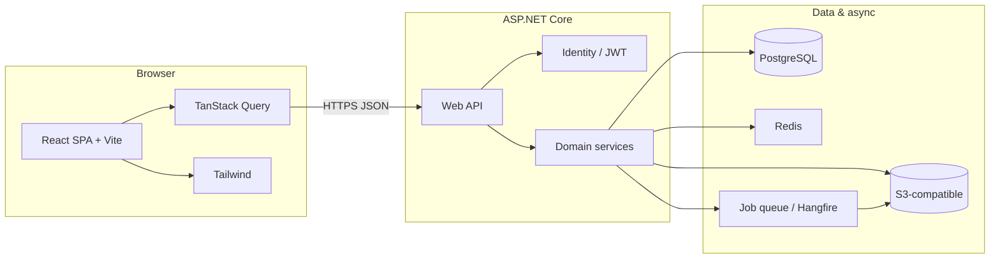

# Technical Design: Simplified Share & Showcase (.NET + React)

This document is the implementation-oriented technical design for **Simplified Share & Showcase**, aligned with the product goals in `readme.txt` and the problem/solution scope in `simplified_share_&_showcase_roadmap.md`, but implemented with **ASP.NET Core** and a **React** SPA instead of PHP/Blazor/Razor.

---

## 1. Goals & scope

- **Primary:** Easy curation, organization, and sharing of visual content with a **strong recipient experience** (simple download pages, optional branding, analytics).
- **MVP backend capabilities:** Auth, folders/files metadata, direct upload + **upload-from-URL**, share links (opaque id, expiry, **public vs password**), **async bulk ZIP**, thumbnails/processing via background jobs, activity/analytics events.
- **MVP frontend capabilities:** Authenticated dashboard (library, upload, bulk actions, share UI), responsive Tailwind UI, TanStack Query for server state.
- **Public recipients:** Dedicated **share routes** in the React app (no account login) with clear download CTAs; visibility rules in **§7**. SEO/link-preview metadata handled via **server-rendered or prerendered** HTML for share URLs (see §8) or documented follow-up.
- **Deferred:** **Google-account allowlist** (share only with specific `@gmail.com` / Google users) — not in v1; document when prioritized.

---

## 2. System architecture

| Tier | Technology | Responsibility |
|------|------------|----------------|
| **SPA (owner / admin)** | React 18+, TypeScript, Vite | Dashboard: files, folders, uploads, sharing, settings, analytics views |
| **Public share UI** | React (same app, separate routes) | **Opaque share id** in the path (e.g. `/s/{shareId}`): read-only gallery, single/bulk download; rules in **§7** |
| **Styling** | Tailwind CSS | Layout, components, responsive design |
| **Client data & cache** | TanStack Query (React Query) | Fetching, caching, retries, background refetch, mutations |
| **Routing** | React Router | Private vs public routes, lazy-loaded chunks |
| **Forms & validation** | React Hook Form + Zod | Login/register, share modals, settings with schema validation |
| **Optional UI primitives** | Headless UI or Radix UI | Accessible modals, menus, listbox (choose one and stay consistent) |
| **Drag-and-drop / uploads** | `@dnd-kit/core` or similar | Folder reordering, drop zones (optional for MVP scope) |
| **Virtualized lists** | TanStack Virtual (`@tanstack/react-virtual`) | Large galleries without DOM overload |
| **API** | ASP.NET Core 8+ Web API | REST + JSON, versioning (`/api/v1/...`), problem details for errors |
| **Auth** | ASP.NET Core Identity + JWT or cookie session | **Recommended for SPA:** JWT access + refresh stored securely, or BFF cookie pattern if same-site only |
| **ORM** | Entity Framework Core | Migrations, repositories or clean services |
| **Database** | **PostgreSQL** (Npgsql) | Relational metadata, ACLs, share links, audit — **same engine for local development and production** (connection string via env; see §11). |
| **Object storage** | **Cloudflare R2** (S3-compatible API) — also AWS S3 / MinIO via same SDK patterns | Blobs, pre-signed GET for downloads, multipart upload |
| **Cache / rate limits** | Redis | Share token throttling, idempotency keys, optional session |
| **Background jobs** | Hangfire, Quartz.NET, or hosted `BackgroundService` + queue | Thumbnails, ZIP jobs, URL ingest, virus scan hooks |
| **CDN** | Cloudflare / CloudFront / Azure CDN | Static assets + cached media URLs |
| **Email (optional MVP+)** | SendGrid, Mailgun, SMTP | “ZIP ready” notifications |

---

## 3. Backend (.NET) structure

- **Single deployable** `Web` project (or split `Api` + `Worker` if workers scale separately).
- **Layers (suggested):**
  - `Domain` — entities, value objects, domain errors.
  - `Application` — commands/queries, validators (FluentValidation), DTOs.
  - `Infrastructure` — EF Core, storage adapters, email, Redis, Hangfire jobs.
  - `Api` — controllers/minimal endpoints, filters (exception → RFC7807), auth.
- **Cross-cutting:** structured logging (`ILogger` + OpenTelemetry optional), correlation IDs, request validation, rate limiting (`AspNetCoreRateLimit` or built-in middleware + Redis).

### Core services (map to roadmap)

- **Auth:** register/login/refresh, email confirmation (optional), password reset.
- **File & folder:** CRUD, hierarchy, soft delete, move/copy.
- **Media pipeline:** enqueue processing job after upload; store `ProcessingStatus` on file row.
- **Sharing:** create/revoke links; resolve token; log `ShareAccess` for analytics; password verify; expiry.
- **Bulk download:** `POST` → enqueue ZIP job → poll or SignalR/email when `DownloadTicket` ready with short-lived pre-signed URL.
- **Upload from URL:** `POST` with URL → validate SSRF (allowlists, block private IPs) → enqueue fetch job → same pipeline as upload.
- **Branding (tier):** logo URL, colors stored per user/team; applied on public share page.

---

## 4. API conventions (illustrative)

| Area | Example endpoints |
|------|-------------------|
| Auth | `POST /api/v1/auth/register`, `POST /api/v1/auth/login`, `POST /api/v1/auth/refresh` |
| Folders | `GET/POST /api/v1/folders`, `PATCH /api/v1/folders/{id}`, `DELETE ...` |
| Files | `GET /api/v1/files`, `POST /api/v1/files/upload` (multipart), `POST /api/v1/files/upload-from-url` |
| Downloads | `GET /api/v1/files/{id}/download`, `POST /api/v1/downloads/bulk` → `{ jobId }`, `GET /api/v1/downloads/jobs/{jobId}` |
| Shares | `POST /api/v1/shares`, `GET /api/v1/shares/{id}`, `DELETE ...` |
| Public (optional BFF) | `GET /api/v1/public/shares/{token}/metadata` (no auth, rate limited) |

**Errors:** `application/problem+json` with stable `type`/`title`/`detail`; never leak stack traces in production.

**CORS:** allow only the SPA origin(s) in development and production.

---

## 5. Frontend (React) stack — detailed

| Package / tool | Role |
|----------------|------|
| **Vite** | Fast dev server, optimized production build, env-based API base URL |
| **TypeScript** | Type safety for API models shared or duplicated from OpenAPI |
| **Tailwind CSS** | Utility-first styling; `@tailwindcss/forms` plugin optional |
| **PostCSS + Autoprefixer** | Standard Tailwind pipeline |
| **TanStack Query** | Server state: folders, files, share links, job polling for ZIP |
| **React Router** | Routes: `/login`, `/app/...`, `/s/:token` (public) |
| **React Hook Form + Zod** | Forms with minimal re-renders; schema = single source of truth |
| **Zustand** (optional, small) | UI-only state: sidebar, modal open, selection set (avoid duplicating server data) |
| **Axios or fetch wrapper** | Inject base URL, attach JWT, refresh on 401 |
| **date-fns** or **Day.js** | Format dates in UI |
| **clsx** / **tailwind-merge** | Conditional class names without conflicts |
| **@tanstack/react-virtual** | Virtualize large grids |
| **ESLint + Prettier** | Consistency in CI |

**Not required for MVP:** Redux (TanStack Query + light Zustand usually enough).

**OpenAPI:** Generate TypeScript clients with `openapi-typescript` or NSwag from the .NET API for fewer drift bugs.

---

## 6. Authentication patterns (SPA + .NET)

Pick one and document it in deployment:

1. **JWT access + refresh (SPA stores refresh in httpOnly cookie set by API)** — common; implement refresh rotation and revoke list if needed.
2. **Backend-for-frontend (BFF):** cookie session only, SPA calls same-site API — simplest token handling, harder if mobile apps later.

For **public share pages**, endpoints must be **anonymous**, **rate limited**, and **never** expose internal IDs—only opaque token.

---

## 7. Links, visibility & embedding (policy)

This section fixes the **v1** product rules for **public** vs **password-protected** shares and how they relate to **URLs** and **forums/embeds**. It aligns with a **single primary viewer link** per share (similar in spirit to competitor “app page + optional CDN” splits, without over-complicating v1).

### 7.1 One viewer link (human-facing)

- Every share has **one opaque id** in the app URL, e.g. `https://app-host/s/{shareId}` (exact path prefix is an implementation choice; **opaque id**, not guessable slugs, for anything sensitive).
- **Public:** opening the URL shows the asset(s) / gallery and download actions without an account.
- **Password-protected:** same URL shows a **password gate** first; after success, issue a **session** (httpOnly cookie scoped to the share/site) or equivalent so repeat views do not re-prompt on every navigation. **Do not** publish a **long-lived public object URL** on R2 for the raw bytes of password-protected content.

### 7.2 Direct / CDN URLs (optional enhancement)

- **Public** assets may later expose **additional** URLs for **hotlinking** (HTML ``, Markdown, BBCode) pointing at **R2** (or CDN in front of R2), e.g. competitor-style **viewer** vs **direct file** URLs. This is **parity** for public embeds, not required on day one.
- **Password-protected** assets: **v1 does not** support classic forum **`[img]https://…/file.png[/img]`** hotlinks that work anonymously—those URLs would bypass the password. Product expectation: **share link** or **iframe** to the viewer (see §7.3).

### 7.3 Password-protected content and forums (v1)

- Users assume **password-protected** files will **not** be embedded like public hotlinks unless the destination supports **iframes** to your viewer.
- **v1 UX copy:** state that password shares are **link-first**; optional **iframe embed snippet** can be offered later for password shares where forums allow it.

### 7.4 Deferred access model

- **Google-account allowlist** (only specific Google-signed-in emails) — **out of scope for v1**; see §1. Add when product and OAuth scope are ready.

### 7.5 Competitive note (optional future)

- Services like Share My Image often show **viewer link** + **separate CDN URL** for embeds. For **public** content, adding **HTML / Markdown / BBCode** presets that use **direct public URLs** is a **later** enhancement once public R2 paths and derivatives (e.g. thumbnails) exist.

---

## 8. Public share page & link previews (SEO / Open Graph)

React SPAs often serve the same `index.html` for all routes; crawlers may not execute JS.

**Options (choose early):**

- **A.** Small **Razor** or **static HTML** shell only for `/s/*` served by ASP.NET with injected `<meta property="og:*">` (minimal Razor, rest still React hydrate) — best OG support.
- **B.** **Prerender** service (Prerender.io, Cloudflare Workers) for `/s/*`.
- **C.** Accept weaker previews until phase 2.

Document the chosen approach in deployment runbooks.

---

## 9. Data model (EF Core — conceptual)

Align with the existing roadmap entities: `User`, `Team`, `TeamMember`, `Folder`, `File`, `ShareLink`, `ShareAccessLog`, `Permission`, optional `BrandingProfile`, `DownloadJob`.

- Use **UUID** or **bigint** PKs consistently; **share token** = high-entropy string, unique index.
- **Polymorphic** share targets (file vs folder) enforced in application layer if not TPH table.

---

## 10. Security checklist

- SSRF protection on **upload-from-URL**; size/MIME limits; scan hook optional.
- Pre-signed URLs: **short TTL** for ZIP and single-file download.
- Rate limit **login** and **public share** endpoints.
- CSP headers for SPA static host; `Content-Disposition` for downloads.
- Secrets in **User Secrets** / Key Vault / environment variables — never in repo.

---

## 11. Deployment & environments

- **Database (PostgreSQL everywhere):** Use **PostgreSQL** for **local development and production** — same provider (Npgsql), different connection strings via environment. Local options: **Docker Compose** with an official `postgres` image, **Podman**, or a locally installed Postgres instance. Avoid maintaining a separate SQLite-only path unless needed for constrained CI smoke tests; the **source of truth** for schema is PostgreSQL.
- **Containers:** Docker image for API + optional worker image; React build output as static files served by CDN or embedded in Kestrel/static files middleware.
- **Env:** `ASPNETCORE_ENVIRONMENT`, **`ConnectionStrings:DefaultConnection`** (PostgreSQL), S3/R2 credentials, Redis, JWT signing key, SPA `VITE_API_BASE_URL`.
- **CI:** `dotnet test`, `npm ci && npm run build`, lint (CI may spin up **Postgres** as a service container or use a test container).
- **Hosted evolution (Railway two services → Cloudflare Pages):** see **§15**.

---

## 12. Phasing suggestion

| Phase | Deliver |
|-------|---------|
| **P0** | Auth, folders/files CRUD, direct upload to storage, list UI, TanStack Query integration |
| **P1** | Share links (**§7** visibility: public vs password), public `/s/:shareId` route, analytics logging, branding fields |
| **P2** | Bulk ZIP + jobs, upload-from-URL, thumbnails; optional **public** direct R2 URLs + HTML/Markdown embed presets (§7.2 / §7.5) |
| **P3** | Teams/ACLs (if product requires), advanced analytics, email notifications |

---

## 13. Relation to other docs

- **Product & problems:** Same as `simplified_share_&_showcase_roadmap.md` (bulk download, URL upload, UI clarity, recipient experience, collaboration).
- **This doc:** Canonical **.NET + React** stack and architecture; the PHP/SQL snippets in the original roadmap are **reference only** — implement via **EF Core** and C# services.

---

## 14. Repository scaffold

Runnable code lives under **`src/`**:

- **`src/ShareShowcase.Api`** — ASP.NET Core Web API (`GET /api/v1/system/health`, CORS for the SPA).
- **`src/share-showcase-web`** — React + Vite + Tailwind v4 + TanStack Query + React Router; dev proxy to the API.

See **`src/README.md`** for run instructions. The web app pins **Vite 6** for broad Node/Windows compatibility.

**Database alignment:** This design targets **PostgreSQL** for all environments. The scaffold may still use SQLite until migrated; migrating the API to **Npgsql** and a Postgres connection string (local Docker + Railway) is the expected next backend step (see §11).

---

## 15. Deployment evolution (Railway → Cloudflare Pages)

**Intent:** Start with **two separate services on one Railway project** (API + static React). Later, move **only the SPA** to **Cloudflare Pages** for global edge delivery and cost on static bandwidth—**without** a large rewrite, if we follow the rules below from day one.

### Phase A — Current target (Railway)

| Service | Role |
|---------|------|
| **API** | ASP.NET Core container: PostgreSQL connection, JWT, R2 credentials, CORS. |
| **Frontend** | Static hosting (e.g. Nginx/Caddy Dockerfile) serving the Vite **`dist/`** output. |
| **Database** | Railway PostgreSQL — same **Postgres** family as local dev (§11). |

**Object storage:** Cloudflare **R2** (S3-compatible) from the API; not on Railway disk for production media.

**CORS:** The browser sees **two origins** (e.g. `*.up.railway.app` for app vs API). Configure **allowed origins** from environment (array), not hardcoded—include both Railway hostnames and room for later Pages URLs.

### Phase B — Near future (Cloudflare Pages + Railway API)

| Piece | Hosting |
|-------|---------|
| **SPA** | Cloudflare Pages (same **`dist/`** artifact as Phase A). |
| **API** | Stays on Railway. |
| **DB** | Stays with API (Railway Postgres or unchanged). |
| **R2** | Unchanged; optional tighter integration with Workers later. |

**Migration steps (should be small):** deploy the same `npm run build` output to Pages; set **`VITE_API_BASE_URL`** (or build-time `VITE_*`) to the public Railway API URL; add the **Pages origin** (and custom domain if any) to the API **CORS** allowlist via env. No change to REST contracts.

### Design rules so conversion stays fast

1. **API base URL:** Single env-driven base for all client calls (`VITE_API_BASE_URL` in Vite). Never hardcode production API URLs in source except documentation.
2. **CORS:** Load **multiple origins** from configuration (`Cors:Origins` or equivalent) so Railway static + Pages + custom domains can coexist during cutover.
3. **Auth:** Prefer **JWT in `Authorization`** for SPA → API across origins; avoid coupling the SPA to **same-site cookies** unless a BFF is intentional—cookies complicate cross-domain moves.
4. **SPA assumptions:** Treat the UI as a **pure static SPA**; do not assume the API serves `/` or embeds the bundle (that would be a different deployment model).
5. **CI:** One pipeline produces **`dist/`** and publishes it—only the **deploy target** changes between Railway static and Pages.
6. **Custom domains (optional):** If using e.g. `app.example.com` (Pages) and `api.example.com` (Railway), plan CORS and env for those hostnames early.

### What this section is not

- **Embedding React in Kestrel** (single Railway service, `UseStaticFiles`) is a valid alternative but a **different** migration path to Pages; the rules above target the **two-service** → **Pages** path specifically.

---

*Document version: 1.3 — Simplified Share & Showcase, .NET + React technical design.*

**Changelog (1.3):** Added **§7 Links, visibility & embedding** (public vs password, no password hotlinks in v1, iframe/link; deferred Google allowlist). **PostgreSQL** specified for **local and production** (§2, §11, §14). R2 called out in architecture table. Section renumbering §8–§15. Phasing P1/P2 updated for share policy and optional embed parity.
